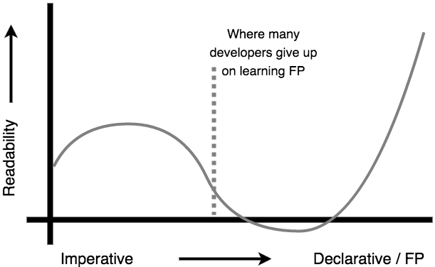

# Functional-Light JavaScript
# Chapter 1: Why Functional Programming?

> Functional programmer: (noun) One who names variables "x", names functions "f", and names code patterns "zygohistomorphic prepromorphism"
>
> James Iry ‏@jamesiry 5/13/15
>
> https://twitter.com/jamesiry/status/598547781515485184

Functional Programming (FP) is not a new concept by any means. It's been around almost the entire history of programming. However -- and I'm not sure it's fair to say, but! -- it sure hasn't seemed like as mainstream of a concept in the overall developer world until perhaps the last few years. I think FP has more been the realm of academics.

But that's all changing. A groundswell of interest is growing around FP, not just at the languages level but even in libraries and frameworks. You very well might be reading this text because you've finally realized FP is something you can't ignore any longer. Or maybe you're like me and you've tried to learn FP many times before but struggled to wade through all the terms or mathematical notation.

Whatever your reason for reading this book, welcome to the party!

## Confidence

I have a very simple premise that sort of underlies everything I do as a teacher of software development (in JavaScript): code that you cannot trust is code that you do not understand. And furthermore, if you cannot trust or understand your code, then you can have no confidence whatsoever that the code you write is suitable to the task. You run the program and cross your fingers.

What do I mean by trust? I mean that you can verify, by reading, not just running, that you understand what a piece of code *will* do, not just relying on what it *should* do. Perhaps more often than we should, we tend to rely on verification of our program's correctness by running test suites. I don't mean to suggest tests are bad. But I do think we should aspire to be able to understand our code well enough that we know the test suite will pass before it runs.

I believe the techniques that form the foundation of FP are designed from the mindset of having far more confidence over our programs just by reading them. Someone who understands FP, and who diligently uses it in their programs, will write code that they can read and verify, by the principles they have already proven to be true, that the program will do what they want.

It is my hope that you will begin to develop more confidence in the code you write, and that these functional-light programming principles will begin your journey in that direction.

## Communication

Why is functional programming important? To answer that, we need to take a bigger step back and talk about why programming itself is important.

It may surprise you to hear this, but I don't believe that code is primarily a set of instructions for the computer. As a matter of fact, I think the fact that code instructs the computer is almost a happy accident.

I believe very deeply that the vastly more important role of code is as a means of communication with other human beings.

You probably know by experience that an awful lot of your time spent "coding" is actually spent reading existing code. Very few of us are so privileged as to spend all or most of our time simply banging out all new code and never dealing with code that others (or our past selves) wrote.

Did you know that researchers who've studied this topic say that 70% of the time we spend maintaining code is just spent reading it to understand it? I find that shocking. 70%. No wonder the global average for a programmer's lines of code written per day is around 5. We spend the other 7 hours and 30 minutes of the day just reading the code to figure out where those 5 lines should go!

I think we should focus a lot -- a LOT! -- more on the readability of our code. Like, a lot more. And by the way, readability is not about least number of characters. Readability is actually most affected by familiarity (yes, that's been studied, too).

So, if we are going to spend more time concerned with making code that will be more readable and understandable, FP turns out to be a really handy pattern in that effort. The principles of FP are well established, deeply studied and vetted, and provably verifiable.

If we use FP principles, I believe we will create code that is easier to reason about. Once we know these principles, they will be recognizable and familiar in the code, meaning we'll spend less time figuring that part out when we read a piece of code. Our focus will be spent on how all the well-known, established lego pieces are assembled, not on what those lego pieces mean.

FP (at least, without all the terminology weighing it down) is one of the most effective tools for writing readable code. *That* is why it's so important.

### Readability Curve

It's really important I take a moment to call out a phenomena that has derailed and frustrated me many times over the years, and was especially acute while writing this book.

I also think it's probably something that many developers have a tendency to run into. You, dear reader, may just find yourself in this same boat as you work through this text. But take heart; if you stick this out, the curve comes back.

	

We'll cover this more in the next chapter, but imperative code is the code you probably already write, like `if` statements and `for`-loops. It's focused on precisely instructing the computer *how* to do something. Declarative code, and moreover the kind of code we'll be striving to learn to write that adheres to FP principles, is code that's more focused on describing the *what* outcome.

Let me just clue you into a painful fact, one that I've been trying to swallow the whole time I've worked on this book: it takes a lot more effort, and often a lot more code, to improve the readability of your code and to minimize or eliminate most of the places where you might write bugs.

If you're hoping that your FP code refactoring will immediately make your code more graceful, elegant, clever, and concise, that's just not a realistic expectation -- at least not at first.

FP is a very different way of thinking about how code should be structured, to make the flow of data much more obvious and to help your reader follow your thinking. This effort is eminently worthwhile, but it can be an arduous journey and the code you end up with will not seem more readable until you've spent a lot more time conditioning yourself to FP.

Also, my experience has been that it takes about a half dozen attempts at turning a snippet of imperative code into more declarative FP, before I end up with something that's clear enough for me to understand. For me, writing FP is more like a process than a binary flip from one paradigm to another.

I also apply the "read it later" test to every piece of FP code I write. I write it, then leave the code alone for a few hours or a day, then come back and try to read it with fresh eyes. Usually, it's confusing as hell, so I tweak it and repeat.

Functional programming has not been for me achieving a single elegant brush stroke on the artist's canvas that leaves the audience in awe. Rather, it's a painstaking, detailed, sometimes treacherous hack through the weeds of a neglected field.

But I'm not trying to dampen your spirits. I really want you to hack through those weeds. I am glad I have. I can finally start to see the curve bending upward towards more readability. The effort has been worth it. I believe it will be for you, too.

## Take

We're going to approach FP from the ground up, and uncover the basic foundational principles that I believe formal FPers would admit are the scaffolding for everything they do. But for the most part we'll stay arms length away from most of the intimidating terminology or mathematical notation that can so easily frustrate learners.

I believe it's less important what you call something and more important that you understand what it is and how it works. That's not to say there's no importance to shared terminology -- it undoubtedly eases communication among seasoned professionals. But for the learner, I've found it can be somewhat distracting.

So I hope this book can focus more on the base concepts and less on the fancy terminology. That's not to say there won't be terminology; there definitely will be. But don't get too wrapped up in the fancier words. Look beyond them to the ideas. That's what this book is trying to be about.

I call the less formal practice herein "Functional-Light Programming" because I think where the formalism of true FP suffers is that it can be quite overwhelming if you're not already accustomed to formal thought. I'm not just guessing; this is my own personal story. Even after teaching FP and writing this book, I can still say that the formalism of terms and notation in FP is very, very diffcult for me to process. I've tried, and tried, and I can't seem to get through much of it.

I know many FPers who believe that the formalism itself helps learning. But I think there's clearly a cliff where that only becomes true once you reach a certain comfort with the formalism. If you happen to already have a math background or even some flavors of CS experience, this may come more naturally to you. But some of us don't, and no matter how hard we try, the formalism keeps getting in the way.

So this book introduces the concepts that I believe FP is built on, but comes at it by giving you a boost to climb up the cliff wall rather than throwing you straight at it to figure out how to climb as you go.

## YAGNI

If you've been around programming for very long, chances are you've heard the phrase "YAGNI" before: "You Ain't Gonna Need It". This principle primarily comes from extreme programming, and stresses the high risk and cost of building a feature before it's needed.

Sometimes we guess we'll need a feature in the future, build it now believing it'll be easier to do as we build other stuff, then realize we guessed wrong and the feature wasn't needed, or needed to be quite different. Other times we guess right, but build a feature too early, and suck up time from the features that are genuinely needed now; we incur an opportunity cost in diluting our energy.

YAGNI challenges us to remember: even if it's counter intuitive in a situation, we often should postpone building something until it's presently needed. We tend to exaggerate our mental estimates of the future refactoring cost of adding it later when it is needed. Odds are, it won't be as hard to do later as we might assume.

As it applies to functional programming, I would give this admonition: there will be plenty of interesting and compelling patterns discussed in this text, but just because you find some pattern exciting to apply, it may not necessarily be appropriate to do so in a given part of your code.

This is where I will differ from many more formal FPers: just because you *can* FP something doesn't mean you *should* FP it. Moreover, there are many ways to slice a problem, and even though you may have learned a more sophisticated approach that is more "future-proof" to maintenance and extensibility, a simpler FP pattern might be more than sufficient in that spot.

Generally, I'd recommend to seek balance in what you code, and to be conservative in your application of FP concepts as you get the hang of things. Default to the YAGNI principle in deciding if a certain pattern or abstraction will help that part of the code be more readable or if it's just introducing more clever sophistication that isn't (yet) warranted.

> Reminder, any extensibility point that’s never used isn’t just wasted effort, it’s likely to also get in your way as well
>
> Jeremy D. Miller @jeremydmiller 2/20/15
>
> https://twitter.com/jeremydmiller/status/568797862441586688

Remember, every single line of code you write has a reader cost associated with it. That reader may be another team member, or even your future self. Neither of those readers will be impressed with overly clever unnecessary sophistication to show off your FP agility.

The best code is the code that is most readable in the future because it strikes exactly the right balance between what it can/should be (idealism) and what it must be (pragmatism).

## Resources

I have drawn on a great many different resources to be able to compose this text. I believe you too may benefit from them, so I wanted to take a moment to point them out.

### Books

Some FP/JavaScript books that you should definitely read:

* [Professor Frisby's Mostly Adequate Guide to Functional Programming](https://drboolean.gitbooks.io/mostly-adequate-guide/content/ch1.html) by [Brian Lonsdorf](https://twitter.com/drboolean)
* [JavaScript Allongé](https://leanpub.com/javascript-allonge) by [Reg Braithwaite](https://twitter.com/raganwald)
* [Functional JavaScript](http://shop.oreilly.com/product/0636920028857.do) by [Michael Fogus](https://twitter.com/fogus)

### Blogs/Sites

Some other authors and content you should check out:

* [Fun Fun Function Videos](https://www.youtube.com/watch?v=BMUiFMZr7vk) by [Mattias P Johansson](https://twitter.com/mpjme)
* [Awesome FP JS](https://github.com/stoeffel/awesome-fp-js)
* [Kris Jenkins](http://blog.jenkster.com/2015/12/what-is-functional-programming.html)
* [Eric Elliott](https://medium.com/@_ericelliott)
* [James A Forbes](https://james-forbes.com/)
* [James Longster](https://github.com/jlongster)
* [André Staltz](http://staltz.com/)
* [Functional Programming Jargon](https://github.com/hemanth/functional-programming-jargon#functional-programming-jargon)
* [Functional Programming Exercises](https://github.com/InceptionCode/Functional-Programming-Exercises)

### Libraries

The code snippets in this book do not use libraries. Each operation that we discover, we'll derive how to implement it in standalone, plain ol' JavaScript. However, as you begin to build more of your real code with FP, you'll quickly want a library to provide optimized and highly reliable versions of these commonly accepted utilities.

By the way, you'll want to make sure you check the documentation for the library functions you use to make sure you know how they work. There will be a lot of similarities in many of them to the code we build on in this text, but there will undoubtedly be some differences, even between popular libraries.

Here are a few popular FP libraries for JavaScript that are a great place to start your exploration with:

* [Ramda](http://ramdajs.com)
* [lodash/fp](https://github.com/lodash/lodash/wiki/FP-Guide)
* [functional.js](http://functionaljs.com/)
* [Immutable.js](https://github.com/facebook/immutable-js)

Appendix C illustrates some of these libraries using various examples from the text.

## Summary

This is Functional-Light JavaScript. The goal is to learn to communicate with our code but not suffocate under mountains of notation or terminology to get there. I hope this book jumpstarts your journey!
