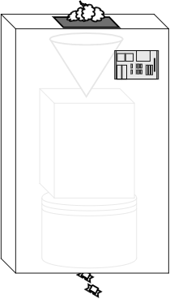

# Functional-Light JavaScript
# Chapter 4: Composing Functions

By now, I hope you're feeling much more comfortable with what it means to use functions for functional programming.

A functional programmer sees every function in their program like a little simple lego piece. They recognize the blue 2x2 brick at a glance, and know exactly how it works and what they can do with it. As they go about building a bigger complex lego model, as they need each next piece, they already have an instinct for which of their many spare pieces to grab.

But sometimes you take the blue 2x2 brick and the gray 4x1 brick and put them together in a certain way, and you realize, "that's a useful piece that I need often".

So now you've come up with a new "piece", a combination of two other pieces, and you can reach for that kind of piece now anytime you need it. It's more effective to recognize and use this compound blue-gray L-brick thing where it's needed than to separately think about assembling the two individual bricks each time.

Functions come in a variety of shapes and sizes. And we can define a certain combination of them to make a new compound function that will be handy in various parts of the program. This process of using functions together is called composition.

Composition is how an FPer models the flow of data through the program. In some senses, it's the most foundational concept in all of FP, because without it, you can't declaratively model data and state changes. In other words, everything else in FP would collapse without composition.

## Output To Input

We've already seen a few examples of composition. For example, in Chapter 3 our discussion of `unary(..)` included this expression: `unary(adder(3))`. Think about what's happening there.

To compose two functions together, pass the output of the first function call as the input of the second function call. In `unary(adder(3))`, the `adder(3)` call returns a value (a function); that value is directly passed as an argument to `unary(..)`, which also returns a value (another function).

To take a step back and visualize the conceptual flow of data, consider:

```
functionValue <-- unary <-- adder <-- 3
```

`3` is the input to `adder(..)`. The output of `adder(..)` is the input to `unary(..)`. The output of `unary(..)` is `functionValue`. This is the composition of `unary(..)` and `adder(..)`.

**Note:** The right-to-left orientation here is on purpose, though it may seem strange at this point in your learning. We'll come back to explain that more fully later.

Think of this flow of data like a conveyor belt in a candy factory, where each operation is a step in the process of cooling, cutting, and wrapping a piece of candy. We'll use the candy factory metaphor throughout this chapter to explain what composition is.

<p align="center">
    
</p>

Let's examine composition in action one step at a time. Consider these two utilitites you might have in your program:

```js
function words(str) {
    return String( str )
        .toLowerCase()
        .split( /\s|\b/ )
        .filter( function alpha(v){
            return /^[\w]+$/.test( v );
        } );
}

function unique(list) {
    var uniqList = [];

    for (let v of list) {
        // value not yet in the new list?
        if (uniqList.indexOf( v ) === -1 ) {
            uniqList.push( v );
        }
    }

    return uniqList;
}
```

`words(..)` splits of a string into an array of words. `unique(..)` takes a list of words and filters it to not have any repeat words in it.

To use these two utilities to analyze a string of text:

```js
var text = "To compose two functions together, pass the \
output of the first function call as the input of the \
second function call.";

var wordsFound = words( text );
var wordsUsed = unique( wordsFound );

wordsUsed;
// ["to","compose","two","functions","together","pass",
// "the","output","of","first","function","call","as",
// "input","second"]
```

We name the array output of `words(..)` as `wordsFound`. The input of `unique(..)` is also an array, so we can pass the `wordsFound` into it.

Back to the candy factory assembly line: the first machine takes as "input" the melted chocolate, and its "output" is a chunk of formed and cooled chocolate. The next machine a little down the assembly line takes as its "input" the chunk of chocolate, and its "output" is a cut-up of piece of chocolate candy. Next, a machine on the line takes small pieces of chocolate candy from the conveyor belt and outputs wrapped candies ready to bag and ship.


The candy factory is fairly successful with this process, but as with all businesses, management keeps searching for ways to grow.

To keep up with demand for more candy production, they decide to take out the conveyor belt contraption and just stack all three machines on top of each other, so that the output valve of one is connected directly to the input valve of the one below it. There's no longer sprawling wasted space where a chunk of chocolate slowly and noisly rumbles down a conveyor belt from the first machine to the second.

This innovation saves a lot of room on the factory floor, so management is happy they'll get to make more candy each day!

The code equivalent of this improved candy factory configuration is to skip the intermediate step (the `wordsFound` variable in the earlier snippet), and just use the two function calls together:

```js
var wordsUsed = unique( words( text ) );
```

**Note:** Though we typically read the function calls left-to-right -- `unique(..)` and then `words(..)` -- the order of operations will actually be more right-to-left, or inner-to-outer. `words(..)` will run first and then `unique(..)`. Later we'll talk about a pattern that matches the order of execution to our natural left-to-right reading, called `pipe(..)`.

The stacked machines are working fine, but it's kind of clunky to have the wires hanging out all over the place. The more of these machine-stacks they create, the more cluttered the factory floor gets. And the effort to assemble and maintain all these machine stacks is awfully time intensive.



One morning, an engineer at the candy factory has a great idea. She figures that it'd be much more efficient if she made an outer box to hide all the wires; on the inside, all three of the machines are hooked up together, and on the outside everything is now neat and tidy. On the top of this fancy new machine is a valve to pour in melted chocolate and on the bottom is a valve that spits out wrapped chocolate candies. Brilliant!

This single compound machine is much easier to move around and install wherever the factory needs it. The workers on the factory floor are even happier because they don't need to fidget with buttons and dials on three individual machines anymore; they quickly prefer using the single fancy machine.

Relating back to the code: we now realize that the pairing of `words(..)` and `unique(..)` in that specific order of execution -- think: compound lego -- is something we could use in several other parts of our application. So, let's define a compound function that combines them:

```js
function uniqueWords(str) {
    return unique( words( str ) );
}
```

`uniqueWords(..)` takes a string and returns an array. It's a composition of `unique(..)` and `words(..)`, as it fulfills the data flow:

```
wordsUsed <-- unique <-- words <-- text
```

You certainly get it by now: the unfolding revolution in candy factory design is function composition.

### Machine Making

The candy factory is humming along nicely, and thanks to all the saved space, they now have plenty of room to try out making new kinds of candies. Building on the earlier success, management is keen to keep inventing new fancy compound machines for their growing candy assortment.

But the factory engineers struggle to keep up, because each time a new kind of fancy compound machine needs to be made, they spend quite a bit of time making the new outer box and fitting the individual machines into it.

So the factory engineers contact an industrial machine vendor for help. They're amazed to find out that this vendor offers a **machine-making** machine! As incredible as it sounds, they purchase a machine that can take a couple of the factory's smaller machines -- the chocolate cooling one and the cutting one, for example -- and wire them together automatically, even wrapping a nice clean bigger box around them. This is surely going to make the candy factory really take off!

<p align="center">
    
</p>

Back to code land, let's consider a utility called `compose2(..)` that creates a composition of two functions automatically, exactly the same way we did manually:

```js
function compose2(fn2,fn1) {
    return function composed(origValue){
        return fn2( fn1( origValue ) );
    };
}

// or the ES6 => form
var compose2 =
    (fn2,fn1) =>
        origValue =>
            fn2( fn1( origValue ) );
```

Did you notice that we defined the parameter order as `fn2,fn1`, and furthermore that it's the second function listed (aka `fn1` parameter name) that runs first, then the first function listed (`fn2`)? In other words, the functions compose from right-to-left.

That may seem like a strange choice, but there are some reasons for it. Most typical FP libraries define their `compose(..)` to work right-to-left in terms of ordering, so we're sticking with that convention.

But why? I think the easiest explanation (but perhaps not the most historically accurate) is that we're listing them to match the order they are written in code manually, or rather the order we encounter them when reading from left-to-right.

`unique(words(str))` lists the functions in the left-to-right order `unique, words`, so we make our `compose2(..)` utility accept them in that order, too. The execution order is right-to-left, but the code order is left-to-right. Pay close attention to keep those distinct in your mind.

Now, the more efficient definition of the candy making machine is:

```js
var uniqueWords = compose2( unique, words );
```

### Composition Variation

It may seem like the `<-- unique <-- words` combination is the only order these two functions can be composed. But we could actually compose them in the opposite order to create a utility with a bit of a different purpose:

```js
var letters = compose2( words, unique );

var chars = letters( "How are you Henry?" );
chars;
// ["h","o","w","a","r","e","y","u","n"]
```

This works because the `words(..)` utility, for value-type safety sake, first coerces its input to a string using `String(..)`. So the array that `unique(..)` returns -- now the input to `words(..)` -- becomes the string `"H,o,w, ,a,r,e,y,u,n,?"`, and then the rest of the behavior in `words(..)` processes that string into the `chars` array.

Admittedly, this is a contrived example. But the point is that function compositions are not always unidirectional. Sometimes we put the gray brick on top of the blue brick, and sometimes we put the blue brick on top.

The candy factory better be careful if they try to feed the wrapped candies into the machine that mixes and cools the chocolate!

## General Composition

If we can define the composition of two functions, we can just keep going to support composing any number of functions. The general data visualization flow for any number of functions being composed looks like this:

```
finalValue <-- func1 <-- func2 <-- ... <-- funcN <-- origValue
```

<p align="center">
    
</p>

Now the candy factory owns the best machine of all: a machine that can take any number of separate smaller machines and spit out a big fancy machine that does every step in order. That's one heck of a candy operation! It's Willy Wonka's dream!

We can implement a general `compose(..)` utility like this:

```js
function compose(...fns) {
    return function composed(result){
        // copy the array of functions
        var list = fns.slice();

        while (list.length > 0) {
            // take the last function off the end of the list
            // and execute it
            result = list.pop()( result );
        }

        return result;
    };
}

// or the ES6 => form
var compose =
    (...fns) =>
        result => {
            var list = fns.slice();

            while (list.length > 0) {
                // take the last function off the end of the list
                // and execute it
                result = list.pop()( result );
            }

            return result;
        };
```

**Warning:** `...fns` is a collected array of arguments, not a passed-in array, and as such, it's local to `compose(..)`. It may be tempting to think the `fns.slice()` would thus be unnecessary. However, in this particular implementation, `.pop()` inside the inner `composed(..)` function is mutating the list, so if we didn't make a copy each time, the returned composed function could only be used reliably once. We'll revisit this hazard in Chapter 6.

Now let's look at an example of composing more than two functions. Recalling our `uniqueWords(..)` composition example, let's add a `skipShortWords(..)` to the mix:

```js
function skipShortWords(words) {
    var filteredWords = [];

    for (let word of words) {
        if (word.length > 4) {
            filteredWords.push( word );
        }
    }

    return filteredWords;
}
```

Let's define `biggerWords(..)` that includes `skipShortWords(..)`. The manual composition equivalent we're looking for is `skipShortWords(unique(words(text)))`, so let's do it with `compose(..)`:

```js
var text = "To compose two functions together, pass the \
output of the first function call as the input of the \
second function call.";

var biggerWords = compose( skipShortWords, unique, words );

var wordsUsed = biggerWords( text );

wordsUsed;
// ["compose","functions","together","output","first",
// "function","input","second"]
```

Now, let's recall `partialRight(..)` from Chapter 3 to do something more interesting with composition. We can build a right-partial application of `compose(..)` itself, pre-specifying the second and third arguments (`unique(..)` and `words(..)`, respectively); we'll call it `filterWords(..)` (see below).

Then, we can complete the composition multiple times by calling `filterWords(..)`, but with different first-arguments respectively:

```js
// Note: uses a `<= 4` check instead of the `> 4` check
// that `skipShortWords(..)` uses
function skipLongWords(list) { /* .. */ }

var filterWords = partialRight( compose, unique, words );

var biggerWords = filterWords( skipShortWords );
var shorterWords = filterWords( skipLongWords );

biggerWords( text );
// ["compose","functions","together","output","first",
// "function","input","second"]

shorterWords( text );
// ["to","two","pass","the","of","call","as"]
```

Take a moment to consider what the right-partial application on `compose(..)` gives us. It allows us to specify ahead of time the first step(s) of a composition, and then create specialized variations of that composition with different subsequent steps (`biggerWords(..)` and `shorterWords(..)`). This is one of the most powerful tricks of FP!

You can also `curry(..)` a composition instead of partial application, though because of right-to-left ordering, you might more often want to `curry( reverseArgs(compose), ..)` rather than just `curry( compose, ..)` itself.

**Note:** Since `curry(..)` (at least the way we implemented it in Chapter 3) relies on either detecting the arity (`length`) or having it manually specified, and `compose(..)` is a variadic function, you'll need to manually specify the intended arity like `curry(.. , 3)`.

### Alternate Implementations

While you may very well never implement your own `compose(..)` to use in production, and rather just use a library's implementation as provided, I've found that understanding how it works under the covers actually helps solidify general FP concepts very well.

So let's examine some different implementation options for `compose(..)`. We'll also see there are some pros/cons to each implementation, especially performance.

We'll be looking at the `reduce(..)` utility in detail later in the text, but for now, just know that it reduces a list (array) to a single finite value. It's like a fancy loop.

For example, if you did an addition-reduction across the list of numbers `[1,2,3,4,5,6]`, you'd be looping over them adding them together as you go. The reduction would add `1` to `2`, and add that result to `3`, and then add that result to `4`, and so on, resulting in the final summation: `21`.

The original version of `compose(..)` uses a loop and eagerly (aka, immediately) calculates the result of one call to pass into the next call. We can do that same thing with `reduce(..)`:

```js
function compose(...fns) {
    return function composed(result){
        return fns.reverse().reduce( function reducer(result,fn){
            return fn( result );
        }, result );
    };
}

// or the ES6 => form
var compose = (...fns) =>
    result =>
        fns.reverse().reduce(
            (result,fn) =>
                fn( result )
            , result
        );
```

Notice that the `reduce(..)` looping happens each time the final `composed(..)` function is run, and that each intermediate `result(..)` is passed along to the next iteration as the input to the next call.

The advantage of this implementation is that the code is more concise and also that it uses a well-known FP construct: `reduce(..)`. And the performance of this implementation is also similar to the original `for`-loop version.

However, this implementation is limited in that the outer composed function (aka, the first function in the composition) can only receive a single argument. Most other implementations pass along all arguments to that first call. If every function in the composition is unary, this is no big deal. But if you need to pass multiple arguments to that first call, you'd want a different implementation.

To fix that first call single-argument limitation, we can still use `reduce(..)` but produce a lazy-evaluation function wrapping:

```js
function compose(...fns) {
    return fns.reverse().reduce( function reducer(fn1,fn2){
        return function composed(...args){
            return fn2( fn1( ...args ) );
        };
    } );
}

// or the ES6 => form
var compose =
    (...fns) =>
        fns.reverse().reduce( (fn1,fn2) =>
            (...args) =>
                fn2( fn1( ...args ) )
        );
```

Notice that we return the result of the `reduce(..)` call directly, which is itself a function, not a computed result. *That* function lets us pass in as many arguments as we want, passing them all down the line to the first function call in the composition, then bubbling up each result through each subsequent call.

Instead of calculating the running result and passing it along as the `reduce(..)` looping proceeds, this implementation runs the `reduce(..)` looping **once** up front at composition time, and defers all the function call calculations -- referred to as lazy calculation. Each partial result of the reduction is a successively more wrapped function.

When you call the final composed function and provide one or more arguments, all the levels of the big nested function, from the inner most call to the outer, are executed in reverse succession (not via a loop).

The performance characteristics will potentially be different than in the previous `reduce(..)`-based implementation. Here, `reduce(..)` only runs once to produce a big composed function, and then this composed function call simply executes all its nested functions each call. In the former version, `reduce(..)` would be run for every call.

Your mileage may vary on which implementation is better, but keep in mind that this latter implementation isn't limited in argument count the way the former one is.

We could also define `compose(..)` using recursion. The recursive definition for `compose(fn1,fn2, .. fnN)` would look like:

```
compose( compose(fn1,fn2, .. fnN-1), fnN );
```

**Note:** We will cover recursion in deep detail in Chapter 8, so if this approach seems confusing, feel free to skip it for now and come back later after reading that chapter.

Here's how we implement `compose(..)` with recursion:

```js
function compose(...fns) {
    // pull off the last two arguments
    var [ fn1, fn2, ...rest ] = fns.reverse();

    var composedFn = function composed(...args){
        return fn2( fn1( ...args ) );
    };

    if (rest.length == 0) return composedFn;

    return compose( ...rest.reverse(), composedFn );
}

// or the ES6 => form
var compose =
    (...fns) => {
        // pull off the last two arguments
        var [ fn1, fn2, ...rest ] = fns.reverse();

        var composedFn =
            (...args) =>
                fn2( fn1( ...args ) );

        if (rest.length == 0) return composedFn;

        return compose( ...rest.reverse(), composedFn );
    };
```

I think the benefit of a recursive implementation is mostly conceptual. I personally find it much easier to think about a repetitive action in recursive terms instead of in a loop where I have to track the running result, so I prefer the code to express it that way.

Others will find the recursive approach quite a bit more daunting to mentally juggle. I invite you to make your own evaluations.

## Reordered Composition

We talked earlier about the right-to-left ordering of standard `compose(..)` implementations. The advantage is in listing the arguments (functions) in the same order they'd appear if doing the composition manually.

The disadvantage is they're listed in the reverse order that they execute, which could be confusing. It was also more awkward to have to use `partialRight(compose, ..)` to pre-specify the *first* function(s) to execute in the composition.

The reverse ordering, composing from left-to-right, has a common name: `pipe(..)`. This name is said to come from Unix/Linux land, where multiple programs are strung together by "pipe"ing (`|` operator) the output of the first one in as the input of the second, and so on (i.e., `ls -la | grep "foo" | less`).

`pipe(..)` is identical to `compose(..)` except it processes through the list of functions in left-to-right order:

```js
function pipe(...fns) {
    return function piped(result){
        var list = fns.slice();

        while (list.length > 0) {
            // take the first function from the list
            // and execute it
            result = list.shift()( result );
        }

        return result;
    };
}
```

In fact, we could just define `pipe(..)` as the arguments-reversal of `compose(..)`:

```js
var pipe = reverseArgs( compose );
```

That was easy!

Recall this example from general composition earlier:

```js
var biggerWords = compose( skipShortWords, unique, words );
```

To express that with `pipe(..)`, we just reverse the order we list them in:

```js
var biggerWords = pipe( words, unique, skipShortWords );
```

The advantage of `pipe(..)` is that it lists the functions in order of execution, which can sometimes reduce reader confusion. It may be simpler to see `pipe(words,unique,skipShortWords)` and read that we do `words(..)` first, then `unique(..)`, and finally `skipShortWords(..)`.

`pipe(..)` is also handy if you're in a situation where you want to partially apply the *first* function(s) that execute. Earlier we did that with right-partial application of `compose(..)`.

Compare:

```js
var filterWords = partialRight( compose, unique, words );

// vs

var filterWords = partial( pipe, words, unique );
```

As you may recall from our first implementation of `partialRight(..)` in Chapter 3, it uses `reverseArgs(..)` under the covers, just as our `pipe(..)` now does. So we get the same result either way.

*In this specific case*, the slight performance advantage to using `pipe(..)` is, since we're not trying to preserve the right-to-left argument order of `compose(..)`, we don't need to reverse the argument order back, like we do inside `partialRight(..)`. So `partial(pipe, ..)` is a little more efficient here than `partialRight(compose, ..)`.

## Abstraction

Abstraction plays heavily into our reasoning about composition, so let's examine it in more detail.

Similar to how partial application and currying (see Chapter 3) allow a progression from generalized to specialized functions, we can abstract by pulling out the generality between two or more tasks. The general part is defined once, so as to avoid repetition. To perform each task's specialization, the general part is parameterized.

For example, consider this (obviously contrived) code:

```js
function saveComment(txt) {
    if (txt != "") {
        comments[comments.length] = txt;
    }
}

function trackEvent(evt) {
    if (evt.name !== undefined) {
        events[evt.name] = evt;
    }
}
```

Both of these utilities are storing a value in a data source. That's the generality. The specialty is that one of them sticks the value at the end of an array, while the other sets the value at a property name of an object.

So let's abstract:

```js
function storeData(store,location,value) {
    store[location] = value;
}

function saveComment(txt) {
    if (txt != "") {
        storeData( comments, comments.length, txt );
    }
}

function trackEvent(evt) {
    if (evt.name !== undefined) {
        storeData( events, evt.name, evt );
    }
}
```

The general task of referencing a property on an object (or array, thanks to JS's convenient operator overloading of `[ ]`) and setting its value is abstracted into its own function `storeData(..)`. While this utility only has a single line of code right now, one could envision other general behavior that was common across both tasks, such as generating a unique numeric ID or storing a timestamp with the value.

If we repeat the common general behavior in multiple places, we run the maintenance risk of changing some instances but forgetting to change others. There's a principle at play in this kind of abstraction, often referred to as DRY (don't repeat yourself).

DRY strives to have only one definition in a program for any given task. An alternate aphorism to motivate DRY coding is that programmers are just generally lazy and don't want to do unnecessary work.

Abstraction can be taken too far. Consider:

```js
function conditionallyStoreData(store,location,value,checkFn) {
    if (checkFn( value, store, location )) {
        store[location] = value;
    }
}

function notEmpty(val) { return val != ""; }

function isUndefined(val) { return val === undefined; }

function isPropUndefined(val,obj,prop) {
    return isUndefined( obj[prop] );
}

function saveComment(txt) {
    conditionallyStoreData( comments, comments.length, txt, notEmpty );
}

function trackEvent(evt) {
    conditionallyStoreData( events, evt.name, evt, isPropUndefined );
}
```

In an effort to be DRY and avoid repeating an `if` statement, we moved the conditional into the general abstraction. We also assumed that we *may* have checks for non-empty strings or non-`undefined` values elsewhere in the program in the future, so we might as well DRY those out, too!

This code *is* more DRY, but to an overkill extent. Programmers must be careful to apply the appropriate levels of abstraction to each part of their program, no more, no less.

Regarding our greater discussion of function composition in this chapter, it might seem like its benefit is this kind of DRY abstraction. But let's not jump to that conclusion, because I think composition actually serves a more important purpose in our code.

Moreover, **composition is helpful even if there's only one occurrence of something** (no repetition to DRY out).

### Separation Enables Focus

Aside from generalization vs specialization, I think there's another more useful definition for abstraction, as revealed by this quote:

> ... abstraction is a process by which the programmer associates a name with a potentially complicated program fragment, which can then be thought of in terms of its purpose of function, rather than in terms of how that function is achieved. By hiding irrelevant details, abstraction reduces conceptual complexity, making it possible for the programmer to focus on a manageable subset of the program text at any particular time.
>
> Scott, Michael L. “Chapter 3: Names, Scopes, and Bindings.” Programming Language Pragmatics, 4th ed., Morgan Kaufmann, 2015, pp. 115.

The point this quote makes is that abstraction -- generally, pulling out some piece of code into its own function -- serves the primary purpose of separating apart two pieces of functionality so that each piece can be focused on independent of the other.

Note that abstraction in this sense is not really intended to *hide* details, as if to treat things as black boxes we *never* examine.

In this quote, "irrelevant", in terms of what is hidden, shouldn't be thought of as an absolute qualitative judgement, but rather relative to what you want to focus on at any given moment. In other words, when we separate X from Y, if I want to focus on X, Y is irrelevant at that moment. At another time, if I want to focus on Y, X is irrelevant at that moment.

**We're not abstracting to hide, but to separate to improve focus**.

Recall that at the outset of this text I described the goal of FP as creating more readable, understandable code. One effective way of doing that is untangling complected -- read: tightly braided, as in strands of rope -- code into separate, simpler -- read: loosely bound -- pieces of code. In that way, the reader isn't distracted by the details of one part while looking for the details of the other part.

Our higher goal is not to implement something only once, as it is with the DRY mindset. As a matter of fact, sometimes we'll actually repeat ourselves in code.

As we asserted in Chapter 3, the main goal with abstraction is to implement separate things, separately. We're trying to improve focus, because that improves readability.

By separating two ideas, we insert a semantic boundary between them, which affords us the ability to focus on each side independent of the other. In many cases, that semantic boundary is something like the name of a function. The function's implementation is focused on *how* to compute something, and the call-site using that function by name is focused on *what* to do with its output. We abstract the *how* from the *what* so they are separate and separately reason'able.

Another way of describing this goal is with imperative vs declarative programming style. Imperative code is primarily concerned with explicitly stating *how* to accomplish a task. Declarative code states *what* the outcome should be, and leaves the implementation to some other responsibility.

Declarative code abstracts the *what* from the *how*. Typically declarative coding is favored in readability over imperative, though no program (except of course machine code 1's and 0's) is ever entirely one or the other. The programmer must seek balance between them.

ES6 added many syntactic affordances that transform old imperative operations into newer declarative forms. Perhaps one of the clearest is destructuring. Destructuring is a pattern for assignment that describes how a compound value (object, array) is taken apart into its constituent values.

Here's an example of array destructuring:

```js
function getData() {
    return [1,2,3,4,5];
}

// imperative
var tmp = getData();
var a = tmp[0];
var b = tmp[3];

// declarative
var [ a ,,, b ] = getData();
```

The *what* is assigning the first value of the array to `a` and the fourth value to `b`. The *how* is getting a reference to the array (`tmp`) and manually referencing indexes `0` and `3` in assignments to `a` and `b`, respectively.

Does the array destructuring *hide* the assignment? Depends on your perspective. I'm asserting that it simply separates the *what* from the *how*. The JS engine still does the assignments, but it prevents you from having to be distracted by *how* it's done.

Instead, you read `[ a ,,, b ] = ..` and can see the assignment pattern merely telling you *what* will happen. Array destructuring is an example of declarative abstraction.

### Composition As Abstraction

What's all this have to do with function composition? Function composition is also declarative abstraction.

Recall the `shorterWords(..)` example from earlier. Let's compare an imperative and declarative definition for it:

```js
// imperative
function shorterWords(text) {
    return skipLongWords( unique( words( text ) ) );
}

// declarative
var shorterWords = compose( skipLongWords, unique, words );
```

The declarative form focuses on the *what* -- these 3 functions pipe data from a string to a list of shorter words -- and leaves the *how* to the internals of `compose(..)`.

In a bigger sense, the `shorterWords = compose(..)` line explains the *how* for defining a `shorterWords(..)` utility, leaving this declarative line somewhere else in the code to focus only on the *what*:

```js
shorterWords( text );
```

Composition abstracts getting a list of shorter words from the steps it takes to do that.

By contrast, what if we hadn't used composition abstraction?

```js
var wordsFound = words( text );
var uniqueWordsFound = unique( wordsFound );
skipLongWords( uniqueWordsFound );
```

Or even:

```js
skipLongWords( unique( words( text ) ) );
```

Either of these two versions demonstrates a more imperative style as opposed to the prior declarative style. The reader's focus in those two snippets is inextricably tied to the *how* and less on the *what*.

Function composition isn't just about saving code with DRY. Even if the usage of `shorterWords(..)` only occurs in one place -- so there's no repetition to avoid! -- separating the *how* from the *what* still improves our code.

Composition is a powerful tool for abstraction that transforms imperative code into more readable declarative code.

## Revisiting Points

Now that we've thoroughly covered composition -- a trick that will be immensely helpful in many areas of FP -- let's watch it in action by revisiting point-free style from "No Points" in Chapter 3 with a scenario that's a fair bit more complex to refactor:

```js
// given: ajax( url, data, cb )

var getPerson = partial( ajax, "http://some.api/person" );
var getLastOrder = partial( ajax, "http://some.api/order", { id: -1 } );

getLastOrder( function orderFound(order){
    getPerson( { id: order.personId }, function personFound(person){
        output( person.name );
    } );
} );
```

The "points" we'd like to remove are the `order` and `person` parameter references.

Let's start by trying to get the `person` "point" out of the `personFound(..)` function. To do so, let's first to define:

```js
function extractName(person) {
    return person.name;
}
```

But let's observe that this operation could instead be expressed in generic terms: extracting any property by name off of any object. Let's call such a utility `prop(..)`:

```js
function prop(name,obj) {
    return obj[name];
}

// or the ES6 => form
var prop =
    (name,obj) =>
        obj[name];
```

While we're dealing with object properties, let's also define the opposite utility: `setProp(..)` for setting a property value onto an object.

However, we want to be careful not to just mutate an existing object but rather create a clone of the object to make the change to, and then return it. The reasons for such care will be discussed in detail in Chapter 5.

```js
function setProp(name,obj,val) {
    var o = Object.assign( {}, obj );
    o[name] = val;
    return o;
}
```

Now, to define an `extractName(..)` that pulls a `"name"` property off an object, we'll partially apply `prop(..)`:

```
var extractName = partial( prop, "name" );
```

**Note:** Don't miss that `extractName(..)` here hasn't actually extracted anything yet. We partially applied `prop(..)` to make a function that's waiting to extract the `"name"` property from whatever object we pass into it. We could also have done it with `curry(prop)("name")`.

Next, let's narrow the focus on our example's nested lookup calls to this:

```js
getLastOrder( function orderFound(order){
    getPerson( { id: order.personId }, outputPersonName );
} );
```

How can we define `outputPersonName(..)`? To visualize what we need, think about the desired flow of data:

```
output <-- extractName <-- person
```

`outputPersonName(..)` needs to be a function that takes an (object) value, passes it into `extractName(..)`, then passes that value to `output(..)`.

Hopefully you recognized that as a `compose(..)` operation. So we can define `outputPersonName(..)` as:

```
var outputPersonName = compose( output, extractName );
```

The `outputPersonName(..)` function we just created is the callback provided to `getPerson(..)`. So we can define a function called `processPerson(..)` that presets the callback argument, using `partialRight(..)`:

```js
var processPerson = partialRight( getPerson, outputPersonName );
```

Let's reconstruct the nested lookups example again with our new function:

```js
getLastOrder( function orderFound(order){
    processPerson( { id: order.personId } );
} );
```

Phew, we're making good progress!

But we need to keep going and remove the `order` "point". The next step is to observe that `personId` can be extracted from an object (like `order`) via `prop(..)`, just like we did with `name` on the `person` object:

```js
var extractPersonId = partial( prop, "personId" );
```

To construct the object (of the form `{ id: .. }`) that needs to be passed to `processPerson(..)`, let's make another utility for wrapping a value in an object at a specified property name, called `makeObjProp(..)`:

```js
function makeObjProp(name,value) {
    return setProp( name, {}, value );
}

// or the ES6 => form
var makeObjProp =
    (name,value) =>
        setProp( name, {}, value );
```

**Tip:** This utility is known as `objOf(..)` in the Ramda library.

Just as we did with `prop(..)` to make `extractName(..)`, we'll partially apply `makeObjProp(..)` to build a function `personData(..)` that makes our data object:

```js
var personData = partial( makeObjProp, "id" );
```

To use `processPerson(..)` to perform the lookup of a person attached to an `order` value, the conceptual flow of data through operations we need is:

```
processPerson <-- personData <-- extractPersonId <-- order
```

So we'll just use `compose(..)` again to define a `lookupPerson(..)` utility:

```js
var lookupPerson = compose( processPerson, personData, extractPersonId );
```

And... that's it! Putting the whole example back together without any "points":

```js
var getPerson = partial( ajax, "http://some.api/person" );
var getLastOrder = partial( ajax, "http://some.api/order", { id: -1 } );

var extractName = partial( prop, "name" );
var outputPersonName = compose( output, extractName );
var processPerson = partialRight( getPerson, outputPersonName );
var personData = partial( makeObjProp, "id" );
var extractPersonId = partial( prop, "personId" );
var lookupPerson = compose( processPerson, personData, extractPersonId );

getLastOrder( lookupPerson );
```

Wow. Point-free. And `compose(..)` turned out to be really helpful in two places!

I think in this case, even though the steps to derive our final answer were a bit drawn out, the end result is much more readable code, because we've ended up explicitly calling out each step.

And even if you didn't like seeing/naming all those intermediate steps, you can preserve point-free but wire the expressions together without individual variables:

```js
partial( ajax, "http://some.api/order", { id: -1 } )
(
    compose(
        partialRight(
            partial( ajax, "http://some.api/person" ),
            compose( output, partial( prop, "name" ) )
        ),
        partial( makeObjProp, "id" ),
        partial( prop, "personId" )
    )
);
```

This snippet is less verbose for sure, but I think it's less readable than the previous snippet where each operation is its own variable. Either way, composition helped us with our point-free style.

## Summary

Function composition is a pattern for defining a function that routes the output of one function call into another function call, and its output to another, and so on.

Because JS functions can only return single values, the pattern essentially dictates that all functions in the composition (except perhaps the first called) need to be unary, taking only a single input from the output of the previous function.

Instead of listing out each step as a discrete call in our code, function composition using a utility like `compose(..)` or `pipe(..)` abstracts that implementation detail so the code is more readable, allowing us to focus on *what* the composition will be used to accomplish, not *how* it will be performed.

Composition is declarative data flow, meaning our code describes the flow of data in an explicit, obvious, and readable way.

Composition is the most important foundational pattern in all of FP, in large part because it's the only way to route data through our programs aside from using side effects; the next chapter explores why such should be avoided wherever possible.
