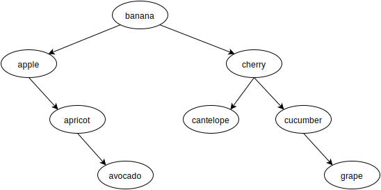

# Functional-Light JavaScript
# Chapter 7: List Operations

> If you can do something awesome, keep doing it repeatedly.

We've already seen several brief references earlier in the text to some utilities that we now want to take a very close look at, namely `map(..)`, `filter(..)`, and `reduce(..)`. In JavaScript, these utilities are typically used as methods on the array (aka, "list") prototype, so we would naturally refer to them as array or list operations.

Before we talk about the specific array methods, we want to examine conceptually what these operations are used for. It's equally important in this chapter that you understand *why* list operations are important as it is to understand *how* list operations work. Make sure you approach this chapter with that detail in mind.

The vast majority of common illustrations of these operations, both outside of this book and here in this chapter, depict trivial tasks performed on lists of values (like doubling each number in an array); it's a cheap and easy way to get the point across.

But don't just gloss over these simple examples and miss the deeper point. Some of the most important FP value in understanding list operations comes from being able to model a sequence of tasks -- a series of statements that wouldn't otherwise *look* like a list -- as a list operation instead of performing them individually.

This isn't just a trick to write more terse code. What we're after is to move from imperative to declarative style, to make the code patterns more readily recognizable and thus more readable.

# Map

// TODO

map: perform an operation across multiple values

map: transformation for each value

map: projection from one list to another

map: adapt a function from a single value to a data structure it doesn't know how to handle (map array, map tree, etc)

map: event handler for each value

# Filter

Imagine I bring an empty basket with me to the grocery store, and I visit the fruit section. There's a big display of fruit (apples, oranges, and bananas). I'm really hungry so I want to get as much fruit as they have available, but I really only prefer the round fruits (apples and oranges). So I sift through each fruit one-by-one, and I end up with my basket full of just the apples and oranges.

Let's say we call this process *filtering*. Would you more naturally describe my action as starting with an empty basket and **filtering in** (selecting, including) only the apples and oranges, or starting with the full display of fruits and **filtering out** (skipping, excluding) the bananas as my basket is filled with fruit?

Depending on your perspective, filter is either exclusionary or inclusionary. This conceptual mish-mash is unfortunate.

## Reduce

Reduce is a combination operation. Reduce is the swiss army knife of FP.

### Map As Reduce

// TODO

### Filter As Reduce

// TODO

## Advanced List Operations

Now that we feel comfortable with the foundational list operations `map(..)`, `filter(..)`, and `reduce(..)`, let's look at a few more-sophisticated operations you may find useful in various situations. These are all utilities you'll find in various FP libraries.

### Unique

Filtering a list to include only unique values, based on `indexOf(..)` searching ( which uses `===` strict equality comparision):

```js
function unique(arr) {
	return arr.filter( function firstFound(v,idx){
		return arr.indexOf( v ) == idx;
	} );
}

// or the ES6 => form
var unique =
	arr =>
		arr.filter(
			(v,idx) =>
				arr.indexOf( v ) == idx
		);
```

This technique works by observing that we should only include the first occurrence of an item from `arr` into the new list; when running left-to-right, this will only be true if its `idx` position is the same as the `indexOf(..)` found position.

Another way to implement `unique(..)` is to run through `arr` and include an item into a new (initially empty) list if that item cannot already be found in the new list. For that processing, we use `reduce(..)`:

```js
function unique(arr) {
	return arr.reduce( function firstFound(list,v){
		if (list.indexOf( v ) == -1) list.push( v );
		return list;
	}, [] );
}

// or the ES6 => form
var unique =
	arr =>
		arr.reduce(
			(list,v) =>
				list.indexOf( v ) == -1 ?
					( list.push( v ), list ) : list
		, [] );
```

**Note:** There are many other ways to implement this algorithm using more imperative approaches like loops, and many of them are likely "more efficient" performance-wise. However, the advantage of either of these presented approaches is that they use existing built-in list operations, which makes them easier to chain/compose alongside other list operations. We'll talk more about those concerns later in this chapter.

`unique(..)` nicely produces a new list with no duplicates:

```js
unique( [1,4,7,1,3,1,7,9,2,6,4,0,5,3] );
// [1, 4, 7, 3, 9, 2, 6, 0, 5]
```

### Flatten

From time to time, you may have (or produce through some other operations) an array that's not just a flat list of values, but with nested arrays, such as:

```js
[ [1, 2, 3], 4, 5, [6, [7, 8]] ]
```

What if you'd like to transform it into:

```js
[ 1, 2, 3, 4, 5, 6, 7, 8 ]
```

The operation we're looking for is typically called `flatten(..)`, and it could be implemented like this using our swiss army knife `reduce(..)`:

```js
function flatten(arr) {
	return arr.reduce( function reducer(list,v){
		return list.concat( Array.isArray( v ) ? flatten( v ) : v );
	}, [] );
}

// or the ES6 => form
var flatten =
	arr =>
		arr.reduce(
			(list,v) =>
				list.concat( Array.isArray( v ) ? flatten( v ) : v )
		, [] );
```

**Note:** This implementation choice relies on recursion to handle the nesting of lists. More on recursion in a later chapter.

To use `flatten(..)` with an array of arrays (of any nested depth):

```js
flatten( [[0,1],2,3,[4,[5,6,7],[8,[9,[10,[11,12],13]]]]] );
// [0, 1, 2, 3, 4, 5, 6, 7, 8, 9, 10, 11, 12, 13]
```

### Zip

So far, the list operations we've examined have operated on a single list. But some cases will need to process multiple lists. One well-known operation alternates selection of values from each of two input lists into sub-lists, called `zip(..)`:

```js
zip( [1,3,5,7,9], [2,4,6,8,10] );
// [ [ 1, 2 ], [ 3, 4 ], [ 5, 6 ], [ 7, 8 ], [ 9, 10 ] ]
```

Values `1` and `2` were selected into the sub-list `[1,2]`, then `3` and `4` into `[3,4]`, etc. The definition of `zip(..)` requires a value from each of the two lists. If the two lists are of different lengths, the selection of values will continue until the shorter list has been exhausted, with the extra values in the other list ignored.

An implementation of `zip(..)`:

```js
function zip(list1,list2) {
	var zipped = [];
	list1 = list1.slice();
	list2 = list2.slice();

	while (list1.length > 0 && list2.length > 0) {
		zipped.push( [ list1.shift(), list2.shift() ] );
	}

	return zipped;
}
```

The `list1.slice()` and `list2.slice()` calls ensure `zip(..)` is pure by not causing side effects with the received array references.

**Note:** There are some decidedly un-FP things going on in this implementation. There's an imperative `while`-loop and mutations of lists with both `shift()` and `push(..)`. Earlier in the book, I asserted that it's reasonable for pure functions to use impure behavior inside them (usually for performance), as long as the effects are fully self-contained. This implementation is safely pure.

### Merge

Merging two lists by interleaving values from each source looks like this:

```js
mergeLists( [1,3,5,7,9], [2,4,6,8,10] );
// [ 1, 2, 3, 4, 5, 6, 7, 8, 9, 10 ]
```

It may not be obvious, but this result seems similar to what we get if we compose `flatten(..)` and `zip(..)`:

```js
zip( [1,3,5,7,9], [2,4,6,8,10] );
// [ [ 1, 2 ], [ 3, 4 ], [ 5, 6 ], [ 7, 8 ], [ 9, 10 ] ]

flatten( [ [1,2], [3,4], [5,6], [7,8], [9,10] ] );
// [ 1, 2, 3, 4, 5, 6, 7, 8, 9, 10 ]

// composed:
flatten( zip( [1,3,5,7,9], [2,4,6,8,10] ) );
// [ 1, 2, 3, 4, 5, 6, 7, 8, 9, 10 ]
```

However, recall that `zip(..)` only selects values until the shorter of two lists is exhausted, ignoring the leftover values; merging two lists would most naturally retain those extra values. Also, `flatten(..)` works recursively on nested lists, but you might expect list-merging to only work shallowly, keeping nested lists.

So, let's define a `mergeLists(..)` that works more like we'd expect:

```js
function mergeLists(list1,list2) {
	var merged = [];
	list1 = list1.slice();
	list2 = list2.slice();

	while (list1.length > 0 || list2.length > 0) {
		if (list1.length > 0) {
			merged.push( list1.shift() );
		}
		if (list2.length > 0) {
			merged.push( list2.shift() );
		}
	}

	return merged;
}
```

**Note:** Various FP libraries don't define a `mergeLists(..)` but instead define a `merge(..)` that merges properties of two objects; the results of `merge(..)` will differ from our `mergeLists(..)`.

Alternatively, here's a couple of options to implement the list merging as a reducer:

```js
// via @rwaldron
var mergeReducer =
	(merged,v,idx) =>
		(merged.splice( idx * 2, 0, v ), merged);


// via @WebReflection
var mergeReducer =
	(merged,v,idx) =>
		merged
			.slice( 0, idx * 2 )
			.concat( v, merged.slice( idx * 2 ) );
```

And using it:

```js
[1,3,5,7,9]
.reduce( mergeReducer, [2,4,6,8,10] );
// [1,2,3,4,5,6,7,8,9,10]
```

**Tip:** We'll use the `mergeReducer(..)` trick later in the chapter.

## Method vs. Standalone

A common source of frustration for FPers in JavaScript is unifying their strategy for working with utilities when some of them are provided as standalone functions -- think about the various FP utilities we've derived in previous chapters -- and others are methods of the array prototype -- like the ones we've seen in this chapter.

The pain of this problem becomes more evident when you consider combining multiple operations:

```js
[1,2,3,4,5]
.filter( isOdd )
.map( double )
.reduce( sum, 0 );					// 18

// vs.

reduce(
	map(
		filter( [1,2,3,4,5], isOdd ),
		double
	),
	sum,
	0
);									// 18
```

Both API styles accomplish the same task, but they have very different ergonomics. Many FPers will prefer the latter to the former, but the former is unquestionably more common in JavaScript. One thing specifically that's disliked about the latter is the nesting of the calls. The preference for the method chain style -- typically called a fluent API style, as in jQuery and other tools -- is that it's compact/concise and it reads in declarative top-down order.

The visual order for that manual composition of the standalone style is neither strictly left-to-right (top-to-bottom) nor right-to-left (bottom-to-top); it's inner-to-outer, which harms the readability.

Automatic composition normalizes the reading order as right-to-left (bottom-to-top) for both styles. So, to explore the implications of the form differences, let's examine composition specifically; it seems like it should be straightforward, but it's a little awkward in both cases.

### Composing Method Chains

The array methods receive the implicit `this` argument, so despite their appearance, they can't be treated as unary; that makes composition more awkward. To cope, we'll first need a `this`-aware version of `partial(..)`:

```js
function partialThis(fn,...presetArgs) {
	return function partiallyApplied(...laterArgs){
		return fn.apply( this, [...presetArgs, ...laterArgs] );
	};
}

// or the ES6 => form
var partialThis =
	(fn,...presetArgs) =>
		function partiallyApplied(...laterArgs){
			return fn.apply( this, [...presetArgs, ...laterArgs] );
		};
```

We'll also need a version of `compose(..)` that calls each of the partially applied methods in the context of the chain -- the input value it's being "passed" (via implicit `this`) from the previous step:

```js
function composeChainedMethods(...fns) {
	return function composed(result){
		return fns.reduceRight( function reducer(result,fn){
			return fn.call( result );
		}, result );
	};
}

// or the ES6 => form
var composeChainedMethods =
	(...fns) =>
		result =>
			fns.reduceRight(
				(result,fn) =>
					fn.call( result )
				, result
			);
```

And using these two `this`-aware utilities together:

```js
composeChainedMethods(
   partialThis( [].reduce, sum, 0 ),
   partialThis( [].map, double ),
   partialThis( [].filter, isOdd )
)
( [1,2,3,4,5] );					// 18
```

**Note:** The three `[].XYZ`-style references are grabbing references to the generic `Array.prototype.*` methods without repeating `Array.prototype` each time; this is done by creating a throwaway `[]` empty array value to access a method reference. This is just a shorthand cheat for shorter code.

### Composing Standalone Utilities

Standalone `compose(..)`-style composition of these utilities doesn't need all the `this` contortions, which is its most favorable argument.

But standalone style suffers from its own awkwardness; the cascading array context is the first argument rather than the last, so we have to use right-partial application:

```js
compose(
	partialRight( reduce, sum, 0 )
	partialRight( map, double )
	partialRight( filter, isOdd )
)
( [1,2,3,4,5] );					// 18
```

However, if `filter(..)`, `map(..)`, and `reduce(..)` are alternately defined to receive the array last instead of first, and are curried, the composition flows a bit nicer:

```js
compose(
	reduce( sum )( 0 ),
	map( double ),
	filter( isOdd )
)
( [1,2,3,4,5] );					// 18
```

The cleanliness of this approach is in part why FPers prefer the standalone utility style instead of instance methods. But your mileage may vary.

### Adapting Methods To Standalones

If you prefer to work with only standalone utilities, you can straightforwardly define standalone adaptations of the array methods.

```js
function filter(arr,predicateFn) {
	return arr.filter( predicateFn );
}

function map(arr,mapperFn) {
	return arr.map( mapperFn );
}

function reduce(arr,reducerFn,initialValue) {
	return arr.reduce( reducerFn, initialValue );
}
```

You might have spotted the common pattern across these three; can we generate these standalone adaptations with a utility? Yes. While we're at it, let's swap the `arr` argument to the right and `curry(..)` the generated function, to make composition easier:

```js
function unmethodify(methodName,argCount) {
	return curry( function standalone(...args){
		var arr = args.pop();
		return arr[methodName]( ...args );
	}, argCount );
}

// or the ES6 => form
var unmethodify =
	(methodName,argCount) =>
		curry(
			(...args) => {
				var arr = args.pop();
				return arr[methodName]( ...args );
			}
			, argCount
		);
```

And to use this utility:

```js
var filter = unmethodify( "filter" );
var map = unmethodify( "map" );
var reduce = unmethodify( "reduce" );

compose(
	reduce( sum )( 0 ),
	map( double ),
	filter( isOdd )
)
( [1,2,3,4,5] );					// 18
```

### Adapting Standalones To Methods

If you prefer to work with only array methods, you have two choices. You can:

1. Extend the built-in `Array.prototype` with additional methods.
2. Adapt the standalone utility to work as a reducer function and pass it to the `reduce(..)` instance method.

**Don't do (1).** It's never a good idea to extend built-in natives like `Array.prototype` -- unless you define a subclass of `Array`, but that's beyond our discussion scope here. In an effort to discourage bad practices, we won't go any further into this approach.

Let's **focus on (2)** instead. Recall the `flatten(..)` standalone utility we defined earlier:

```js
function flatten(arr) {
	return arr.reduce( function reducer(list,v){
		return list.concat( Array.isArray( v ) ? flatten( v ) : v );
	}, [] );
}
```

Let's pull out the inner `reducer(..)` function as the standalone utility (and adapt it to work without the outer `flatten(..)`):

```js
function flattenReducer(list,v) {
	return list.concat(
		Array.isArray( v ) ? v.reduce( flattenReducer, [] ) : v
	);
}
```

Now, we can use this utility in a method chain via `reduce(..)`:

```js
[ [1, 2, 3], 4, 5, [6, [7, 8]] ]
.reduce( flattenReducer, [] )
// ..
```

## Looking For Lists

So far, most of the examples have been rather trivial, based on simple lists of numbers or strings. Let's now talk about where list operations can start to shine: modeling an imperative series of statements declaratively.

Consider this base example:

```js
var getSessionId = partial( prop, "sessId" );
var getUserId = partial( prop, "uId" );

var session, sessionId, user, userId, orders;

session = getCurrentSession();
if (session != null) sessionId = getSessionId( sessionId );
if (sessionId != null) user = lookupUser( sessionId );
if (user != null) userId = getUserId( user );
if (userId != null) orders = lookupOrders( userId );
if (orders != null) processOrders( orders );
```

First, let's observe that the five variable declarations and the running series of `if` conditionals guarding the function calls are effectively one big composition of these six calls `getCurrentSession()`, `getSessionId(..)`, `lookupUser(..)`, `getUserId(..)`, `lookupOrders(..)`, and `processOrders(..)`. Ideally, we'd like to get rid of all these variable declarations and imperative conditionals.

Unfortunately, the `compose(..)` / `pipe(..)` utilties we explored in Chapter 4 don't by themselves offer a convenient way to express the `!= null` conditionals in the composition. Let's define a utility to help:

```js
var guard =
	fn =>
		arg =>
			arg != null ? fn( arg ) : arg;
```

**Note:** We're going to use ES6 `=>` form for the rest of this refactoring, just to keep things concise.

This `guard(..)` utility lets us map the five conditional-guarded functions:

```js
[ getSessionId, lookupUser, getUserId, lookupOrders, processOrders ]
.map( guard )
```

The result of this mapping is an array of functions that are ready to compose (actually, pipe, in this listed order). We could spread this array to `pipe(..)`, but since we're already doing list operations, let's do it with a `reduce(..)`, using the session value from `getCurrentSession()` as the initial value:

```js
.reduce(
	(result,nextFn) => nextFn( result )
	, getCurrentSession()
)
```

Next, let's observe that `getSessionId(..)` and `getUserId(..)` can be expressed as a mapping from the respective values `"sessId"` and `"uId"`:

```js
[ "sessId", "uId" ].map( propName => partial( prop, propName ) )
```

But to use these, we'll need to interleave them with the other three functions (`lookupUser(..)`, `lookupOrders(..)`, and `processOrders(..)`) to get the array of five functions to guard / compose as discussed above.

To do the interleaving, we can model this as list merging. Recall `mergeReducer(..)` from earlier in the chapter:

```js
var mergeReducer =
	(merged,v,idx) =>
		(merged.splice( idx * 2, 0, v ), merged);
```

We can use `reduce(..)` (our swiss army knife, remember!?) to "insert" `lookupUser(..)` in the array between the generated `getSessionId(..)` and `getUserId(..)` functions, by merging two lists:

```js
.reduce( mergeReducer, [ lookupUser ] )
```

Then we'll concatenate `lookupOrders(..)` and `processOrders(..)` onto the end of the running functions array:

```js
.concat( lookupOrders, processOrders )
```

To review, the generated list of five functions is expressed as:

```js
[ "sessId", "uId" ].map( propName => partial( prop, propName ) )
.reduce( mergeReducer, [ lookupUser ] )
.concat( lookupOrders, processOrders )
```

Finally, to put it all together, take this list of functions and tack on the guarding and composition from earlier:

```js
[ "sessId", "uId" ].map( propName => partial( prop, propName ) )
.reduce( mergeReducer, [ lookupUser ] )
.concat( lookupOrders, processOrders )
.map( guard )
.reduce(
	(result,nextFn) => nextFn( result )
	, getCurrentSession()
);
```

Gone are all the imperative variable declarations and conditionals, and in their place we have clean and declarative list operations chained together.

If this version is harder for you read right now than the original, don't worry. The original is unquestionably the more common imperative form you're familiar with. Part of your evolution to become a functional programmer is to develop a recognition of FP patterns such as list operations. Over time, these will jump out of the code more readily as your sense of code readability shifts to declarative style.

Before we leave this topic, let's take a reality check: the example here is heavily contrived. Not all code segments will be straightforwardly modeled as list operations. The pragmatic take-away is to develop the instinct to look for these opportunities, but not get too hung up on code acrobatics; some improvement is better than none. Always step back and ask if you're **improving or harming** code readability.

## Fusion

Imagine this scenario:

```js
function removeInvalidChars(str) {
	return str.replace( /[^\w]*/g, "" );
}

function upper(str) {
	return str.toUpperCase();
}

function elide(str) {
	if (str.length > 10) return str.substr( 0, 7 ) + "...";
	return str;
}

var words = "Mr. Jones isn't responsible for this disaster!"
	.split( /\s/ );

words;
// [ "Mr.", "Jones", "isn't", "responsible", "for", "this", "disaster!" ]

words
.map( removeInvalidChars )
.map( upper )
.map( elide );
// [ "MR", "JONES", "ISNT", "RESPONS...", "FOR", "THIS", "DISASTER" ]
```

## Beyond Lists

So far we've been discussing operations in the context of the list (array) data structure; it's by far the most common scenario you encounter them. But in a more general sense, these operations can be performed against any collection of values.

Just as we said earlier that array's `map(..)` adapts a single-value operation to all its values, any data structure can provide a `map(..)` operation to do the same. Likewise, it can implement `filter(..)`, `reduce(..)`, or any other operation that makes sense for working with the data structure's values.

The important part to maintain in the spirit of FP is that these operators must behave according to value immutability, meaning that they must return a new data structure rather than mutating the existing one.

Let's illustrate with a well-known data structure: the binary tree. A binary tree is a node (just an object!) that has two references to other nodes (binary trees), typically referred to as *left* and *right* child trees. Each node holds one value of the overall data structure.

<p align="center">
	
</p>

For ease of illustration, we'll make our binary tree a binary search tree (BST). However, the operations we'll identify work the same for any regular non-BST binary tree.

**Note:** A binary search tree is a general binary tree with a special constraint on the relationship of values in the tree to each other. Each value of nodes on the left side of a tree is less than the value of the node at the root of that tree, which in turn is less than each value of nodes in the right side of the tree. The notion of "less than" is relative to the kind of data stored; it can be numerical for numbers, lexicographic for strings, etc. BSTs are useful because they make searching for a value in the tree straightforward and more efficient, using a recursive binary search algorithm.

To make a binary tree node object, let's use this factory function:

```js
function BinaryTree(value,parent,left,right) {
	return { value, parent, left, right };
}
```

For convenience, we make each node store the `left` and `right` child trees as well as a reference to its own `parent` node.

Let's now define a BST of names of common produce (fruits, vegetables):

```js
var banana = BinaryTree( "banana" );
var apple = banana.left = BinaryTree( "apple", banana );
var cherry = banana.right = BinaryTree( "cherry", banana );
var apricot = apple.right = BinaryTree( "apricot", apple );
var avocado = apricot.right = BinaryTree( "avocado", apricot );
var cantelope = cherry.left = BinaryTree( "cantelope", cherry );
var cucumber = cherry.right = BinaryTree( "cucumber", cherry );
var grape = cucumber.right = BinaryTree( "grape", cucumber );
```

In this particular tree structure, `banana` is the root node; this tree could have been set up with nodes in different locations, but still had a BST with the same traversal.

Our tree looks like:

<p align="center">
	
</p>

There are multiple ways to traverse a binary tree to process its values. If it's a BST (our's is!) and we do an *in-order* traversal -- always visit the left child tree first, then the node itself, then the right child tree -- we'll visit the values in ascending (sorted) order.

For convenience, let's define a `forEach(..)` method that visits a binary tree in the same manner as an array:

```js
// in-order traversal
BinaryTree.forEach = function forEach(node,visitFn){
	if (node) {
		if (node.left) {
			forEach( node.left, visitFn );
		}
		visitFn( node );
		if (node.right) {
			forEach( node.right, visitFn );
		}
	}
};
```

**Note:** Working with binary trees lends itself most naturally to recursive processing. Our `forEach(..)` utility recursively calls itself to process both the left and right child trees. We'll cover recursion in more detail in a later chapter, where we'll cover recursion in that chapter.

Use `forEach(..)` to print out values from the tree:

```js
BinaryTree.forEach( banana, function each(node){
	console.log( node.value );
} );
// apple apricot avocado banana cantelope cherry cucumber grape

// visit only `cherry`-rooted subtree
BinaryTree.forEach( cherry, function each(node){
	console.log( node.value );
} );
// cantelope cherry cucumber grape
```

To operate on our binary tree data structure using FP patterns, let's start by defining a `map(..)`:

```js
BinaryTree.map = function map(node,mapperFn) {
	if (node) {
		let newNode = mapperFn( node );
		newNode.parent = node.parent;
		newNode.left = node.left ? map( node.left, mapperFn ) : undefined;
		newNode.right = node.right ? map( node.right, mapperFn ): undefined;

		if (newNode.left) {
			newNode.left.parent = newNode;
		}
		if (newNode.right) {
			newNode.right.parent = newNode;
		}

		return newNode;
	}
};
```

You might have assumed we'd `map(..)` only the node `value` properties, but in general we might actually want to map the tree nodes themselves. So, the `mapperFn(..)` is passed the whole node being visited, and it expects to receive a new `BinaryTree(..)` node back, with the transformation applied. If you just return the same node, this operation will mutate your tree and quite possibly cause unexpected results!

Let's map our tree to a list of produce with all uppercase names:

```js
var BANANA = BinaryTree.map(
	banana,
	function upper(node){
		return BinaryTree( node.value.toUpperCase() );
	}
);

BinaryTree.forEach( BANANA, function each(node) {
	console.log( node.value );
} );
// APPLE APRICOT AVOCADO BANANA CANTELOPE CHERRY CUCUMBER GRAPE
```

`BANANA` is a different tree (with all different nodes) than `banana`, just like calling `map(..)` on an array returns a new array. Just like arrays of other objects/arrays, if `node.value` itself references some object/array, you'll also need to handle manually copying it in the mapper function if you want deeper immutability.

How about `reduce(..)`? Same basic process: do an in-order traversal of the tree nodes. One usage would be to `reduce(..)` our tree to an array of its values, which would be useful in further adapting other typical list operations. Or we can `reduce(..)` our tree to a string concatenation of all its produce names.

We'll mimic the behavior of the array `reduce(..)`, which makes passing the `initialValue` argument optional. This algorithm is a little trickier, but still manageable:

```js
BinaryTree.reduce = function reduce(node,reducerFn,initialValue) {
	if (node) {
		let result;

		if (arguments.length < 3) {
			if (node.left) {
				result = reduce( node.left, reducerFn );
			}
			else {
				return node.right ?
					reduce( node.right, reducerFn, node ) :
					node;
			}
		}
		else {
			result = node.left ?
				reduce( node.left, reducerFn, initialValue ) :
				initialValue;
		}

		result = reducerFn( result, node );
		result = node.right ?
			reduce( node.right, reducerFn, result ) :
			result;
		return result;
	}

	return initialValue;
};
```

Let's use `reduce(..)` to make our shopping list:

```js
BinaryTree.reduce(
	banana,
	function pick(result,node){
		return result.concat( node.value );
	},
	[]
);
// [ "apple", "apricot", "avocado", "banana", "cantelope"
//   "cherry", "cucumber", "grape" ]
```

Finally, let's consider `filter(..)` for our tree. This algorithm is trickiest so far because it effectively (not actually) involves removing nodes from the tree, which requires handling several corner cases. Don't get intimiated by the implementation, though. Just skip over it for now, if you prefer, and focus on how we use it instead.

```js
BinaryTree.filter = function filter(node,predicateFn) {
	if (node) {
		let newNode;
		let newLeft = node.left ?
			filter(node.left,predicateFn) :
			undefined;
		let newRight = node.right ?
			filter(node.right,predicateFn) :
			undefined;

		if (predicateFn( node )) {
			newNode = BinaryTree(
				node.value,
				node.parent,
				newLeft,
				newRight
			);
			if (newLeft) {
				newLeft.parent = newNode;
			}
			if (newRight) {
				newRight.parent = newNode;
			}
		}
		else {
			if (newLeft) {
				if (newRight) {
					newNode = BinaryTree(
						undefined,
						node.parent,
						newLeft,
						newRight
					);
					newLeft.parent = newRight.parent = newNode;

					if (newRight.left) {
						let minRightNode = newRight;
						while (minRightNode.left) {
							minRightNode = minRightNode.left;
						}

						newNode.value = minRightNode.value;

						if (minRightNode.right) {
							minRightNode.parent.left =
								minRightNode.right;
							minRightNode.right.parent =
								minRightNode.parent;
						}
						else {
							minRightNode.parent.left = undefined;
						}

						minRightNode.right =
							minRightNode.parent = undefined;
					}
					else {
						newNode.value = newRight.value;
						newNode.right = newRight.right;
						if (newRight.right) {
							newRight.right.parent = newNode;
						}
					}
				}
				else {
					return newLeft;
				}
			}
			else {
				return newRight;
			}
		}

		return newNode;
	}
};
```

The majority of this code listing is dedicated to handling the shifting of node parent/child references if a node is "removed" (filtered out) of the duplicated tree structure.

As an example to illustrate using `filter(..)`, let's narrow our produce tree down to only vegetables:

```js
var vegetables = [ "asparagus", "avocado", "brocolli", "carrot",
	"celery", "corn", "cucumber", "lettuce", "potato", "squash",
	"zucchini" ];

var whatToBuy = BinaryTree.filter(
	banana,
	function onlyVegetables(node){
		return vegetables.indexOf( node.value ) != -1;
	}
);

// shopping list
BinaryTree.reduce(
	whatToBuy,
	function pick(result,node){
		return result.concat( node.value );
	},
	[]
);
// [ "avocado", "cucumber" ]
```

You will likely use most of the list operations from this chapter in the context of simple list data structures. But now we've seen that the concepts apply to whatever data structures and operations you might need. That's a powerful expression of how FP can be widely applied to many different application scenarios!

## Summary

Three common and powerful list operations:

* `map(..)`: transforms values as it projects them to a new list.
* `filter(..)`: selects or excludes values as it projects them to a new list.
* `reduce(..)`: combines values in a list to produce some other (usually but not always non-list) value.

Fusion uses function composition techniques to consolidate multiple adjacent `map(..)` calls, `filter(..)` calls, or `reduce(..)` calls. This is mostly a performance optimization, but it also improves the declarative nature of your list operations.
