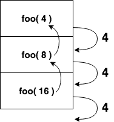
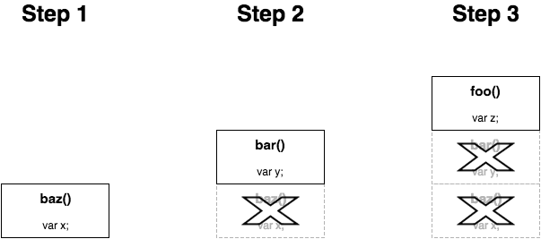

# Functional-Light JavaScript
# Chapter 8: Recursion

Did you have fun down our little closures/objects rabbit hole in the previous chapter? Welcome back!

On the next page, we're going to jump into the topic of recursion.

<hr>

*(rest of the page intentionally left blank)*

<p>&nbsp;</p>
<p>&nbsp;</p>
<p>&nbsp;</p>
<p>&nbsp;</p>
<p>&nbsp;</p>
<p>&nbsp;</p>
<p>&nbsp;</p>
<p>&nbsp;</p>
<p>&nbsp;</p>
<p>&nbsp;</p>
<p>&nbsp;</p>

<div style="page-break-after: always;"></div>

Let's talk about recursion. Before we dive in, consult the previous page for the formal definition.

Weak joke, I know. :)

Recursion is one of those programming techniques that most developers admit can be very powerful, but also most of them don't like to use it. I'd put it in the same category as regular expressions, in that sense. Powerful, but confusing, and thus seen as *not worth the effort*.

I'm a big fan of recursion, and you can, too! Unfortunately, many examples of recursion focus on trivial academic tasks like generating Fibonacci sequences. If you're needing those kinds of numbers in your program -- and let's face it, that's not very common! -- you'll likely miss the big picture.

As a matter of fact, recursion is one of the most important ways that FP developers avoid imperative looping and reassignment, by offloading the implementation details to the language and engine. When used properly, recursion is powerfully declarative for complex problems.

Sadly, recursion gets far less attention, especially in JS, than it should, in large part because of some very real performance (speed and memory) limitations. Our goal in this chapter is to dig deeper and find practical reasons that recursion should be front-and-center in our FP.

## Definition

Recursion is when a function calls itself, and that call does the same, and this cycle continues until a base condition is satisfied and the call loop unwinds.

**Warning:** If you don't ensure that a base condition is *eventually* met, recursion will run forever, and crash or lock up your program; the base condition is pretty important to get right!

But... that definition is too confusing in its written form. We can do better. Consider this recursive function:

```js
function foo(x) {
    if (x < 5) return x;
    return foo( x / 2 );
}
```

Let's visualize what happens with this function when we call `foo( 16 )`:

<p align="center">
    
</p>

In step 2, `x / 2` produces `8`, and that's passed in as the argument so a recursive `foo(..)` call. In step 3, same thing, `x / 2` produces `4`, and that's passed in as the argument to yet another `foo(..)` call. That part is hopefully fairly straightforward.

But where someone may often get tripped up is what happens in step 4. Once we've satisifed the base condition where `x` (value `4`) is `< 5`, we no longer make any more recursive calls, and just (effectively) do `return 4`. Specifically the dotted line return of `4` in this figure simplifies what's happening there, so let's dig into that last step and visualize it as these three sub-steps:

<p align="center">
    
</p>

Once the base condition is satisified, the returned value cascades back through all of the current function calls (and thus `return`s), eventually `return`ing the final result out.

Another way to visualize this recursion is by considering the function calls in the order they happen (commonly referred to as the call stack):

<p align="center">
    
</p>

More on the call stack later in this chapter.

Another recursion example:

```js
function isPrime(num,divisor = 2){
    if (num < 2 || (num > 2 && num % divisor == 0)) {
        return false;
    }
    if (divisor <= Math.sqrt( num )) {
        return isPrime( num, divisor + 1 );
    }

    return true;
}
```

This prime checking basically works by trying each integer from `2` up to the square root of the `num` being checked, to see if any of them divide evenly (`%` mod returning `0`) into the number. If any do, it's not a prime. Otherwise, it must be prime. The `divisor + 1` uses the recursion to iterate through each possible `divisor` value.

One of the most famous examples of recursion is calculating a Fibonacci number, where the sequence is defined as:

```
fib( 0 ): 0
fib( 1 ): 1
fib( n ):
    fib( n - 2 ) + fib( n - 1 )
```

**Note:** The first several numbers of this sequence are: 0, 1, 1, 2, 3, 5, 8, 13, 21, 34, ... Each number is the addition of the previous two numbers in the sequence.

The definition of fibonacci expressed directly in code:

```js
function fib(n) {
    if (n <= 1) return n;
    return fib( n - 2 ) + fib( n - 1 );
}
```

`fib(..)` calls itself recursively twice, which is typically referred to as binary recursion. We'll talk more about binary recursion later.

We'll use `fib(..)` variously throughout this chapter to illustrate ideas around recursion, but one downside to this particular form is that there's an awful lot of duplicated work. `fib(n-1)` and `fib(n-2)` don't share any of their work with each other, but overlap with each other almost entirely, over the entire integer space down to `0`.

We briefly touched on memoization in the "Performance Effects" section of Chapter 5. Here, memoization would allow the `fib(..)` of any given number to be computed only once, instead of being recomputed many times. We won't go further into that topic here, but that performance caveat is important to keep in mind with any algorithm, recursive or not.

### Mutual Recursion

When a function calls itself, specifically, this is referred to as direct recursion. That's what we saw in the previous section with `foo(..)`, `isPrime(..)`, and `fib(..)`. When two or more functions call each other in a recursive cycle, this is referred to as mutual recursion.

These two functions are mutually recursive:

```js
function isOdd(v) {
    if (v === 0) return false;
    return isEven( Math.abs( v ) - 1 );
}

function isEven(v) {
    if (v === 0) return true;
    return isOdd( Math.abs( v ) - 1 );
}
```

Yes, this is a silly way to calculate if a number is odd or even. But it illustrates the idea that certain algorithms can be defined in terms of mutual recursion.

Recall the binary recursive `fib(..)` from the previous section; we could instead have expressed it with mutual recursion:

```js
function fib_(n) {
    if (n == 1) return 1;
    else return fib( n - 2 );
}

function fib(n) {
    if (n == 0) return 0;
    else return fib( n - 1 ) + fib_( n );
}
```

**Note:** This mutually recursive `fib(..)` implementation is adapted from research presented in "Fibonacci Numbers Using Mutual Recursion" (https://www.researchgate.net/publication/246180510_Fibonacci_Numbers_Using_Mutual_Recursion).

While these mutual recursion examples shown are rather contrived, there are more complex use cases where mutual recursion can be very helpful. Counting the number of leaves in a tree data structure is one example, and recursive descent parsing (of source code, by a compiler) is another.

### Why Recursion?

Now that we've defined and illustrated recursion, we should examine why recursion is useful.

The most commonly cited reason that recursion fits the spirit of FP is because it trades (much of) the explicit tracking of state with implicit state on the call stack. Typically, recursion is most useful when the problem requires conditional branching and back-tracking, and managing that kind of state in a purely iterative environment can be quite tricky; at a minimum, the code is highly imperative and harder to read and verify. But tracking each level of branching as its own scope on the call stack often significantly cleans up the readability of the code.

Simple iterative algorithms can trivially be expressed as recursion:

```js
function sum(total,...nums) {
    for (let num of nums) {
        total = total + num;
    }

    return total;
}

// vs

function sum(num1,...nums) {
    if (nums.length == 0) return num1;
    return num1 + sum( ...nums );
}
```

It's not just that the `for`-loop is eliminated in favor of the call stack, but that the incremental partial sums (the intermittent state of `total`) are tracked implicitly across the `return`s of the call stack instead of reassigning `total` each iteration. FPers will often prefer to avoid reassignment of local variables where it's possible to avoid.

In a basic algorithm like this kind of summation, this difference is minor and nuanced. But the more sophisticated your algorithm, the more you will likely see the payoff of recursion instead of imperative state tracking.

## Declarative Recursion

Mathematicians use the **Σ** symbol as a placeholder to represent the summation of a list of numbers. The primary reason they do that is because it's more cumbersome (and less readable!) if they're working with more complex formulas and they have to write out the summation manually, like `1 + 3 + 5 + 7 + 9 + ..`. Using the notation is declarative math!

Recursion is declarative for algorithms in the same sense that **Σ** is declarative for mathematics. Recursion expresses that a problem solution exists, but doesn't necessarily require the reader of the code to understand how that solution works. Let's consider two approaches to finding the highest even number passed as an argument:

```js
function maxEven(...nums) {
    var maxNum = -Infinity;

    for (let num of nums) {
        if (num % 2 == 0 && num > maxNum) {
            maxNum = num;
        }
    }

    if (num !== -Infinity) {
        return maxNum;
    }
}
```

This implementation is not particulary intractable, but it's also not readily apparent what its nuances are. How obvious is it that `maxEven()`, `maxEven(1)`, and `maxEven(1,13)` all return `undefined`? Is it quickly clear why the final `if` statement is necessary?

Let's instead consider a recursive approach, to compare. We could notate the recursion this way:

```
maxEven( nums ):
    maxEven( nums.0, maxEven( ...nums.1 ) )
```

In other words, we can define the max-even of a list of numbers as the max-even of the first number compared to the max-even of the rest of the numbers. For example:

```
maxEven( 1, 10, 3, 2 ):
    maxEven( 1, maxEven( 10, maxEven( 3, maxEven( 2 ) ) )
```

To implement this recursive definition in JS, one approach is:

```js
function maxEven(num1,...restNums) {
    var maxRest = restNums.length > 0 ?
            maxEven( ...restNums ) :
            undefined;

    return (num1 % 2 != 0 || num1 < maxRest) ?
        maxRest :
        num1;
}
```

So what advantages does this approach have?

First, the signature is a little different than before. I intentionally called out `num1` as the first argument name, collecting the rest of the arguments into `restNums`. But why? We could just have collected them all into a single `nums` array and then referred to `nums[0]`.

This function signature is an intentional hint at the recursive definition. It reads like this:

```
maxEven( num1, ...restNums ):
    maxEven( num1, maxEven( ...restNums ) )
```

Do you see the symmetry between the signature and the recursive definition?

When we can make the recursive definition more apparent even in the function signature, we improve the declarativeness of the function. And if we can then mirror the recursive definition from the signature to the function body, it gets even better.

But I'd say the most obvious improvement is that the distraction of the imperative `for`-loop is suppressed. All the looping logic is abstracted into the recursive call stack, so that stuff doesn't clutter the code. We're free then to focus on the logic of finding a max-even by comparing two numbers at a time -- the important part anyway!

Mentally, what's happening is similar to when a mathematician uses a **Σ** summation in a larger equation. We're saying, "the max-even of the rest of the list is calculated by `maxEven(...restNums)`, so we'll just assume that part and move on."

Additionally, we reinforce that notion with the `restNums.length > 0` guard, because if there are no more numbers to consider, the natural result is that `maxRest` would have to be `undefined`. We don't need to devote any extra mental attention to that part of the reasoning. This base condition (no more numbers to consider) is clearly evident.

Next, we turn our attention to checking `num1` against `maxRest` -- the main logic of the algorithm is how to determine which of two numbers, if any, is a max-even. If `num1` is not even (`num1 % 2 != 0`), or it's less than `maxRest`, then `maxRest` *has* to be `return`ed, even if it's `undefined`. Otherwise, `num1` is the answer.

The case I'm making is that this reasoning while reading an implementation is more straightforward, with fewer nuances or noise to distract us, than the imperative approach; it's **more declarative** than the `for`-loop with `-Infinity` approach.

**Tip:** We should point out that another (likely better!) way to model this besides manual iteration or recursion would be with list operations like we discussed in Chapter 7. The list of numbers could first be `filter(..)`ed to include only evens, and then finding the max is a `reduce(..)` that simply compares two numbers and returns the bigger of the two. We only used this example to illustrate the more declarative nature of recursion over manual iteration.

### Binary Tree Recursion

Here's another recursion example: calculating the depth of a binary tree. In fact, almost every operation you'll do with trees is implemented most easily with recursion, because manually tracking the stack up and down is highly imperative and error prone.

The depth of a binary tree is the longest path down (either left or right) through the nodes of the tree. Another way to define that is recursively: the depth of a tree at any node is 1 (the current node) plus the greater of depths from either its left or right child trees:

```
depth( node ):
    1 + max( depth( node.left ), depth( node.right ) )
```

Translating that straightforwardly to a binary recursive function:

```js
function depth(node) {
    if (node) {
        let depthLeft = depth( node.left );
        let depthRight = depth( node.right );
        return 1 + max( depthLeft, depthRight );
    }

    return 0;
}
```

I'm not going to list out the imperative form of this algorithm, but trust me, it's a lot messier. This recursive approach is nicely and gracefully declarative. It follows the recursive definition of the algorithm very closely with very little distraction.

Not all problems are cleanly recursive. This is not some silver bullet that you should try to apply everywhere. But recursion can be very effective at evolving the expression of a problem from more imperative to more declarative.

## Stack

Let's revisit the `isOdd(..)` / `isEven(..)` recursion from earlier:

```js
function isOdd(v) {
    if (v === 0) return false;
    return isEven( Math.abs( v ) - 1 );
}

function isEven(v) {
    if (v === 0) return true;
    return isOdd( Math.abs( v ) - 1 );
}
```

In most browsers, if you try this you'll get an error:

```js
isOdd( 33333 );         // RangeError: Maximum call stack size exceeded
```

What's going on with this error? The engine throws this error because it's trying to protect your program from running the system out of memory. To explain that, we need to peek a little below the hood at what's going on in the JS engine when function calls happen.

Each function call sets aside a small chunk of memory called a stack frame. The stack frame holds certain important information about the current state of processing statements in a function, including the values in any variables. The reason this information needs to be stored in memory (in a stack frame) is because the function may call out to another function, which pauses the current function. When the other function finishes, the engine needs to resume the exact state from when it was paused.

When the second function call starts, it needs a stack frame as well, bringing the count to 2. If that function calls another, we need a third stack frame. And so on. The word "stack" speaks to the notion that each time a function is called from the previous one, the next frame is *stacked* on top. When a function call finishes, its frame is popped off the stack.

Consider this program:

```js
function foo() {
    var z = "foo!";
}

function bar() {
    var y = "bar!";
    foo();
}

function baz() {
    var x = "baz!";
    bar();
}

baz();
```

Visualizing this program's stack frame step by step:

<p align="center">
    
</p>

**Note:** If these functions didn't call each other, but were just called sequentially -- like `baz(); bar(); foo();`, where each one finishes before the next one starts -- the  frames won't stack up; each function call finishes and removes its frame from the stack before the next one is added.

OK, so a little bit of memory is needed for each function call. No big deal under most normal program conditions, right? But it quickly becomes a big deal once you introduce recursion. While you'd almost certainly never manually stack thousands (or even hundreds!) of calls of different functions together in one call stack, you'll easily see tens of thousands or more recursive calls stack up.

The `isOdd(..)` / `isEven(..)` pairing throws a `RangeError` because the engine steps in at an arbitrary limit when it thinks the call stack has grown too much and should be stopped. This is not likely a limit based on actual memory levels nearing zero, but rather a prediction by the engine that if this kind of program was left running, memory usage would be runaway. It is impossible to know or prove that a program will eventually stop, so the engine has to make an informed guess.

This limit is implementation dependent. The specification doesn't say anything about it at all, so it's not *required*. But practically all JS engines do have a limit, because having no limit would create an unstable device that's susceptible to poorly written or malicious code. Each engine in each different device environment is going to enforce its own limits, so there's no way to predict or guarantee how far we can run up the function call stack.

What this limit means to us as developers is that there's a practical limitation on the usefulness of recursion in solving problems on non-trivially sized data sets. In fact, I think this kind of limitation might be single biggest reason that recursion is a second-class citizen in the developer's toolbox. Regrettably, recursion is an after thought rather than a primary technique.

### Tail Calls

Recursion far predates JS, and so do these memory limitations. Back in the 1960s, developers were wanting to use recursion and running up against hard limits of device memory of their powerful computers that were far lower than we have on our watches today.

Fortunately, a powerful observation was made in those early days that still offers hope. The technique is called *tail calls*.

The idea is that if a call from function `baz()` to function `bar()` happens at the very end of function `baz()`'s execution -- referred to as a tail call -- the stack frame for `baz()` isn't needed anymore. That means that either the memory can be reclaimed, or even better, simply reused to handle function `bar()`'s execution. Visualizing:

<p align="center">
    
</p>

Tail calls are not really directly related to recursion, per se; this notion holds for any function call. But your manual non-recursion call stacks are unlikely to go beyond maybe 10 levels deep in most cases, so the chances of tail calls impacting your program's memory footprint are pretty low.

Tail calls really shine in the recursion case, because it means that a recursive stack could run "forever", and the only performance concern would be computation, not fixed memory limitations. Tail call recursion can run in `O(1)` fixed memory usage.

These sorts of techniques are often referred to as Tail Call Optimizations (TCO), but it's important to distinguish the ability to detect a tail call to run in fixed memory space, from the techniques that optimize this approach. Technically, tail calls themselves are not a performance optimization as most people would think, as they might actually run slower than normal calls. TCO is about optimizing tail calls to run more efficiently.

### Proper Tail Calls (PTC)

JavaScript has never required (nor forbidden) tail calls, until ES6. ES6 mandates recognition of tail calls, of a specific form referred to as Proper Tail Calls (PTC), and the guarantee that code in PTC form will run without unbounded stack memory growth. Practically speaking, this means we should not get `RangeError`s thrown if we adhere to PTC.

First, PTC in JavaScript requires strict mode. You should already be using strict mode, but if you aren't, this is yet another reason you should already be using strict mode. Did I mention, yet, you should already be using strict mode!?

Second, a *proper* tail call looks like this:

```js
return foo( .. );
```

In other words, the function call is the last thing to execute in the surrounding function, and whatever value it returns is explicitly `return`ed. In this way, JS can be absolutely guaranteed that the current stack frame won't be needed anymore.

These *are not* PTC:

```js
foo();
return;

// or

var x = foo( .. );
return x;

// or

return 1 + foo( .. );
```

**Note:** A JS engine, or a smart transpiler, *could* do some code reorganization to realize that `var x = foo(); return x;` is effectively the same as `return foo();`, which would then make it eligible as PTC. But that is not be required by the specification.

The `1 +` part is definitely processed *after* `foo(..)` finishes, so the stack frame has to be kept around.

However, this *is* PTC:

```js
return x ? foo( .. ) : bar( .. );
```

After the `x` condition is computed, either `foo(..)` or `bar(..)` will run, and in either case, the return value will be always be `return`ed back. That's PTC form.

Binary (or multiple) recursion -- as shown earlier, two (or more!) recursive calls made at each level -- can never be fully PTC as-is, because all the recursion has to be in tail call position to avoid the stack growth; at most, only one recursive call can appear in PTC position.

Earlier, we showed an example of refactoring from binary recursion to mutual recursion. It may be possible to achieve PTC from a multiple-recursive algorithm by splitting each into separate function calls, where each is expressed respectively in PTC form. However, that type of intricate refactoring is highly dependendent on the scenario, and beyond the scope of what we can cover in this text.

## Rearranging Recursion

If you want to use recursion but your problem set could grow enough eventually to exceed the stack limit of the JS engine, you're going to need to rearrange your recursive calls to take advantage of PTC (or avoid nested calls entirely). There are several refactoring strategies that can help, but there are of course tradeoffs to be aware of.

As a word of caution, always keep in mind that code readability is our overall most important goal. If recursion along with some combination of these following strategies results in harder to read/understand code, **don't use recursion**; find another more readable approach.

### Replacing The Stack

The main problem with recursion is its memory usage, keeping around the stack frames to track the state of a function call while it dispatches to the next recursive call iteration. If we can figure out how to rearrange our usage of recursion so that the stack frame doesn't need to be kept, then we can express recursion with PTC and take advantage of the JS engine's optimized handling of tail calls.

Let's recall the summation example from earlier:

```js
function sum(num1,...nums) {
    if (nums.length == 0) return num1;
    return num1 + sum( ...nums );
}
```

This isn't in PTC form because after the recursive call to `sum(...nums)` is finished, the `total` variable is added to that result. So, the stack frame has to be preserved to keep track of the `total` partial result while the rest of the recursion proceeds.

The key recognition point for this refactoring strategy is that we could remove our dependence on the stack by doing the addition *now* instead of *after*, and then forward-passing that partial result as an argument to the recursive call. In other words, instead of keeping `total` in the current function's stack frame, push it into the stack frame of the next recursive call; that frees up the current stack frame to be removed/reused.

To start, we could alter the signature our `sum(..)` function to have a new first parameter as the partial result:

```js
function sum(result,num1,...nums) {
    // ..
}
```

Now, we should pre-calculate the addition of `result` and `num1`, and pass that along:

```js
"use strict";

function sum(result,num1,...nums) {
    result = result + num1;
    if (nums.length == 0) return result;
    return sum( result, ...nums );
}
```

Now our `sum(..)` is in PTC form! Yay!

But the downside is we now have altered the signature of the function that makes using it stranger. The caller essentially has to pass `0` as the first argument ahead of the rest of the numbers they want to sum.

```js
sum( /*initialResult=*/0, 3, 1, 17, 94, 8 );        // 123
```

That's unfortunate.

Typically, people will solve this by naming their awkward-signature recursive function differently, then defining an interface function that hides the awkwardness:

```js
"use strict";

function sumRec(result,num1,...nums) {
    result = result + num1;
    if (nums.length == 0) return result;
    return sumRec( result, ...nums );
}

function sum(...nums) {
    return sumRec( /*initialResult=*/0, ...nums );
}

sum( 3, 1, 17, 94, 8 );                             // 123
```

That's better. Still unfortunate that we've now created multiple functions instead of just one. Sometimes you'll see developers "hide" the recursive function as an inner function, like this:

```js
"use strict";

function sum(...nums) {
    return sumRec( /*initialResult=*/0, ...nums );

    function sumRec(result,num1,...nums) {
        result = result + num1;
        if (nums.length == 0) return result;
        return sumRec( result, ...nums );
    }
}

sum( 3, 1, 17, 94, 8 );                             // 123
```

The downside here is that we'll recreate that inner `sumRec(..)` function each time the outer `sum(..)` is called. So, we can go back to them being side-by-side functions, but hide them both inside an IIFE, and expose just the one we want to:

```js
"use strict";

var sum = (function IIFE(){

    return function sum(...nums) {
        return sumRec( /*initialResult=*/0, ...nums );
    }

    function sumRec(result,num1,...nums) {
        result = result + num1;
        if (nums.length == 0) return result;
        return sumRec( result, ...nums );
    }

})();

sum( 3, 1, 17, 94, 8 );                             // 123
```

OK, we've got PTC and we've got a nice clean signature for our `sum(..)` that doesn't require the caller to know about our implementation details. Yay!

But... wow, our simple recursive function has a lot more noise now. The readability has definitely been reduced. That's unfortunate to say the least. Sometimes, that's just the best we can do.

Luckily, in some other cases, like the present one, there's a better way. Let's reset back to this version:

```js
"use strict";

function sum(result,num1,...nums) {
    result = result + num1;
    if (nums.length == 0) return result;
    return sum( result, ...nums );
}

sum( /*initialResult=*/0, 3, 1, 17, 94, 8 );        // 123
```

What you might observe is that `result` is a number just like `num1`, which means that we can always treat the first number in our list as our running total; that includes even the first call. All we need is to rename those params to make this clear:

```js
"use strict";

function sum(num1,num2,...nums) {
    num1 = num1 + num2;
    if (nums.length == 0) return num1;
    return sum( num1, ...nums );
}

sum( 3, 1, 17, 94, 8 );                             // 123
```

Awesome. That's much better, huh!? I think this pattern achieves a good balance between declarative/reasonable and performant.

Let's try refactoring with PTC once more, revisiting our earlier `maxEven(..)` (currently not PTC). We'll observe that similar to keeping the sum as the first argument, we can narrow the list of numbers one at a time, keeping the first argument as the highest even we've come across thus far.

For clarity, the algorithm strategy (similar to what we discussed earlier) we might use:

1. Start by comparing the first two numbers, `num1` and `num2`.
2. Is `num1` even, and is `num1` greater than `num2`? If so, keep `num1`.
3. If `num2` is even, keep it (store in `num1`).
4. Otherwise, fall back to `undefined` (store in `num1`).
5. If there are more `nums` to consider, recursively compare them to `num1`.
6. Finally, just return whatever value is left in `num1`.

Our code can follow these steps almost exactly:

```js
"use strict";

function maxEven(num1,num2,...nums) {
    num1 =
        (num1 % 2 == 0 && !(maxEven( num2 ) > num1)) ?
            num1 :
            (num2 % 2 == 0 ? num2 : undefined);

    return nums.length == 0 ?
        num1 :
        maxEven( num1, ...nums )
}
```

**Note:** The first `maxEven(..)` call is not in PTC position, but since it only passes in `num2`, it only recurses just that one level then returns right back out; this is only a trick to avoid repeating the `%` logic. As such, this call won't increase the growth of the recursive stack, any more than if that call was to an entirely different function. The second `maxEven(..)` call is the legitimate recursive call, and it is in fact in PTC position, meaning our stack won't grow as the recursion proceeds.

It should be repeated that this example is only to illustrate the approach to moving recursion to the PTC form to optimize the stack (memory) usage. The more direct way to express a max-even algorithm might indeed be a filtering of the `nums` list for evens first, followed then by a max bubbling or even a sort.

Refactoring recursion into PTC is admittedly a little intrusive on the simple declarative form, but it still gets the job done reasonably. Unfortunately, some kinds of recursion won't work well even with an interface function, so we'll need different strategies.

### Continuation Passing Style (CPS)

In JavaScript, the word *continuation* is often used to mean a function callback that specifies the next step(s) to execute after a certain function finishes its work. Organizing code so that each function receives another function to execute at its end, is referred to as Continuation Passing Style (CPS).

Some forms of recursion cannot practically be refactored to pure PTC, especially multiple recursion. Recall the `fib(..)` function earlier, and even the mutual recursion form we derived. In both cases, there are multiple recursive calls, which effectively defeats PTC memory optimizations.

However, you can perform the first recursive call, and wrap the subsequent recursive calls in a continuation function to pass into that first call. Even though this would mean ultimately many more functions will need to be executed in the stack, as long all of them, continuations included, are in PTC form, stack memory usage will not grow unbounded.

We could do this for `fib(..)`:

```js
"use strict";

function fib(n,cont = identity) {
    if (n <= 1) return cont( n );
    return fib(
        n - 2,
        n2 => fib(
            n - 1,
            n1 => cont( n2 + n1 )
        )
    );
}
```

Pay close attention to what's happening here. First, we default the `cont(..)` continuation function as our `identity(..)` utility from Chapter 3; remember, it simply returns whatever is passed to it.

Morever, not just one but two continuation functions are added to the mix. The first one receives the `n2` argument, which eventually receives the computation of the `fib(n-2)` value. The next inner continuation receives the `n1` argument, which eventually is the `fib(n-1)` value. Once both `n2` and `n1` values are known, they can be added together (`n2 + n1`), and that value is passed along to the next `cont(..)` continuation step.

Perhaps this will help mentally sort out what's going on: just like in the previous discussion when we passed partial results along instead of returning them back after the recursive stack, we're doing the same here, but each step gets wrapped in a continuation, which defers its computation. That trick allows us to perform multiple steps where each is in PTC form.

In static languages, CPS is often an opportunity for tail calls the compiler can automatically identify and rearrange recursive code to take advantage of. Unfortunately, that doesn't really apply to the nature of JS.

In JavaScript, you'd likely need to write the CPS form yourself. It's clunkier, for sure; the declarative notation-like form has certainly been obscured. But overall, this form is still more declarative than the `for`-loop imperative implementation.

**Warning:** One major caveat that should be noted is that in CPS, creating the extra inner continuation functions still consumes memory, but of a different sort. Instead of piling up stack frames, the closures just consume free memory (typically, from the heap). Engines don't seem to apply the `RangeError` limits in these cases, but that doesn't mean your memory usage is fixed in scale.

### Trampolines

Where CPS creates continuations and passes them along, another technique for alleviating memory pressure is called trampolines. In this style of code, CPS-like continuations are created, but instead of passed in, they are shallowly returned.

Instead of functions calling functions, the stack never goes beyond depth of one, because each function just returns the next function that should be called. A loop simply keeps running each returned function until there are no more functions to run.

One advantage with trampolines is you aren't limited to environments that support PTC; another is that each function call is regular, not PTC optimized, so it may run quicker.

Let's sketch out a `trampoline(..)` utility:

```js
function trampoline(fn) {
    return function trampolined(...args) {
        var result = fn( ...args );

        while (typeof result == "function") {
            result = result();
        }

        return result;
    };
}
```

As long as a function is returned, the loop keeps going, executing that function and capturing its return, then checking its type. Once a non-function comes back, the trampoline assumes the function calling is complete, and just gives back the value.

Because each continuation needs to return another continuation, we'll need to use the earlier trick of forward-passing the partial result as an argument. Here's how we could use this utility with our earlier example of summation of a list of numbers:

```js
var sum = trampoline(
    function sum(num1,num2,...nums) {
        num1 = num1 + num2;
        if (nums.length == 0) return num1;
        return () => sum( num1, ...nums );
    }
);

var xs = [];
for (let i=0; i<20000; i++) {
    xs.push( i );
}

sum( ...xs );                   // 199990000
```

The downside is that a trampoline requires you to wrap your recursive function in the trampoline driving function; moreover, just like CPS, closures are created for each continuation. However, unlike CPS, each continuation function returned runs and finishes right away, so the engine won't have to accumulate a growing amount of closure memory while the call stack depth of the problem is exhausted.

Beyond execution and memory performance, the advantage of trampolines over CPS is that they're less intrusive on the declarative recursion form, in that you don't have to change the function signature to receive a continuation function argument. Trampolines are not ideal, but they can be effective in your balancing act between imperative looping code and declarative recursion.

## Summary

Recursion is when a function recursively calls itself. Heh. A recursive definition for recursion. Get it!?

Direct recursion is a function that makes at least one call to itself, and it keeps dispatching to itself until it satisifies a base condition. Multiple recursion (like binary recursion) is when a function calls itself multiple times. Mutual recursion is when a two or more functions recursively loop by *mutually* calling each other.

The upside of recursion is that it's more declarative and thus typically more readable. The downside is usually performance, but more memory constraints even than execution speed.

Tail calls alleviate the memory pressure by reusing/discarding stack frames. JavaScript requires strict mode and proper tail calls (PTC) to take advantage of this "optimization". There are several techniques we can mix-n-match to refactor a non-PTC recursive function to PTC form, or at least avoid the memory constraints by flattening the stack.

Remember: recursion should be used to make code more readable. If you misuse or abuse recursion, the readability will end up worse than the imperative form. Don't do that!
