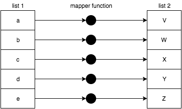
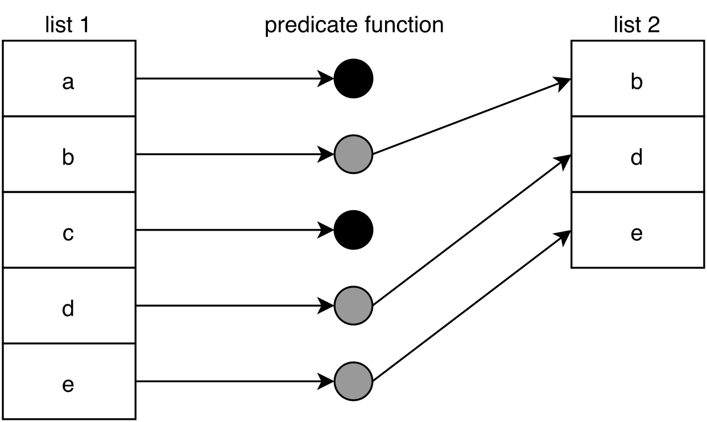
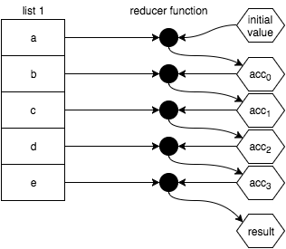
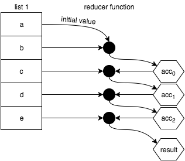
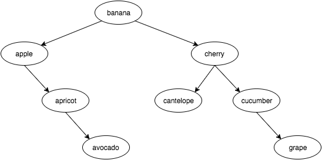

# Functional-Light JavaScript
# Chapter 9: List Operations

> If you can do something awesome, keep doing it repeatedly.

We've already seen several brief references earlier in the text to some utilities that we now want to take a very close look at, namely `map(..)`, `filter(..)`, and `reduce(..)`. In JavaScript, these utilities are typically used as methods on the array (aka, "list") prototype, so we would naturally refer to them as array or list operations.

Before we talk about the specific array methods, we want to examine conceptually what these operations are used for. It's equally important in this chapter that you understand *why* list operations are important as it is to understand *how* list operations work. Make sure you approach this chapter with that detail in mind.

The vast majority of common illustrations of these operations, both outside of this book and here in this chapter, depict trivial tasks performed on lists of values (like doubling each number in an array); it's a cheap and easy way to get the point across.

But don't just gloss over these simple examples and miss the deeper point. Some of the most important FP value in understanding list operations comes from being able to model a sequence of tasks -- a series of statements that wouldn't otherwise *look* like a list -- as a list operation instead of performing them individually.

This isn't just a trick to write more terse code. What we're after is to move from imperative to declarative style, to make the code patterns more readily recognizable and thus more readable.

But there's something **even more important to grasp**. With imperative code, each intermediate result in a set of calculations is stored in variable(s) through assignment. The more of these imperative patterns your code relies on, the harder it is to verify that there aren't mistakes -- in the logic, accidental mutation of values, or hidden side causes/effects lurking.

By chaining and/or composing list operations together, the intermediate results are tracked implicitly and largely protected from these hazards.

**Note:** More than previous chapters, to keep the many following code snippets as brief as possible, we'll rely heavily on the ES6 `=>` form. However, my advice on `=>` from Chapter 2 still applies for general coding.

## Non-FP List Processing

As a quick preamble to our discussion in this chapter, I want to call out a few operations which may seem related to JavaScript arrays and FP list operations, but which aren't. These operations will not be covered here, because they are not consistent with general FP best practices:

* `forEach(..)`
* `some(..)`
* `every(..)`

`forEach(..)` is an iteration helper, but it's designed for each function call to operate with side effects; you can probably guess why that's not an endorsed FP list operation for our discussion!

`some(..)` and `every(..)` do encourage the use of pure functions (specifically, predicate functions like `filter(..)` does), but they inevitably reduce a list to a `true` / `false` result, essentially like a search or matching. These two utilities don't really fit the mold of how we want to model our code with FP, so we're going to skip covering them here.

## Map

We'll start our exploration of FP list operations with one of the most basic and fundamental: `map(..)`.

A mapping is a transformation from one value to another value. For example, if you start with the number `2` and you multiply it by `3`, you have mapped it to `6`. It's important to note that we're not talking about mapping transformation as implying *in-place* mutation or reassignment; rather mapping transformation projects a new value from one location to the other.

In other words:

```js
var x = 2, y;

// transformation / projection
y = x * 3;

// mutation / reassignment
x = x * 3;
```

If we define a function for this multiplying by `3`, that function acts as a mapping (transformer) function:

```js
var multipleBy3 = v => v * 3;

var x = 2, y;

// transformation / projection
y = multiplyBy3( x );
```

We can naturally extend mapping from a single value transformation to a collection of values. `map(..)` is an operation that transforms all the values of a list as it projects them to a new list:

<p align="center">
    
</p>

To implement `map(..)`:

```js
function map(mapperFn,arr) {
    var newList = [];

    for (let [idx,v] of arr.entries()) {
        newList.push(
            mapperFn( v, idx, arr )
        );
    }

    return newList;
}
```

**Note:** The parameter order `mapperFn, arr` may feel backwards at first, but this convention is much more common in FP libraries because it makes these utilities easier to compose (with currying).

The `mapperFn(..)` is naturally passed the list item to map/transform, but also an `idx` and `arr`. We're doing that to keep consistency with the built-in array `map(..)`. These extra pieces of information can be very useful in some cases.

But in other cases, you may want to use a `mapperFn(..)` that only the list item should be passed to, because the extra arguments might change its behavior. In "All For One" in Chapter 3, we introduced `unary(..)`, which limits a function to only accept a single argument (no matter how many are passed).

Recall the example from Chapter 3 about limiting `parseInt(..)` to a single argument to be used safely as a `mapperFn(..)`:

```js
map( ["1","2","3"], unary( parseInt ) );
// [1,2,3]
```

JavaScript provides the `map(..)` utility built-in on arrays, making it very convenient to use as part of a chain of operations on a list.

**Note:** The JavaScript array prototype operations (`map(..)`, `filter(..)`, and `reduce(..)`) all accept an optional last argument to use for `this` binding of the function. As we discussed in "What's This?" in Chapter 2, `this`-based coding should generally be avoided wherever possible in terms of being consistent with the best practices of FP. As such, our example implementations in this chapter do not support such a `this`-binding feature.

Beyond the obvious numeric or string operations you could perform against a list of those respective value types, here's some other examples of mapping operations. We can use `map(..)` to transform a list of functions into a list of their return values:

```js
var one = () => 1;
var two = () => 2;
var three = () => 3;

[one,two,three].map( fn => fn() );
// [1,2,3]
```

Or we can first transform a list of functions by composing each of them with another function, and then execute them:

```js
var increment = v => ++v;
var decrement = v => --v;
var square = v => v * v;

var double = v => v * 2;

[increment,decrement,square]
.map( fn => compose( fn, double ) )
.map( fn => fn( 3 ) );
// [7,5,36]
```

Something interesting to observe about `map(..)`: we typically would assume that the list is processed left-to-right, but there's nothing about the concept of `map(..)` that really requires that. Each transformation is supposed to be independent of every other transformation.

Mapping in a general sense could even been parallelized in an environment that supports that, which for a large list could drastically improve performance. We don't see JavaScript actually doing that because there's nothing that requires you to pass a pure function as `mapperFn(..)`, even though you **really ought to**. If you were to pass an impure function and JS were to run different calls in different orders, it would quickly cause havoc.

Even though theoretically, individual mapping operations are independent, JS has to assume that they're not. That's a bummer.

### Sync vs Async

The list operations we're discussing in this chapter all operate synchronously on a list of values that are all already present; `map(..)` as conceived here is an eager operation. But another way of thinking about the mapper function is as an event handler which is invoked for each new value encountered in the list.

Imagine something fictional like this:

```js
var newArr = arr.map();

arr.addEventListener( "value", multiplyBy3 );
```

Now, any time a value is added to `arr`, the `multiplyBy3(..)` event handler -- mapper function -- is called with the value, and its transformation is added to `newArr`.

What we're hinting at is that arrays, and the array operations we perform on them, are the eager synchronous versions, whereas these same operations can also be modeled on a "lazy list" (aka, stream) that receives its values over time. We'll dive into this topic in Chapter 10.

### Mapping vs Eaching

Some advocate using `map(..)` as a general form of `forEach(..)`-iteration, where essentially the value received is passed through untouched, but then some side-effect can be performed:

```js
[1,2,3,4,5]
.map( function mapperFn(v){
    console.log( v );           // side effect!
    return v;
} )
..
```

The reason this technique can seem useful is that the `map(..)` returns the array so you can keep chaining more operations after it; the return value of `forEach(..)` is `undefined`. However, I think you should avoid using `map(..)` in this way, because it's a net confusion to use a core FP operation in a decidedly un-FP way.

You've heard the old addage about using the right tool for the right job, right? Hammer for a nail, screwdriver for a screw, etc. This is slightly different: it's use the right tool *in the right way*.

A hammer is meant to be swung in your hand; if you instead hold it in your mouth and try to hammer the nail, you're not gonna be very effective. `map(..)` is intended to map values, not create side effects.

### A Word: Functors

We've mostly tried to stay away from invented terminology in FP as much as possible in this book. We have used official terms at times, but mostly when we can derive some sense of meaning from them in regular everyday conversation.

I'm going to very briefly break that pattern and use a word that might be a little intimidating: functor. The reason I want to talk about functors here is because we now already understand what they do, and because that term is used heavily throughout the rest of FP literature; indeed, functors are foundational ideas in FP that come straight from the mathematical principles (category theory). You being at least familiar with and not scared by this term will be beneficial.

A functor is a value that has a utility for using an operator function on that value, which preserves composition.

If the value in question is compound, meaning it's comprised of individual values -- as is the case with arrays, for example! -- a functor uses the operator function on each individual value. Moreover, the functor utility creates a new compound value holding the results of all the individual operator function calls.

This is all a fancy way of describing what we just looked at with `map(..)`. The `map(..)` function takes its associated value (an array) and a mapping function (the operator function), and executes the mapping function for each individual value in the array. Finally, it returns a new array with all the newly mapped values in it.

Another example: a string functor would be a string plus a utility that executes some operator function across all the characters in the string, returning a new string with the processed letters. Consider this highly-contrived example:

```js
function uppercaseLetter(c) {
    var code = c.charCodeAt( 0 );

    // lowercase letter?
    if (code >= 97 && code <= 122) {
        // uppercase it!
        code = code - 32;
    }

    return String.fromCharCode( code );
}

function stringMap(mapperFn,str) {
    return [...str].map( mapperFn ).join( "" );
}

stringMap( uppercaseLetter, "Hello World!" );
// HELLO WORLD!
```

`stringMap(..)` allows a string to be a functor. You can define a mapping function for any data structure; as long as the utility follows these rules, the data structure is a functor.

## Filter

Imagine I bring an empty basket with me to the grocery store to visit the fruit section; there's a big display of fruit (apples, oranges, and bananas). I'm really hungry so I want to get as much fruit as they have available, but I really only prefer the round fruits (apples and oranges). So I sift through each fruit one-by-one, and I walk away with a basket full of just the apples and oranges.

Let's say we call this process *filtering*. Would you more naturally describe my shopping as starting with an empty basket and **filtering in** (selecting, including) only the apples and oranges, or starting with the full display of fruits and **filtering out** (skipping, excluding) the bananas as my basket is filled with fruit?

If you cook spaghetti in a pot of water, and then pour it into a strainer (aka filter) over the sink, are you filtering in the spaghetti or filtering out the water? If you put coffee grounds into a filter and make a cup of coffee, did you filter in the coffee into your cup, or filter out the coffee grounds?

Does your view of filtering depend on whether the stuff you want is "kept" in the filter or passes through the filter?

What about on airline / hotel websites, when you specify options to "filter your results"? Are you filtering in the results that match your criteria, or are you filtering out everything that doesn't match? Think carefully: this example might have a different semantic than the previous ones.

### Filtering Confusion

Depending on your perspective, filter is either exclusionary or inclusionary. This conceptual conflation is unfortunate.

I think the most common interpretation of filtering -- outside of programming, anyway -- is that you filter out unwanted stuff. Unfortunately, in programming, we have essentially flipped this semantic to be more like filtering in wanted stuff.

The `filter(..)` list operation takes a function to decide if each value in the original array should be in the new array or not. This function needs to return `true` if a value should make it, and `false` if it should be skipped. A function that returns `true` / `false` for this kind of decision making goes by the special name: predicate function.

If you think of `true` as being as a positive signal, the definition of `filter(..)` is that you are saying "keep" (to filter in) a value rather than saying "discard" (to filter out) a value.

To use `filter(..)` as an exclusionary action, you have to twist your brain to think of positively signaling an exclusion by returning `false`, and passively letting a value pass through by returning `true`.

The reason this semantic mismatch matters is because of how you will likely name the function used as `predicateFn(..)`, and what that means for the readability of code. We'll come back to this point shortly.

Here's how to visualize a `filter(..)` operation across a list of values:

<p align="center">
    
</p>

To implement `filter(..)`:

```js
function filter(predicateFn,arr) {
    var newList = [];

    for (let [idx,v] of arr.entries()) {
        if (predicateFn( v, idx, arr )) {
            newList.push( v );
        }
    }

    return newList;
}
```

Notice that just like `mapperFn(..)` before, `predicateFn(..)` is passed not only the value but also the `idx` and `arr`. Use `unary(..)` to limit its arguments as necessary.

Just as with `map(..)`, `filter(..)` is provided as a built-in utility on JS arrays.

Let's consider a predicate function like this:

```js
var whatToCallIt = v => v % 2 == 1;
```

This function uses `v % 2 == 1` to return `true` or `false`. The effect here is that an odd number will return `true`, and an even number will return `false`. So, what should we call this function? A natural name might be:

```js
var isOdd = v => v % 2 == 1;
```

Consider how you might use `isOdd(..)` with a simple value check somewhere in your code:

```js
var midIdx;

if (isOdd( list.length )) {
    midIdx = (list.length + 1) / 2;
}
else {
    midIdx = list.length / 2;
}
```

Makes sense, right? But, let's consider using it with the built-in array `filter(..)` to filter a list of values:

```js
[1,2,3,4,5].filter( isOdd );
// [1,3,5]
```

If you described the `[1,3,5]` result, would you say, "I filtered out the even numbers", or would you say "I filtered in the odd numbers"? I think the former is a more natural way of describing it. But the code reads the opposite. The code reads, almost literally, that we "filtered (in) each number that is odd".

I personally find this semantic confusing. There's no question there's plenty of precedent for experienced developers. But if you just start with a fresh slate, this expression of the logic seems kinda like not speaking without a double negative -- aka, speaking with a double negative.

We could make this easier by renaming the function from `isOdd(..)` to `isEven(..)`:

```js
var isEven = v => v % 2 == 1;

[1,2,3,4,5].filter( isEven );
// [1,3,5]
```

Yay! But that function makes no sense with its name, in that it returns `false` when it's even:

```js
isEven( 2 );        // false
```

Yuck.

Recall that in "No Points" in Chapter 3, we defined a `not(..)` operator that negates a predicate function. Consider:

```js
var isEven = not( isOdd );

isEven( 2 );        // true
```

But we can't use *this* `isEven(..)` with `filter(..)` the way it's currently defined, because our logic will be reversed; we'll end up with evens, not odds. We'd need to do:

```js
[1,2,3,4,5].filter( not( isEven ) );
// [1,3,5]
```

That defeats the whole purpose, though, so let's not do that. We're just going in circles.

### Filtering-Out & Filtering-In

To clear up all this confusion, let's define a `filterOut(..)` that actually **filters out** values by internally negating the predicate check. While we're at it, we'll alias `filterIn(..)` to the existing `filter(..)`:

```js
var filterIn = filter;

function filterOut(predicateFn,arr) {
    return filterIn( not( predicateFn ), arr );
}
```

Now we can use whichever filtering makes most sense at any point in our code:

```js
isOdd( 3 );                             // true
isEven( 2 );                            // true

filterIn( isOdd, [1,2,3,4,5] );         // [1,3,5]
filterOut( isEven, [1,2,3,4,5] );       // [1,3,5]
```

I think using `filterIn(..)` and `filterOut(..)` (known as `reject(..)` in Ramda) will make your code a lot more readable than just using `filter(..)` and leaving the semantics conflated and confusing for the reader.

## Reduce

While `map(..)` and `filter(..)` produce new lists, typically this third operator (`reduce(..)`) combines (aka "reduces") the values of a list down to a single finite (non-list) value, like a number or string. However, later in this chapter, we'll look at how you can push `reduce(..)` to use it in more advanced ways. `reduce(..)` is one of the most important FP tools; it's like a swiss army all-in-one knife with all its usefulness.

A combination/reduction is abstractly defined as taking two values and making them into one value. Some FP contexts refer to this as "folding", as if you're folding two values together into one value. That's a helpful visualization, I think.

Just like with mapping and filtering, the manner of the combination is entirely up to you, and generally dependent on the types of values in the list. For example, numbers will typically be combined through arithmetic, strings through concatenation, and functions through composition.

Sometimes a reduction will specify an `initialValue` and start its work by combining it with the first value in the list, cascading down through each of the rest of the values in the list. That looks like this:

<p align="center">
    
</p>

Alternately, you can omit the `initialValue` in which case the first value of the list will act in place of the `initialValue` and the combining will start with the second value in the list, like this:

<p align="center">
    
</p>

**Warning:** In JavaScript, if there's not at least one value in the reduction (either in the array or specified as `initialValue`), an error is thrown. Be careful not to omit the `initialValue` if the list for the reduction could possibly be empty under any circumstance.

The function you pass to `reduce(..)` to perform the reduction is typically called a reducer. A reducer has a different signature from the mapper and predicate functions we looked at earlier. Reducers primarily receive the current reduction result as well as the next value to reduce it with. The current result at each step of the reduction is often referred to as the accumulator.

For example, consider the steps involved in multiply-reducing the numbers `5`, `10`, and `15`, with an `initialValue` of `3`:

1. `3` * `5` = `15`
2. `15` * `10` = `150`
3. `150` * `15` = `2250`

Expressed in JavaScript using the built-in `reduce(..)` method on arrays:

```js
[5,10,15].reduce( (product,v) => product * v, 3 );
// 2250
```

But a standalone implementation of `reduce(..)` might look like this:

```js
function reduce(reducerFn,initialValue,arr) {
    var acc, startIdx;

    if (arguments.length == 3) {
        acc = initialValue;
        startIdx = 0;
    }
    else if (arr.length > 0) {
        acc = arr[0];
        startIdx = 1;
    }
    else {
        throw new Error( "Must provide at least one value." );
    }

    for (let idx = startIdx; idx < arr.length; idx++) {
        acc = reducerFn( acc, arr[idx], idx, arr );
    }

    return acc;
}
```

Just as with `map(..)` and `filter(..)`, the reducer function is also passed the lesser-common `idx` and `arr` arguments in case that's useful to the reduction. I would say I don't typically use these, but I guess it's nice to have them available.

Recall in Chapter 4, we discussed the `compose(..)` utility and showed an implementation with `reduce(..)`:

```js
function compose(...fns) {
    return function composed(result){
        return fns.reverse().reduce( function reducer(result,fn){
            return fn( result );
        }, result );
    };
}
```

To illustrate `reduce(..)`-based composition differently, consider a reducer that will compose functions left-to-right (like `pipe(..)` does), to use in an array chain:

```js
var pipeReducer = (composedFn,fn) => pipe( composedFn, fn );

var fn =
    [3,17,6,4]
    .map( v => n => v * n )
    .reduce( pipeReducer );

fn( 9 );            // 11016  (9 * 3 * 17 * 6 * 4)
fn( 10 );           // 12240  (10 * 3 * 17 * 6 * 4)
```

`pipeReducer(..)` is unfortunately not point-free (see "No Points" in Chapter 3), but we can't just pass `pipe(..)` as the reducer itself, because it's variadic; the extra arguments (`idx` and `arr`) that `reduce(..)` passes to its reducer function would be problematic.

Earlier we talked about using `unary(..)` to limit a `mapperFn(..)` or `predicateFn(..)` to just a single argument. It might be handy to have a `binary(..)` that does something similar but limits to two arguments, for a `reducerFn(..)` function:

```js
var binary =
    fn =>
        (arg1,arg2) =>
            fn( arg1, arg2 );
```

Using `binary(..)`, our previous example is a little cleaner:

```js
var pipeReducer = binary( pipe );

var fn =
    [3,17,6,4]
    .map( v => n => v * n )
    .reduce( pipeReducer );

fn( 9 );            // 11016  (9 * 3 * 17 * 6 * 4)
fn( 10 );           // 12240  (10 * 3 * 17 * 6 * 4)
```

Unlike `map(..)` and `filter(..)` whose order of passing through the array wouldn't actually matter, `reduce(..)` definitely uses left-to-right processing. If you want to reduce right-to-left, JavaScript provides a `reduceRight(..)`, with all other behaviors the same as `reduce(..)`:

```js
var hyphenate = (str,char) => `${str}-${char}`;

["a","b","c"].reduce( hyphenate );
// "a-b-c"

["a","b","c"].reduceRight( hyphenate );
// "c-b-a"
```

Where `reduce(..)` works left-to-right and thus acts naturally like `pipe(..)` in composing functions, `reduceRight(..)`'s right-to-left ordering is natural for performing a `compose(..)`-like operation. So, let's revisit `compose(..)` using `reduceRight(..)`:

```js
function compose(...fns) {
    return function composed(result){
        return fns.reduceRight( function reducer(result,fn){
            return fn( result );
        }, result );
    };
}
```

Now, we don't need to do `fns.reverse()`; we just reduce from the other direction!

### Map As Reduce

The `map(..)` operation is iterative in its nature, so it can also be represented as a reduction (`reduce(..)`). The trick is to realize that the `initialValue` of `reduce(..)` can be itself an (empty) array, in which case the result of a reduction can be another list!

```js
var double = v => v * 2;

[1,2,3,4,5].map( double );
// [2,4,6,8,10]

[1,2,3,4,5].reduce(
    (list,v) => (
        list.push( double( v ) ),
        list
    ), []
);
// [2,4,6,8,10]
```

**Note:** We're cheating with this reducer and allowing a side effect by allowing `list.push(..)` to mutate the list that was passed in. In general, that's not a good idea, obviously, but since we know the `[]` list is being created and passed in, it's less dangerous. You could be more formal -- yet less performant! -- by creating a new list with the val `concat(..)`d onto the end. We'll come back to this cheat in Appendix A.

Implementing `map(..)` with `reduce(..)` is not on its surface an obvious step or even an improvement. However, this ability will be a crucial recognition for more advanced techniques like those we'll cover in Appendix A "Transducing".

### Filter As Reduce

Just as `map(..)` can be done with `reduce(..)`, so can `filter(..)`:

```js
var isOdd = v => v % 2 == 1;

[1,2,3,4,5].filter( isOdd );
// [1,3,5]

[1,2,3,4,5].reduce(
    (list,v) => (
        isOdd( v ) ? list.push( v ) : undefined,
        list
    ), []
);
// [1,3,5]
```

**Note:** More impure reducer cheating here. Instead of `list.push(..)`, we could have done `list.concat(..)` and returned the new list. We'll come back to this cheat in Appendix A.

## Advanced List Operations

Now that we feel somewhat comfortable with the foundational list operations `map(..)`, `filter(..)`, and `reduce(..)`, let's look at a few more-sophisticated operations you may find useful in various situations. These are generally utilities you'll find in various FP libraries.

### Unique

Filtering a list to include only unique values, based on `indexOf(..)` searching ( which uses `===` strict equality comparision):

```js
var unique =
    arr =>
        arr.filter(
            (v,idx) =>
                arr.indexOf( v ) == idx
        );
```

This technique works by observing that we should only include the first occurrence of an item from `arr` into the new list; when running left-to-right, this will only be true if its `idx` position is the same as the `indexOf(..)` found position.

Another way to implement `unique(..)` is to run through `arr` and include an item into a new (initially empty) list if that item cannot already be found in the new list. For that processing, we use `reduce(..)`:

```js
var unique =
    arr =>
        arr.reduce(
            (list,v) =>
                list.indexOf( v ) == -1 ?
                    ( list.push( v ), list ) : list
        , [] );
```

**Note:** There are many other ways to implement this algorithm using more imperative approaches like loops, and many of them are likely "more efficient" performance-wise. However, the advantage of either of these presented approaches is that they use existing built-in list operations, which makes them easier to chain/compose alongside other list operations. We'll talk more about those concerns later in this chapter.

`unique(..)` nicely produces a new list with no duplicates:

```js
unique( [1,4,7,1,3,1,7,9,2,6,4,0,5,3] );
// [1, 4, 7, 3, 9, 2, 6, 0, 5]
```

### Flatten

From time to time, you may have (or produce through some other operations) an array that's not just a flat list of values, but with nested arrays, such as:

```js
[ [1, 2, 3], 4, 5, [6, [7, 8]] ]
```

What if you'd like to transform it into:

```js
[ 1, 2, 3, 4, 5, 6, 7, 8 ]
```

The operation we're looking for is typically called `flatten(..)`, and it could be implemented like this using our swiss army knife `reduce(..)`:

```js
var flatten =
    arr =>
        arr.reduce(
            (list,v) =>
                list.concat( Array.isArray( v ) ? flatten( v ) : v )
        , [] );
```

**Note:** This implementation choice relies on recursion as we saw in Chapter 8.

To use `flatten(..)` with an array of arrays (of any nested depth):

```js
flatten( [[0,1],2,3,[4,[5,6,7],[8,[9,[10,[11,12],13]]]]] );
// [0,1,2,3,4,5,6,7,8,9,10,11,12,13]
```

You might like to limit the recursive flattening to a certain depth. We can handle this by adding an optional `depth` limit argument to the implementaiton:

```js
var flatten =
    (arr,depth = Infinity) =>
        arr.reduce(
            (list,v) =>
                list.concat(
                    depth > 0 ?
                        (depth > 1 && Array.isArray( v ) ?
                            flatten( v, depth - 1 ) :
                            v
                        ) :
                        [v]
                )
        , [] );
```

Illustrating the results with different flattening depths:

```js
flatten( [[0,1],2,3,[4,[5,6,7],[8,[9,[10,[11,12],13]]]]], 0 );
// [[0,1],2,3,[4,[5,6,7],[8,[9,[10,[11,12],13]]]]]

flatten( [[0,1],2,3,[4,[5,6,7],[8,[9,[10,[11,12],13]]]]], 1 );
// [0,1,2,3,4,[5,6,7],[8,[9,[10,[11,12],13]]]]

flatten( [[0,1],2,3,[4,[5,6,7],[8,[9,[10,[11,12],13]]]]], 2 );
// [0,1,2,3,4,5,6,7,8,[9,[10,[11,12],13]]]

flatten( [[0,1],2,3,[4,[5,6,7],[8,[9,[10,[11,12],13]]]]], 3 );
// [0,1,2,3,4,5,6,7,8,9,[10,[11,12],13]]

flatten( [[0,1],2,3,[4,[5,6,7],[8,[9,[10,[11,12],13]]]]], 4 );
// [0,1,2,3,4,5,6,7,8,9,10,[11,12],13]

flatten( [[0,1],2,3,[4,[5,6,7],[8,[9,[10,[11,12],13]]]]], 5 );
// [0,1,2,3,4,5,6,7,8,9,10,11,12,13]
```

#### Mapping, Then Flattening

One of the most common usages of `flatten(..)` behavior is when you've mapped a list of elements where each transformed value from the original list is now itself a list of values. For example:

```js
var firstNames = [
    { name: "Jonathan", variations: [ "John", "Jon", "Jonny" ] },
    { name: "Stephanie", variations: [ "Steph", "Stephy" ] },
    { name: "Frederick", variations: [ "Fred", "Freddy" ] }
];

firstNames
.map( entry => [ entry.name, ...entry.variations ] );
// [ ["Jonathan","John","Jon","Jonny"], ["Stephanie","Steph","Stephy"],
//   ["Frederick","Fred","Freddy"] ]
```

The return value is an array of arrays, which might be more awkward to work with. If we want a single dimension list with all the names, we can then `flatten(..)` that result:

```js
flatten(
    firstNames
    .map( entry => [ entry.name, ...entry.variations ] )
);
// ["Jonathan","John","Jon","Jonny","Stephanie","Steph","Stephy","Frederick",
//  "Fred","Freddy"]
```

Besides being slightly more verbose, the disadvantage of doing the `map(..)` and `flatten(..)` as separate steps is primarily around performance; this approach processes the list twice, and creates an intermediate list that's then thrown away.

FP libraries typically define a `flatMap(..)` (often also called `chain(..)`) that does the mapping-then-flattening combined. For consistency and ease of composition (via currying), the `flatMap(..)` / `chain(..)` utility typically matches the `mapperFn, arr` parameter order that we saw earlier with the standalone `map(..)`, `filter(..)`, and `reduce(..)` utilities.

```js
flatMap( entry => [ entry.name, ...entry.variations ], firstNames );
// ["Jonathan","John","Jon","Jonny","Stephanie","Steph","Stephy","Frederick",
//  "Fred","Freddy"]
```

The naive implementation of `flatMap(..)` with both steps done separately:

```js
var flatMap =
    (mapperFn,arr) =>
        flatten( arr.map( mapperFn ), 1 );
```

**Note:** We use `1` for the flattening-depth because the typical definition of `flatMap(..)` is that the flattening is shallow on just the first level.

Since this approach still processes the list twice resulting in worse performance, we can combine the operations manually, using `reduce(..)`:

```js
var flatMap =
    (mapperFn,arr) =>
        arr.reduce(
            (list,v) =>
                // note: concat(..) used here since it automatically
                // flattens an array into the concatenation
                list.concat( mapperFn( v ) )
        , [] );
```

While there's some convenience and performance gained with a `flatMap(..)` utility, there may very well be times when you need other operations like `filter(..)`ing mixed in. If that's the case, doing the `map(..)` and `flatten(..)` separately might still be more appropriate.

### Zip

So far, the list operations we've examined have operated on a single list. But some cases will need to process multiple lists. One well-known operation alternates selection of values from each of two input lists into sub-lists, called `zip(..)`:

```js
zip( [1,3,5,7,9], [2,4,6,8,10] );
// [ [1,2], [3,4], [5,6], [7,8], [9,10] ]
```

Values `1` and `2` were selected into the sub-list `[1,2]`, then `3` and `4` into `[3,4]`, etc. The definition of `zip(..)` requires a value from each of the two lists. If the two lists are of different lengths, the selection of values will continue until the shorter list has been exhausted, with the extra values in the other list ignored.

An implementation of `zip(..)`:

```js
function zip(arr1,arr2) {
    var zipped = [];
    arr1 = arr1.slice();
    arr2 = arr2.slice();

    while (arr1.length > 0 && arr2.length > 0) {
        zipped.push( [ arr1.shift(), arr2.shift() ] );
    }

    return zipped;
}
```

The `arr1.slice()` and `arr2.slice()` calls ensure `zip(..)` is pure by not causing side effects on the received array references.

**Note:** There are some decidedly un-FP things going on in this implementation. There's an imperative `while`-loop and mutations of lists with both `shift()` and `push(..)`. Earlier in the book, I asserted that it's reasonable for pure functions to use impure behavior inside them (usually for performance), as long as the effects are fully self-contained. This implementation is safely pure.

### Merge

Merging two lists by interleaving values from each source looks like this:

```js
mergeLists( [1,3,5,7,9], [2,4,6,8,10] );
// [1,2,3,4,5,6,7,8,9,10]
```

It may not be obvious, but this result seems similar to what we get if we compose `flatten(..)` and `zip(..)`:

```js
zip( [1,3,5,7,9], [2,4,6,8,10] );
// [ [1,2], [3,4], [5,6], [7,8], [9,10] ]

flatten( [ [1,2], [3,4], [5,6], [7,8], [9,10] ] );
// [1,2,3,4,5,6,7,8,9,10]

// composed:
flatten( zip( [1,3,5,7,9], [2,4,6,8,10] ) );
// [1,2,3,4,5,6,7,8,9,10]
```

However, recall that `zip(..)` only selects values until the shorter of two lists is exhausted, ignoring the leftover values; merging two lists would most naturally retain those extra values. Also, `flatten(..)` works recursively on nested lists, but you might expect list-merging to only work shallowly, keeping nested lists.

So, let's define a `mergeLists(..)` that works more like we'd expect:

```js
function mergeLists(arr1,arr2) {
    var merged = [];
    arr1 = arr1.slice();
    arr2 = arr2.slice();

    while (arr1.length > 0 || arr2.length > 0) {
        if (arr1.length > 0) {
            merged.push( arr1.shift() );
        }
        if (arr2.length > 0) {
            merged.push( arr2.shift() );
        }
    }

    return merged;
}
```

**Note:** Various FP libraries don't define a `mergeLists(..)` but instead define a `merge(..)` that merges properties of two objects; the results of such a `merge(..)` will differ from our `mergeLists(..)`.

Alternatively, here's a couple of options to implement the list merging as a reducer:

```js
// via @rwaldron
var mergeReducer =
    (merged,v,idx) =>
        (merged.splice( idx * 2, 0, v ), merged);


// via @WebReflection
var mergeReducer =
    (merged,v,idx) =>
        merged
            .slice( 0, idx * 2 )
            .concat( v, merged.slice( idx * 2 ) );
```

And using a `mergeReducer(..)`:

```js
[1,3,5,7,9]
.reduce( mergeReducer, [2,4,6,8,10] );
// [1,2,3,4,5,6,7,8,9,10]
```

**Tip:** We'll use the `mergeReducer(..)` trick later in the chapter.

## Method vs. Standalone

A common source of frustration for FPers in JavaScript is unifying their strategy for working with utilities when some of them are provided as standalone functions -- think about the various FP utilities we've derived in previous chapters -- and others are methods of the array prototype -- like the ones we've seen in this chapter.

The pain of this problem becomes more evident when you consider combining multiple operations:

```js
[1,2,3,4,5]
.filter( isOdd )
.map( double )
.reduce( sum, 0 );                  // 18

// vs.

reduce(
    map(
        filter( [1,2,3,4,5], isOdd ),
        double
    ),
    sum,
    0
);                                  // 18
```

Both API styles accomplish the same task, but they have very different ergonomics. Many FPers will prefer the latter to the former, but the former is unquestionably more common in JavaScript. One thing specifically that's disliked about the latter is the nesting of the calls. The preference for the method chain style -- typically called a fluent API style, as in jQuery and other tools -- is that it's compact/concise and it reads in declarative top-down order.

The visual order for that manual composition of the standalone style is neither strictly left-to-right (top-to-bottom) nor right-to-left (bottom-to-top); it's inner-to-outer, which harms the readability.

Automatic composition normalizes the reading order as right-to-left (bottom-to-top) for both styles. So, to explore the implications of the style differences, let's examine composition specifically; it seems like it should be straightforward, but it's a little awkward in both cases.

### Composing Method Chains

The array methods receive the implicit `this` argument, so despite their appearance, they can't be treated as unary; that makes composition more awkward. To cope, we'll first need a `this`-aware version of `partial(..)`:

```js
var partialThis =
    (fn,...presetArgs) =>
        // intentionally `function` to allow `this`-binding
        function partiallyApplied(...laterArgs){
            return fn.apply( this, [...presetArgs, ...laterArgs] );
        };
```

We'll also need a version of `compose(..)` that calls each of the partially applied methods in the context of the chain -- the input value it's being "passed" (via implicit `this`) from the previous step:

```js
var composeChainedMethods =
    (...fns) =>
        result =>
            fns.reduceRight(
                (result,fn) =>
                    fn.call( result )
                , result
            );
```

And using these two `this`-aware utilities together:

```js
composeChainedMethods(
   partialThis( Array.prototype.reduce, sum, 0 ),
   partialThis( Array.prototype.map, double ),
   partialThis( Array.prototype.filter, isOdd )
)
( [1,2,3,4,5] );                    // 18
```

**Note:** The three `Array.prototype.XXX`-style references are grabbing references to the built-in `Array.prototype.*` methods so that we can reuse them with our own arrays.

### Composing Standalone Utilities

Standalone `compose(..)`-style composition of these utilities doesn't need all the `this` contortions, which is its most favorable argument. For example, we could define standalones as:

```js
var filter = (arr,predicateFn) => arr.filter( predicateFn );

var map = (arr,mapperFn) => arr.map( mapperFn );

var reduce = (arr,reducerFn,initialValue) =>
    arr.reduce( reducerFn, initialValue );
```

But this particular standalone approach, with the `arr` as the first parameter, suffers from its own awkwardness; the cascading array context is the first argument rather than the last, so we have to use right-partial application to compose them:

```js
compose(
    partialRight( reduce, sum, 0 ),
    partialRight( map, double ),
    partialRight( filter, isOdd )
)
( [1,2,3,4,5] );                    // 18
```

That's why FP libraries typically define `filter(..)`, `map(..)`, and `reduce(..)` to instead receive the array last, not first. They also typically automatically curry the utilities:

```js
var filter = curry(
    (predicateFn,arr) =>
        arr.filter( predicateFn )
);

var map = curry(
    (mapperFn,arr) =>
        arr.map( mapperFn )
);

var reduce = curry(
    (reducerFn,initialValue,arr) =>
        arr.reduce( reducerFn, initialValue )
);
```

Working with the utilities defined in this way, the composition flow is a bit nicer:

```js
compose(
    reduce( sum )( 0 ),
    map( double ),
    filter( isOdd )
)
( [1,2,3,4,5] );                    // 18
```

The cleanliness of this approach is in part why FPers prefer the standalone utility style instead of instance methods. But your mileage may vary.

### Adapting Methods To Standalones

In the previous definition of `filter(..)` / `map(..)` / `reduce(..)`, you might have spotted the common pattern across all three: they all dispatch to the corresponding native array method. So, can we generate these standalone adaptations with a utility? Yes! Let's make a utility called `unboundMethod(..)` to do just that:

```js
var unboundMethod =
    (methodName,argCount = 2) =>
        curry(
            (...args) => {
                var obj = args.pop();
                return obj[methodName]( ...args );
            },
            argCount
        );
```

And to use this utility:

```js
var filter = unboundMethod( "filter", 2 );
var map = unboundMethod( "map", 2 );
var reduce = unboundMethod( "reduce", 3 );

compose(
    reduce( sum )( 0 ),
    map( double ),
    filter( isOdd )
)
( [1,2,3,4,5] );                    // 18
```

**Note:** `unboundMethod(..)` is called `invoker(..)` in Ramda.

### Adapting Standalones To Methods

If you prefer to work with only array methods (fluent chain style), you have two choices. You can:

1. Extend the built-in `Array.prototype` with additional methods.
2. Adapt a standalone utility to work as a reducer function and pass it to the `reduce(..)` instance method.

**Don't do (1).** It's never a good idea to extend built-in natives like `Array.prototype` -- unless you define a subclass of `Array`, but that's beyond our discussion scope here. In an effort to discourage bad practices, we won't go any further into this approach.

Let's **focus on (2)** instead. To illustrate this point, we'll convert the recursive `flatten(..)` standalone utility from earlier:

```js
var flatten =
    arr =>
        arr.reduce(
            (list,v) =>
                // note: concat(..) used here since it automatically
                // flattens an array into the concatenation
                list.concat( Array.isArray( v ) ? flatten( v ) : v )
        , [] );
```

Let's pull out the inner `reducer(..)` function as the standalone utility (and adapt it to work without the outer `flatten(..)`):

```js
// intentionally a function to allow recursion by name
function flattenReducer(list,v) {
    // note: concat(..) used here since it automatically
    // flattens an array into the concatenation
    return list.concat(
        Array.isArray( v ) ? v.reduce( flattenReducer, [] ) : v
    );
}
```

Now, we can use this utility in an array method chain via `reduce(..)`:

```js
[ [1, 2, 3], 4, 5, [6, [7, 8]] ]
.reduce( flattenReducer, [] )
// ..
```

## Looking For Lists

So far, most of the examples have been rather trivial, based on simple lists of numbers or strings. Let's now talk about where list operations can start to shine: modeling an imperative series of statements declaratively.

Consider this base example:

```js
var getSessionId = partial( prop, "sessId" );
var getUserId = partial( prop, "uId" );

var session, sessionId, user, userId, orders;

session = getCurrentSession();
if (session != null) sessionId = getSessionId( session );
if (sessionId != null) user = lookupUser( sessionId );
if (user != null) userId = getUserId( user );
if (userId != null) orders = lookupOrders( userId );
if (orders != null) processOrders( orders );
```

First, let's observe that the five variable declarations and the running series of `if` conditionals guarding the function calls are effectively one big composition of these six calls `getCurrentSession()`, `getSessionId(..)`, `lookupUser(..)`, `getUserId(..)`, `lookupOrders(..)`, and `processOrders(..)`. Ideally, we'd like to get rid of all these variable declarations and imperative conditionals.

Unfortunately, the `compose(..)` / `pipe(..)` utilties we explored in Chapter 4 don't by themselves offer a convenient way to express the `!= null` conditionals in the composition. Let's define a utility to help:

```js
var guard =
    fn =>
        arg =>
            arg != null ? fn( arg ) : arg;
```

This `guard(..)` utility lets us map the five conditional-guarded functions:

```js
[ getSessionId, lookupUser, getUserId, lookupOrders, processOrders ]
.map( guard )
```

The result of this mapping is an array of functions that are ready to compose (actually, pipe, in this listed order). We could spread this array to `pipe(..)`, but since we're already doing list operations, let's do it with a `reduce(..)`, using the session value from `getCurrentSession()` as the initial value:

```js
.reduce(
    (result,nextFn) => nextFn( result )
    , getCurrentSession()
)
```

Next, let's observe that `getSessionId(..)` and `getUserId(..)` can be expressed as a mapping from the respective values `"sessId"` and `"uId"`:

```js
[ "sessId", "uId" ].map( propName => partial( prop, propName ) )
```

But to use these, we'll need to interleave them with the other three functions (`lookupUser(..)`, `lookupOrders(..)`, and `processOrders(..)`) to get the array of five functions to guard / compose as discussed above.

To do the interleaving, we can model this as list merging. Recall `mergeReducer(..)` from earlier in the chapter:

```js
var mergeReducer =
    (merged,v,idx) =>
        (merged.splice( idx * 2, 0, v ), merged);
```

We can use `reduce(..)` (our swiss army knife, remember!?) to "insert" `lookupUser(..)` in the array between the generated `getSessionId(..)` and `getUserId(..)` functions, by merging two lists:

```js
.reduce( mergeReducer, [ lookupUser ] )
```

Then we'll concatenate `lookupOrders(..)` and `processOrders(..)` onto the end of the running functions array:

```js
.concat( lookupOrders, processOrders )
```

To review, the generated list of five functions is expressed as:

```js
[ "sessId", "uId" ].map( propName => partial( prop, propName ) )
.reduce( mergeReducer, [ lookupUser ] )
.concat( lookupOrders, processOrders )
```

Finally, to put it all together, take this list of functions and tack on the guarding and composition from earlier:

```js
[ "sessId", "uId" ].map( propName => partial( prop, propName ) )
.reduce( mergeReducer, [ lookupUser ] )
.concat( lookupOrders, processOrders )
.map( guard )
.reduce(
    (result,nextFn) => nextFn( result )
    , getCurrentSession()
);
```

Gone are all the imperative variable declarations and conditionals, and in their place we have clean and declarative list operations chained together.

I know this version is likely harder for most readers to understand right now than the original. Don't worry, that's natural. The original imperative form is one you're probably much more familiar with.

Part of your evolution to become a functional programmer is to develop a recognition of FP patterns such as list operations, and that takes lots of exposure and practice. Over time, these will jump out of the code more readily as your sense of code readability shifts to declarative style.

Before we leave this topic, let's take a reality check: the example here is heavily contrived. Not all code segments will be straightforwardly modeled as list operations. The pragmatic take-away is to develop the instinct to look for these opportunities, but not get too hung up on code acrobatics; some improvement is better than none. Always step back and ask if you're **improving or harming** code readability.

## Fusion

As you roll FP list operations into more of your thinking about code, you'll likely start seeing very quickly chains that combine behavior like:

```js
..
.filter(..)
.map(..)
.reduce(..);
```

And more often than not, you're also probably going to end up with chains with multiple adjacent instances of each operation, like:

```js
someList
.filter(..)
.filter(..)
.map(..)
.map(..)
.map(..)
.reduce(..);
```

The good news is the chain-style is declarative and it's easy to read the specific steps that will happen, in order. The downside is that each of these operations loops over the entire list, meaning performance can suffer unnecessarily, especially if the list is longer.

With the alternate standalone style, you might see code like this:

```js
map(
    fn3,
    map(
        fn2,
        map( fn1, someList )
    )
);
```

With this style, the operations are listed from bottom-to-top, and we still loop over the list 3 times.

Fusion deals with combining adjacent operators to reduce the number of times the list is iterated over. We'll focus here on collapsing adjacent `map(..)`s as it's the most straightforward to explain.

Imagine this scenario:

```js
var removeInvalidChars = str => str.replace( /[^\w]*/g, "" );

var upper = str => str.toUpperCase();

var elide = str =>
    str.length > 10 ?
        str.substr( 0, 7 ) + "..." :
        str;

var words = "Mr. Jones isn't responsible for this disaster!"
    .split( /\s/ );

words;
// ["Mr.","Jones","isn't","responsible","for","this","disaster!"]

words
.map( removeInvalidChars )
.map( upper )
.map( elide );
// ["MR","JONES","ISNT","RESPONS...","FOR","THIS","DISASTER"]
```

Think about each value that goes through this flow of transformations. The first value in the `words` list starts out as `"Mr."`, becomes `"Mr"`, then `"MR"`, and then passes through `elide(..)` unchanged. Another piece of data flows: `"responsible"` -> `"responsible"` -> `"RESPONSIBLE"` -> `"RESPONS..."`.

In other words, you could think of these data transformations like this:

```js
elide( upper( removeInvalidChars( "Mr." ) ) );
// "MR"

elide( upper( removeInvalidChars( "responsible" ) ) );
// "RESPONS..."
```

Did you catch the point? We can express the three separate steps of the adjacent `map(..)` calls as a composition of the transformers, since they are all unary functions and each returns the value that's suitable as input to the next. We can fuse the mapper functions using `compose(..)`, and then pass the composed function to a single `map(..)` call:

```js
words
.map(
    compose( elide, upper, removeInvalidChars )
);
// ["MR","JONES","ISNT","RESPONS...","FOR","THIS","DISASTER"]
```

This is another case where `pipe(..)` can be a more convenient form of composition, for its ordering readability:

```js
words
.map(
    pipe( removeInvalidChars, upper, elide )
);
// ["MR","JONES","ISNT","RESPONS...","FOR","THIS","DISASTER"]
```

What about fusing two or more `filter(..)` predicate functions? Typically treated as unary functions, they seem suitable for composition. But the wrinkle is they each return a different kind of value (`boolean`) than the next one would want as input. Fusing adjacent `reduce(..)` calls is also possible, but reducers are not unary so that's a bit more challenging; we need more sophisticated tricks to pull this kind of fusion off. We'll cover these advanced techniques in Appendix A "Transducing".

## Beyond Lists

So far we've been discussing operations in the context of the list (array) data structure; it's by far the most common scenario you encounter them. But in a more general sense, these operations can be performed against any collection of values.

Just as we said earlier that array's `map(..)` adapts a single-value operation to all its values, any data structure can provide a `map(..)` operation to do the same. Likewise, it can implement `filter(..)`, `reduce(..)`, or any other operation that makes sense for working with the data structure's values.

The important part to maintain in the spirit of FP is that these operators must behave according to value immutability, meaning that they must return a new data structure rather than mutating the existing one.

Let's illustrate with a well-known data structure: the binary tree. A binary tree is a node (just an object!) that has at most two references to other nodes (themselves binary trees), typically referred to as *left* and *right* child trees. Each node in the tree holds one value of the overall data structure.

<p align="center">
    
</p>

For ease of illustration, we'll make our binary tree a binary search tree (BST). However, the operations we'll identify work the same for any regular non-BST binary tree.

**Note:** A binary search tree is a general binary tree with a special constraint on the relationship of values in the tree to each other. Each value of nodes on the left side of a tree is less than the value of the node at the root of that tree, which in turn is less than each value of nodes in the right side of the tree. The notion of "less than" is relative to the kind of data stored; it can be numerical for numbers, lexicographic for strings, etc. BSTs by definition must remain balanced, which makes searching for a value in the tree more efficient, using a recursive binary search algorithm.

To make a binary tree node object, let's use this factory function:

```js
var BinaryTree =
    (value,parent,left,right) => ({ value, parent, left, right });
```

For convenience, we make each node store the `left` and `right` child trees as well as a reference to its own `parent` node.

Let's now define a BST of names of common produce (fruits, vegetables):

```js
var banana = BinaryTree( "banana" );
var apple = banana.left = BinaryTree( "apple", banana );
var cherry = banana.right = BinaryTree( "cherry", banana );
var apricot = apple.right = BinaryTree( "apricot", apple );
var avocado = apricot.right = BinaryTree( "avocado", apricot );
var cantelope = cherry.left = BinaryTree( "cantelope", cherry );
var cucumber = cherry.right = BinaryTree( "cucumber", cherry );
var grape = cucumber.right = BinaryTree( "grape", cucumber );
```

In this particular tree structure, `banana` is the root node; this tree could have been set up with nodes in different locations, but still had a BST with the same traversal.

Our tree looks like:

<p align="center">
    
</p>

There are multiple ways to traverse a binary tree to process its values. If it's a BST (our's is!) and we do an *in-order* traversal -- always visit the left child tree first, then the node itself, then the right child tree -- we'll visit the values in ascending (sorted) order.

Since you can't just easily `console.log(..)` a binary tree like you can with an array, let's first define a convenience method, mostly to use for printing. `forEach(..)` will visit the nodes of a binary tree in the same manner as an array:

```js
// in-order traversal
BinaryTree.forEach = function forEach(visitFn,node){
    if (node) {
        if (node.left) {
            forEach( visitFn, node.left );
        }

        visitFn( node );

        if (node.right) {
            forEach( visitFn, node.right );
        }
    }
};
```

**Note:** Working with binary trees lends itself most naturally to recursive processing. Our `forEach(..)` utility recursively calls itself to process both the left and right child trees. We already covered recursion in Chapter 8, where we covered recursion in the chapter on recursion.

Recall `forEach(..)` was described at the beginning of this chapter as only being useful for side effects, which is not very typically desired in FP. In this case, we'll use `forEach(..)` only for the side effect of I/O, so it's perfectly reasonable as a helper.

Use `forEach(..)` to print out values from the tree:

```js
BinaryTree.forEach( node => console.log( node.value ), banana );
// apple apricot avocado banana cantelope cherry cucumber grape

// visit only the `cherry`-rooted subtree
BinaryTree.forEach( node => console.log( node.value ), cherry );
// cantelope cherry cucumber grape
```

To operate on our binary tree data structure using FP patterns, let's start by defining a `map(..)`:

```js
BinaryTree.map = function map(mapperFn,node){
    if (node) {
        let newNode = mapperFn( node );
        newNode.parent = node.parent;
        newNode.left = node.left ?
            map( mapperFn, node.left ) : undefined;
        newNode.right = node.right ?
            map( mapperFn, node.right ): undefined;

        if (newNode.left) {
            newNode.left.parent = newNode;
        }
        if (newNode.right) {
            newNode.right.parent = newNode;
        }

        return newNode;
    }
};
```

You might have assumed we'd `map(..)` only the node `value` properties, but in general we might actually want to map the tree nodes themselves. So, the `mapperFn(..)` is passed the whole node being visited, and it expects to receive a new `BinaryTree(..)` node back, with the transformation applied. If you just return the same node, this operation will mutate your tree and quite possibly cause unexpected results!

Let's map our tree to a list of produce with all uppercase names:

```js
var BANANA = BinaryTree.map(
    node => BinaryTree( node.value.toUpperCase() ),
    banana
);

BinaryTree.forEach( node => console.log( node.value ), BANANA );
// APPLE APRICOT AVOCADO BANANA CANTELOPE CHERRY CUCUMBER GRAPE
```

`BANANA` is a different tree (with all different nodes) than `banana`, just like calling `map(..)` on an array returns a new array. Just like arrays of other objects/arrays, if `node.value` itself references some object/array, you'll also need to handle manually copying it in the mapper function if you want deeper immutability.

How about `reduce(..)`? Same basic process: do an in-order traversal of the tree nodes. One usage would be to `reduce(..)` our tree to an array of its values, which would be useful in further adapting other typical list operations. Or we can `reduce(..)` our tree to a string concatenation of all its produce names.

We'll mimic the behavior of the array `reduce(..)`, which makes passing the `initialValue` argument optional. This algorithm is a little trickier, but still manageable:

```js
BinaryTree.reduce = function reduce(reducerFn,initialValue,node){
    if (arguments.length < 3) {
        // shift the parameters since `initialValue` was omitted
        node = initialValue;
    }

    if (node) {
        let result;

        if (arguments.length < 3) {
            if (node.left) {
                result = reduce( reducerFn, node.left );
            }
            else {
                return node.right ?
                    reduce( reducerFn, node, node.right ) :
                    node;
            }
        }
        else {
            result = node.left ?
                reduce( reducerFn, initialValue, node.left ) :
                initialValue;
        }

        result = reducerFn( result, node );
        result = node.right ?
            reduce( reducerFn, result, node.right ) : result;
        return result;
    }

    return initialValue;
};
```

Let's use `reduce(..)` to make our shopping list (an array):

```js
BinaryTree.reduce(
    (result,node) => [ ...result, node.value ],
    [],
    banana
);
// ["apple","apricot","avocado","banana","cantelope"
//   "cherry","cucumber","grape"]
```

Finally, let's consider `filter(..)` for our tree. This algorithm is trickiest so far because it effectively (not actually) involves removing nodes from the tree, which requires handling several corner cases. Don't get intimiated by the implementation, though. Just skip over it for now, if you prefer, and focus on how we use it instead.

```js
BinaryTree.filter = function filter(predicateFn,node){
    if (node) {
        let newNode;
        let newLeft = node.left ?
            filter( predicateFn, node.left ) : undefined;
        let newRight = node.right ?
            filter( predicateFn, node.right ) : undefined;

        if (predicateFn( node )) {
            newNode = BinaryTree(
                node.value,
                node.parent,
                newLeft,
                newRight
            );
            if (newLeft) {
                newLeft.parent = newNode;
            }
            if (newRight) {
                newRight.parent = newNode;
            }
        }
        else {
            if (newLeft) {
                if (newRight) {
                    newNode = BinaryTree(
                        undefined,
                        node.parent,
                        newLeft,
                        newRight
                    );
                    newLeft.parent = newRight.parent = newNode;

                    if (newRight.left) {
                        let minRightNode = newRight;
                        while (minRightNode.left) {
                            minRightNode = minRightNode.left;
                        }

                        newNode.value = minRightNode.value;

                        if (minRightNode.right) {
                            minRightNode.parent.left =
                                minRightNode.right;
                            minRightNode.right.parent =
                                minRightNode.parent;
                        }
                        else {
                            minRightNode.parent.left = undefined;
                        }

                        minRightNode.right =
                            minRightNode.parent = undefined;
                    }
                    else {
                        newNode.value = newRight.value;
                        newNode.right = newRight.right;
                        if (newRight.right) {
                            newRight.right.parent = newNode;
                        }
                    }
                }
                else {
                    return newLeft;
                }
            }
            else {
                return newRight;
            }
        }

        return newNode;
    }
};
```
The majority of this code listing is dedicated to handling the shifting of a node's parent/child references if it's "removed" (filtered out) of the duplicated tree structure.

As an example to illustrate using `filter(..)`, let's narrow our produce tree down to only vegetables:

```js
var vegetables = [ "asparagus", "avocado", "brocolli", "carrot",
    "celery", "corn", "cucumber", "lettuce", "potato", "squash",
    "zucchini" ];

var whatToBuy = BinaryTree.filter(
    // filter the produce list only for vegetables
    node => vegetables.indexOf( node.value ) != -1,
    banana
);

// shopping list
BinaryTree.reduce(
    (result,node) => [ ...result, node.value ],
    [],
    whatToBuy
);
// ["avocado","cucumber"]
```

**Note:** We aren't making any effort to rebalance a tree after any of the `map` / `reduce` / `filter` operations on BSTs. Technically, this means the results are not themselves binary *search* trees. Most JS values have a reasonable `<` less-than operation by which we could rebalance such a tree, but some values (like promises) wouldn't have any such definition. For the sake of keeping this chapter practical in length, we'll punt on handling this complication.

You will likely use most of the list operations from this chapter in the context of simple arrays. But now we've seen that the concepts apply to whatever data structures and operations you might need. That's a powerful expression of how FP can be widely applied to many different application scenarios!

## Summary

Three common and powerful list operations we looked at:

* `map(..)`: transforms values as it projects them to a new list.
* `filter(..)`: selects or excludes values as it projects them to a new list.
* `reduce(..)`: combines values in a list to produce some other (usually but not always non-list) value.

Other more advanced operations that can be very useful in processing lists: `unique(..)`, `flatten(..)`, and `merge(..)`.

Fusion uses function composition techniques to consolidate multiple adjacent `map(..)` calls. This is mostly a performance optimization, but it also improves the declarative nature of your list operations.

Lists are typically visualized as arrays, but can be generalized as any data structure that represents/produces an ordered collection of values. As such, all these "list operations" are actually "data structure operations".
