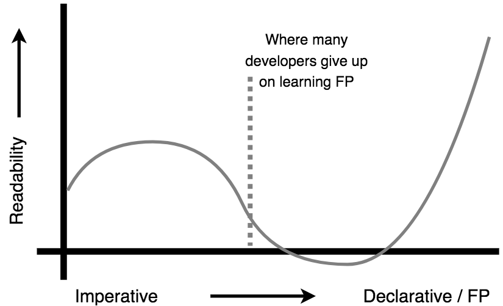

# 轻量函数式 JavaScript
# 第一章：为什么要进行函数式编程？

> 函数式程序员：（名词）那些将变量命名为 “x”，函数命名为 “f”，并将代码模式称为 “zygohistomorphic prepromorphism” 的程序员。
>
> James Iry ‏@jamesiry 5/13/15
>
> https://twitter.com/jamesiry/status/598547781515485184

函数式编程（FP）无论如何都不是一个新概念。它在编程的整个历史中一直存在着。然而，我不确信这样说是否合适，但是…… 确实直到最近几年它才被整个开发者世界看作是一个主流概念。我认为 FP 曾经在学术圈里存在的时间要更长。

但一切都变了。关于 FP 的呼声越来越高，不仅是在语言的层面，在库与框架的层面也是如此。很有可能，你就是终于意识到 FP 是一个你无法再忽视的东西才在读这本书的。或者你可能像我一样，曾经多次试图学习 FP 但是苦于在术语和数学符号之中挣扎。

“为什么我应当在我的代码中使用 FP 风格？”、“轻量函数式 JavaScript 与人们所说的 FP 有何不同？”，第一章的目的就是要回答诸如此类的问题。在我们做好准备工作之后，在下一章和整本书的其余部分中，我们将开始一点儿一点儿地揭示使用轻量函数式编写 JS 的技术与模式。

## 一瞥

让我们使用一段代码改造前后的快照来简要地展示一下 “轻量函数式 JavaScript” 的概念。考虑如下代码：

```js
var numbers = [4,10,0,27,42,17,15,-6,58];
var faves = [];
var magicNumber = 0;

pickFavoriteNumbers();
calculateMagicNumber();
outputMsg();                // The magic number is: 42

// ***************

function calculateMagicNumber() {
    for (let fave of faves) {
        magicNumber = magicNumber + fave;
    }
}

function pickFavoriteNumbers() {
    for (let num of numbers) {
        if (num >= 10 && num <= 20) {
            faves.push( num );
        }
    }
}

function outputMsg() {
    var msg = `The magic number is: ${magicNumber}`;
    console.log( msg );
}
```

现在考虑一下这种非常不同的风格，它得到了完全一样的结果：

```js
var sumOnlyFavorites = FP.compose( [
    FP.filterReducer( FP.gte( 10 ) ),
    FP.filterReducer( FP.lte( 20 ) )
] )( sum );

var printMagicNumber = FP.pipe( [
    FP.reduce( sumOnlyFavorites, 0 ),
    constructMsg,
    console.log
] );

var numbers = [4,10,0,27,42,17,15,-6,58];

printMagicNumber( numbers );        // The magic number is: 42

// ***************

function sum(x,y) { return x + y; }
function constructMsg(v) { return `The magic number is: ${v}`; }
```

一旦你理解了 FP 和轻量函数式，你可能会这样 *阅读* 并思考第二个代码段：

> 我们首先创建了一个称为 `sumOnlyFavorites(..)` 的函数，它是其他三个函数的组合。我们组合了两个过滤器，一个检查一个值是否大于等于 10，一个检查一个值是否小于等于 20 。然后我们在 transducer 组合中引入了 `sum(..)` 递减器。`sumOnlyFavorites(..)` 函数的结果是一个递减器，它检查一个值是否同时通过了两个过滤器，如果是，就将这个值加到累计值上。
>
> 然后我们制造了另一个称为 `printMagicNumber(..)` 的函数，它首先使用我们刚刚定义的 `sumOnlyFavorites(..)` 递减器将一个数字的列表递减为一个仅由通过了 *favorite* 检查的数字构成的和。然后 `printMagicNumber(..)` 将这个最终的和输送给 `constructMsg(..)`，它创建一个最终流入 `console.log(..)` 的字符串值。

目前，所有这些向 FP 开发者进行的 *讲述* 方式在你看来非常陌生。这本书将帮助你学会用相同的推理方式进行 *讲述*，使它对你来说像其他任何代码一样易读，甚至更容易读懂！

关于这段代码比较的其他几个注意点：

* 对于许多读者来说，与后一个代码段相比前一个让人感觉更舒服/易读/易维护。如果这正是你的情况，完全没问题，你正处于正确的位置上。我敢说如果你坚持读完整本书，并实践了我们讨论的每一个话题，那么第二个代码段最终将会变得自然得多，也许甚至是首选！

* 你做过的东西可能与上面两个代码段有巨大不同或完全不同。那也没问题，这本书不会强制灌输你应当用一种特定的方式做事情。它的目标是展示各种模式的优点和缺点，使你有能力做出决断。当这本书结束的时候，你处理事情的方式可能有点儿比现在更接近于第二个代码段。

* 你也可能已经是一位老练的 FP 开发者，正快速地浏览着这本书来看看有没有有用的，值得你读的东西。第二个代码段当然有一些你十分熟悉的东西。但我也打赌你会有好几次这么想：“嗯……，我不会 *这样* 做……”。这没关系，而且完全是合理的。

    这不是一本传统的，经典的 FP 书籍。我们的做法有时候看起来相当异端。我们是在 FP 带来的无法否认的好处，与不必解决一堆吓人的数学/符号/术语就能建造能工作的、可维护的 JS 之间寻找一种实用的平衡。这不是 *你的* 那种 FP，这是 “轻量函数式 JavaScript”。

无论你出于什么原因在读这本书，欢迎你！

## 信心

作为一个（使用 JavaScript）软件开发的教师，我做每一件事都有一个非常简单的前提作为某种基础：你不理解的代码是不能信任的代码。反之亦然，你不能信任的代码是你不能理解的代码。进一步讲，如果你不能信任或理解你自己的代码，那么对于你写的代码能够完成目标任务这件事来说，你就没有任何自信可言。你基本上是在一边祈祷一边运行程序。

我说的信任是什么意思？我的意思是你可以通过阅读一段代码，不是仅靠运行它，来验证这段代码 *将会* 做什么；而非仅依赖于它 *应当* 做什么。也许更经常的是，我们倾向于通过运行测试套件来验证我们程序的正确性。我不是说测试不好，但我确实认为我们应当有这样的追求：能够对我们的代码有足够的理解，以至于在测试套件运行前我们就知道它能够通过。

仅仅通过阅读我们的程序就能对它建立起强大的自信 —— 构成 FP 基础的那些技术就是根据这样的思维模式设计而来的。理解 FP 的人，以及在他们的程序中严于律己、孜孜不倦地使用 FP 的人，将会编写出他们 *和其他人* 能够阅读并验证的代码，他们的程序将会做他们想做的事。

在我们使用避免或最小化 bug 源头的技术时，信心也会随之增长。这也许是 FP 最大的卖点之一：FP 程序通常 bug 更少，而且那些确实存在的 bug 通常会出现在更加明显的地方，使得它们更容易被找到和修复。FP 代码的抗 bug 性更强 —— 但它当然不是 bug 免疫的。

随着在这本书中启程，你将开始在你编写的代码中建立更多的信心，因为你将会使用那些业已被证明为真的模式和实践做法；而且你将会避开大多数造成程序 bug 的常见原因！

## 交流

函数式编程为什么很重要？要回答这个问题，我们得退后一大步来谈谈程序本身为什么重要。

听到这些你可能很吃惊，但我不认为代码主要是计算机的一套指令。事实上，我认为代码能够驱动计算机几乎是一个欢乐的巧合。

我对此深信不疑 —— 代码在人与人之间的交流中扮演的角色要重要得多的多。

你可能有这样的经验，你在“编码”上花费的大把的时间其实只是在阅读既存的代码。我们之中很少有人有特权能够把全部的或大部分时间都用来敲新代码，而从来不用对付其他人（或者我们过去自己）写过的代码。

初步估计，开发者们花在维护代码上的时间有70%都是用来阅读并理解它的。真让人瞠目结舌。70%。难怪全球程序员每天的平均代码量只有10行。我们一天花费7小时只是阅读代码，来搞清楚那10行应该放在什么地方！

我们应当更多地关注代码的可读性。顺带一提的是，可读性不是减少字母数量。对可读性影响最大的实际上是亲和度。<a href="#user-content-footnote-1"><sup>1</sup></a>

如果我们将要花更多的时间来关心如何使我们的代码变得更易读和易理解，那么 FP 就是我们努力的中心。FP 的各种原理十分成熟，经过深刻的研究和检验，而且是可以通过证明来验证的。花时间去学习并利用这些 FP 原理将最终使你的代码能够轻而易举地被你自己和其他人所辨识和熟悉。代码亲和度的提高，以及辨识度带来的好处，将会改进代码的可读性。

比如，一旦你学会了 `map(..)` 所做的事情，当你在任何程序中看到它时，你就可以几乎是立即发现并理解它。但你每次遇到 `for` 循环时，你就不得不阅读整个循环来搞懂它。`for` 循环的语法可能令人倍感亲切，但它所做的实质可不是这样；它不得不每次都被 *读* 一遍。

通过使更多的代码容易辨识，让我们在搞清楚代码在做什么这件事上花的时间更少，使我们的精力被解放出来去思考更高层的程序逻辑；无论如何，这是需要我们最多注意力的重要事务。

FP（至少，刨去所有使它魅力骤减的术语）是编写高可读性代码的最有效的工具之一。这就是为什么它很重要。

### 可读性

可读性不是一个二元性质。它很大程度上是一种描述我们与代码之间关系的人为主观因素，而且随着我们的技能和理解的发展而自然变化。我经历了和下图相似的过程，而且据许多和我讨论过的人说他们也有相同的经历。

<p align="center">
    
</p>

随着你对这本书的学习，你可能会发现自己经历着相似的过程。但是放心，如果你坚持下去，曲线会转而向上延伸！

*指令式* 描述了大多数我们可能已经自然编写的代码；它的焦点在于精确地指示计算机 *如何* 做某些事情。声明式代码 —— 我们将要学习编写、遵循 FP 原理的那一种 —— 更多地关注于描述结果是 *什么*。

让我们回忆一下本章早先出现的两个代码段。

第一个代码段是指令式的，几乎全部都是关注于 *如何* 完成任务；它堆满了 `if` 语句、`for` 循环、临时变量、再赋值、改变值、带有副作用的函数调用，以及函数之间隐含的数据流。你当然 *可以* 跟踪它的逻辑来找出那些数字是如何流动并变化为最终状态的，但它一点儿也不清晰和直接。

第二个代码段更具描述性；它避开了大多数上述指令式技术。注意，它没有明确的条件表达式、循环、副作用、再赋值，或改变值；取而代之的是，它利用了众所周知的（当然，是在 FP 世界中！）、可靠的模式，比如：过滤，递减，transducing，以及组合。关注点从底层的 *如何* 上升到了更高层的结果是 *什么*。

与胡乱地使用一个 `if` 语句来检测一个数字不同的是，我们将这个任务委托给了一个众所周知的 FP 工具 `gte(..)`（大于等于），然后将注意力集中于更重要的事情上 —— 将这个过滤器与另一个过滤器以及一个求和函数相组合。

此外，第二个程序的数据流是明确的：

1. 一个数字的列表流入 `printMagicNumber(..)`。
2. 这些数字由 `sumOnlyFavorites(..)` 一次一个地处理，得出一个数字，它是仅由我们最喜欢的数字组成的和。
3. 这个总和通过 `constructMsg(..)` 转换为一个消息字符串。
4. 这个消息字符串通过 `console.log(..)` 打印到控制台。

你可能依然感觉这种做法是绕圈子，而指令式的代码段更容易理解。这是因为你对它要熟悉得多；亲和度对我们在可读性上的判断有着深刻的影响。但是在本书结束的时候，第二个代码段的声明式方式带来的好处将会沉淀在你心中，而且亲和度将会在可读性上充满生机。

我知道，现在就让你相信这些对你而言是一种信仰上的飞跃。

需要很多努力，有的时候需要更多的代码，才能将可读性改进到我所说的程度，才能将导致 bug 的许多错误最小化/消除。坦白地讲，当我开始写这本书时，我从来不会去编写（甚至完全理解！）第二个代码段那样的代码。随着我学习的旅程渐行渐远，它变得更自然更舒适。

如果你指望 FP 重构像一颗魔法银弹一样，快速地将你的代码变形为更优雅、更聪明、更灵活、更简洁的东西 —— 短期看来很容 —— 很不幸这不是一个切实的期望。

FP 是一种非常不同的思考代码应当如何构造的方式，为的是使数据流变得非常明显来帮助你的读者跟随你的思路。它会花一些时间。这种努力有着非比寻常的价值，但它可能是一次艰苦的旅行。

将一个指令式代码段重构为更具描述性的 FP，在得到对我稍后再来理解它来说足够清晰的结果之前，我依然总是要尝试好几次。我发现将代码转换为 FP 是一种缓慢的迭代过程，而非从一种范式翻转为另一种范式的快速处理。

我还对我编写的每一段代码进行了“稍后再读”测试。在我写好一段代码之后，把这段代码放几个小时或几天，然后回过头来用陌生的眼睛再读一次，假装我需要向某人教授或解释它一样。通常，在前几次它都很混乱且让人糊涂，于是我就调整它再试一次！

但我不是在给你泼冷水。我真的希望你趟过这片丛林。我很高兴我这么做过。我终于能看到曲线向着更高的可读性倾斜。努力是值得的，我相信这对你来说也一样。

## 视角

多数其他的 FP 书籍似乎都采取了一种从上到下的方式，但我们将反其道而行之：从基础开始，我们将揭示一些基本的基础原理 —— 我相信真正的 FP 程序员都会承认这些原理是他们做一切事情时的脚手架。但是大部分情况下，我们将与大多数吓人的学术用语或数学符号保持一定距离，它们太容易使初学者感到沮丧了。

我认为你如何称呼一个东西并不那么重要，更重要的是你理解它是什么以及它如何工作。这不是说在学术用语上的共识不重要 —— 它毋庸置疑地在老练的专业人士之间简化了交流。但是对于初学者，我发现它可能有些分散人的注意力。

所以我希望这本书能够更多地关注于基本概念，而少一些玄之又玄的专业术语。这不是说这里将不会有任何术语；绝对会有的。但不要被这些花哨的词儿绊住。只要有必要，就越过它们去看背后的思想。

我称这种不那么正式的做法为 “轻量函数式编程”，因为我觉得真正的 FP 的形式主义所遇到的问题是，在你还没习惯正式的想法之前它可能让人感到无所适从。我不是在猜测；这就是我自己的故事。即便是在教授了 FP，写了这本书之后，FP 中用语和符号的形式主义对我来说依然非常、非常难对付。我曾经试了又试，但看起来没获得太多进展。

我知道许多 FP 程序员相信形式主义本身有助于学习。但是我认为在你对这种形式主义有相当程度的适应之前，还是存在一个很明显的断崖。如果你碰巧拥有数学方面的背景，或者甚至有一些计算机科学相关的经验，这对于你来说就显得更自然。但是我们之中的一些人没有，而且无论我们如何努力尝试，形式主义依然是个拦路虎。

所以这本书介绍我认为的 FP 建立的基础概念，它的目的是从下面给你助力帮你爬上这个断崖，而非高高在上地把你拒之门外，催促你自己去摸爬滚打。

## 如何寻找平衡

如果你在编程业界待过很长时间，那么你以前很可能听说过 “YAGNI” 这句话：“You Ain't Gonna Need It（你不会需要它）”。这个原则主要是从极限编程中演化出来的，强调一个特性在被需要之前就建造的风险与成本。

有时候我们会猜测我们在未来会需要一个特性，并且相信在我们建造其他东西的同时现在就建造它将会更容易，然后发觉我们猜错了，这个特性不需要，或者与我们猜测的十分不同。其他一些时候我们猜对了，但是一个特性建造的太早了，它从现在真正需要的特性那里榨取了时间；我们引入了一个机会成本来稀释我们的精力。

YAGNI 挑战我们这样的想法，以让我们记住：即便在某种情况下与直觉相悖，我们也通常应当推迟建造某些东西，直到它当前就是被需要的。对于将一个特性在稍后被需要的时候再加入它这件事，我们倾向于夸大估计未来的重构成本。但很可能的是，稍后再做并不会像我们想象的那么难。

把这种思想应用在函数式编程上，我会给出这样的劝诫：在这本书中会讨论相当多的有趣和迷人的模式，但是仅仅因为你发现某些模式用起来激动人心，并不意味着在你代码的特定部分中使用它们是恰当的。

这就是我与许多更正规的 FP 人士之间的不同之处：仅仅因为你 *能* FP 某些东西，不意味着你 *应当* FP 它。另外，有许多方法划分一个问题，而且就算你学过一个更精巧的方式，对可维护性与扩展性更加“适应未来”，但这一点上一个更简单的 FP 模式可能就绰绰有余了。

一般说来，我推荐在你的代码中寻找平衡，并在你熟练掌握 FP 的概念时保守地应用它。在决定某种模式或抽象是否能够提高一部分代码的可读性，还是它只是引入了更多（还）不需要的聪明的复杂性时，默认选择 YANGI 原则。

> 记住，任何永远用不到的扩展点都不只是白费力气，它还很可能成为你的障碍
>
> Jeremy D. Miller @jeremydmiller 2/20/15
>
> https://twitter.com/jeremydmiller/status/568797862441586688

记住，你写的每一行代码都相应的读者成本。这个读者可能是另一个团队的成员，甚至是未来的你自己。他们谁也不会对那些用来炫耀你 FP 灵活性的、聪明过头的、没必要的复杂性感到印象深刻。

最好的代码是在未来最易读的代码，因为它在自己能/应当做什么（理想主义）与自己必须做什么（实用主义）之间，达到了恰到好处的平衡。

## 资源

为了创作这本书我借鉴了大量不同的资源。我相信你同样会从中受益，所以我想花一点儿时间将它们指出来。

### 书籍

一些你绝对应该读的 FP/JavaScript 书籍：

* [Professor Frisby's Mostly Adequate Guide to Functional Programming](https://drboolean.gitbooks.io/mostly-adequate-guide/content/ch1.html) by [Brian Lonsdorf](https://twitter.com/drboolean)
* [JavaScript Allongé](https://leanpub.com/javascript-allonge) by [Reg Braithwaite](https://twitter.com/raganwald)
* [Functional JavaScript](http://shop.oreilly.com/product/0636920028857.do) by [Michael Fogus](https://twitter.com/fogus)

### 博客/网站

一些你应该看看的作者与内容：

* [Fun Fun Function Videos](https://www.youtube.com/watch?v=BMUiFMZr7vk) by [Mattias P Johansson](https://twitter.com/mpjme)
* [Awesome FP JS](https://github.com/stoeffel/awesome-fp-js)
* [Kris Jenkins](http://blog.jenkster.com/2015/12/what-is-functional-programming.html)
* [Eric Elliott](https://medium.com/@_ericelliott)
* [James A Forbes](https://james-forbes.com/)
* [James Longster](https://github.com/jlongster)
* [André Staltz](http://staltz.com/)
* [Functional Programming Jargon](https://github.com/hemanth/functional-programming-jargon#functional-programming-jargon)
* [Functional Programming Exercises](https://github.com/InceptionCode/Functional-Programming-Exercises)

### 库

这本书中的示例代码段不依赖于任何库。我们探索的每一种操作，我们都将推导如何使用独立、普通的 JavaScript 来实现它。然而，在你开始在更多真正的代码上利用 FP 时，你将很快希望能有一个库来提供这些常用工具的优化过的、高度可靠的版本。

顺带一提，你将想要确信自己看过那些你使用的库函数的文档，保证你自己知道它们是如何工作的。在它们与我们这本书中建造的代码之间将会存在许多相似之处，但也毫无疑问地存在一些不同，即使是在流行库之间也是这样。

这里是几个 JavaScript 中流行的 FP 库，它们是你开始探索的很好的起点：

* [Ramda](http://ramdajs.com)
* [lodash/fp](https://github.com/lodash/lodash/wiki/FP-Guide)
* [functional.js](http://functionaljs.com/)
* [Immutable.js](https://github.com/facebook/immutable-js)

[附录 C 更深入地检视了这些库](apC.md/#stuff-to-investigate) 和其他的一些库。

## 总结

你可能有各种理由开始读这本书，并对从中能得到的东西有着不同的期待。这一章解释了为什么我希望你阅读这本书，以及我希望你从中收获什么。它还能帮助你向其他人（比如你的开发者伙伴）清楚地说明为什么他们应当和你一起踏上这次旅行！

函数式编程是关于如何基于一些业已被证明的原理来编写代码，使我们从自己编写和阅读的代码中获得更高一层的信心与信任。编写那些我们焦急地 *希望* 它能够工作的代码，然后当测试套件通过时唐突地长吁一口气 —— 我们不应满足于此。我们应当在测试运行之前就 *知道* 它能够通过，而且我们有绝对的自信说为了其他读者（包括我们未来的自己）的利益，我们已经将所有的想法在代码中交代清楚了。

这就是轻量函数式 JavaScript 的核心。它的目标是学习如何高效地与我们的代码交流，而不必翻过符号或术语的大山来做到这一点。

学习函数式编程的旅行始于对函数性质的深刻理解。这是我们在下一章中要讲解的。

----

<a name="footnote-1"><sup>1</sup></a>Buse, Raymond P. L., and Westley R. Weimer. “Learning a Metric for Code Readability.” IEEE Transactions on Software Engineering, IEEE Press, July 2010, dl.acm.org/citation.cfm?id=1850615.
