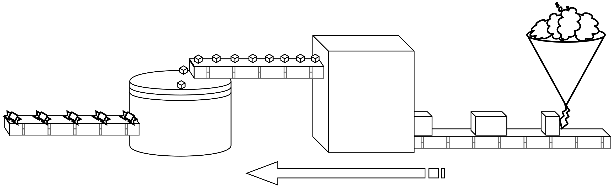
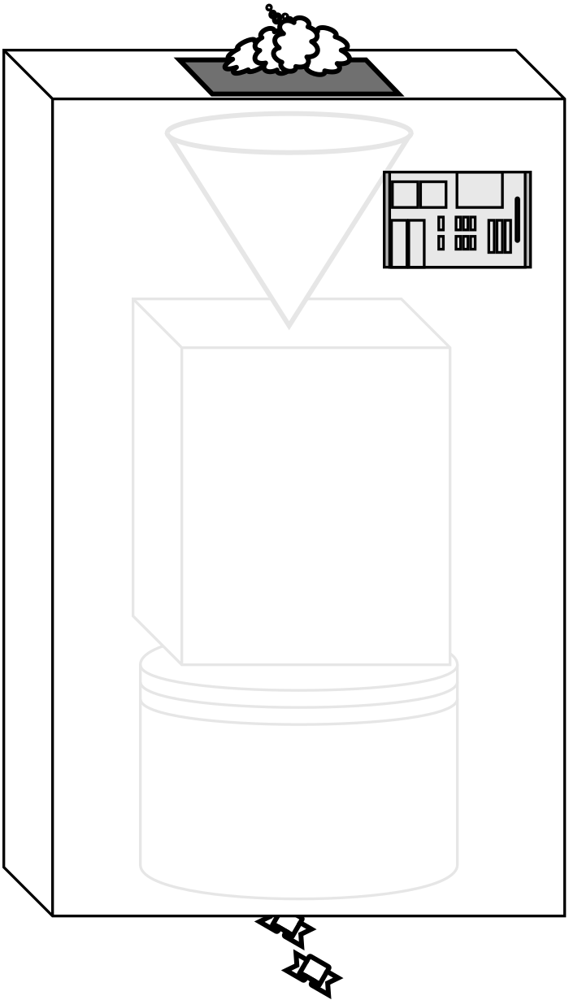
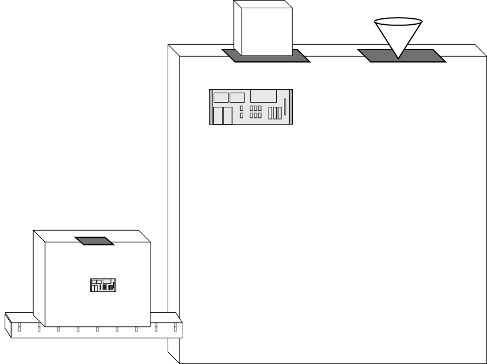
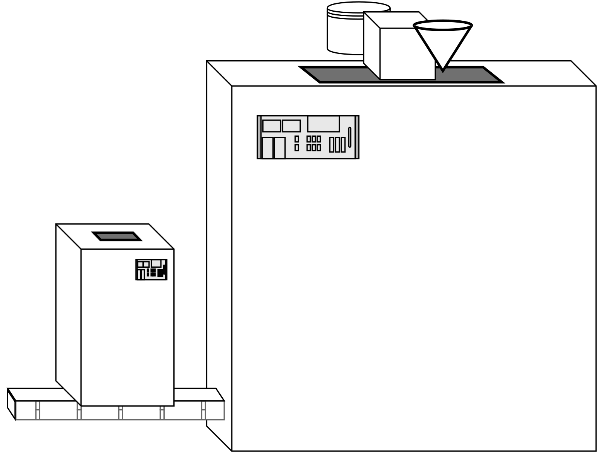

# 轻量函数式 JavaScript
# 第四章：组合函数

至此，我希望你对在函数式编程中使用函数是什么意思感到适应多了。

函数式程序员将他们程序中的每一个函数都看做一个小而简单的乐高积木块。他们一眼就能认出 2x2 的蓝色积木块，而且知道它到底是如何工作以及他们能对它做什么。随着他们建造更大更复杂的乐高模型，当他们每次需要下一个零件时，他们对要抓来哪些积木块已经有了直觉。

但是有时你拿来 2x2 的蓝色积木块和 4x1 的灰色积木块并把它们以特定的方式放在一起，然后发现，“这是我常需要的有用零件”。

于是你现在得到了一个新的“积木块”，两个其他积木块的组合，而且现在你可以在任何你需要这种积木块的时候伸手找到它。识别并使用这种复合的蓝-灰L型积木块要比每次都考虑组合两个独立的积木块更高效。

函数有种种不同的形状与大小。我们可以定义一个它们的特定组合来制造一个新的复合函数，在程序的各个部分用起来十分方便。这种把函数一起使用的处理称为组合。

组合是一个 FP 程序员如何对在程序中的数据流进行建模。在某种意义上，它是所有 FP 中最基础的概念，因为如果没有它，你就不能声明式地对数据和状态的变化建模。换言之，没有组合 FP 中的一切将崩塌。

## 输出到输入

我们已经看到了几个组合的例子。例如，在第三章我们关于 [`unary(..)`](ch3.md/#user-content-unary) 的讨论中包含了这个表达式：[`[ .. ].map(unary(parseInt))`](ch3.md/#user-content-mapunary)。考虑一下这里发生了什么。

要将两个函数组合在一起，可以将第一个函数调用的输出作为第二个函数调用的输入传递。在 `map(unary(parseInt))` 中，`unary(parseInt)` 函数调用返回一个值（一个函数）；这个值作为实际参数直接传递给 `map(..)`，它返回一个数组。

退一步并把概念上的数据流可视化表达一下的话：

```
arrayValue <-- map <-- unary <-- parseInt
```

`parseInt` 是 `unary(..)` 的输入。`unary(..)` 的输出是 `map(..)` 的输入。`map(..)` 的输出是 `arrayValue`。这就是 `map(..)` 和 `unary(..)` 的组合。

**注意：** 这里从右向左的方向是有意为之的，虽然这可能在你学习的角度上有些奇怪。稍后我们会回过头来全面解释这一点。

将这个数据流想象为糖果工厂里的传送带，每个操作都是冷却、切割、包装糖果处理中的一个步骤。我们将在这一章中通篇使用糖果工厂的比喻来解释组合是什么。

<p align="center">
    
</p>

让我一次一个步骤地讲解组合。考虑这两个你可能在程序中用到的工具：

```js
function words(str) {
    return String( str )
        .toLowerCase()
        .split( /\s|\b/ )
        .filter( function alpha(v){
            return /^[\w]+$/.test( v );
        } );
}

function unique(list) {
    var uniqList = [];

    for (let v of list) {
        // 值在新的列表中不存在吗？
        if (uniqList.indexOf( v ) === -1 ) {
            uniqList.push( v );
        }
    }

    return uniqList;
}
```

`words(..)` 将一个字符串分割为一个单词的列表。`unique(..)` 接收一个单词的列表并过滤去重。

使用这两个工具分析一个字符串文本：

```js
var text = "To compose two functions together, pass the \
output of the first function call as the input of the \
second function call.";

var wordsFound = words( text );
var wordsUsed = unique( wordsFound );

wordsUsed;
// ["to","compose","two","functions","together","pass",
// "the","output","of","first","function","call","as",
// "input","second"]
```

我们将 `words(..)` 的数组输出命名为 `wordsFound`。`unique(..)` 的输入也是一个数组，于是我们将 `wordsFound` 传递给它。

回到糖果工厂的生产线：第一台机器将融化的巧克力作为“输入”接收，而且它“输出”冷却成型的巧克力块儿。生产线稍后的下一台机器将巧克力块儿作为“输入”接收，而它的“输出”是一个切割好的巧克力糖块。下一步，生产线上的一台机器从传送带上拿起巧克力的小糖块并输出包装好的糖块准备打包和运输。


由于这些工序糖果工厂相当成功，但是就像所有的生意一样，管理层不停地寻找增长的方法。

为了跟上更多糖果产量的需求，他们决定拿掉传送带装置并将三台机器竖着摞在一起，这样第一台的输出阀门就直接连接在了它下面机器的输入阀门上。巧克力块轰鸣着在传送带上从第一台机器慢慢送到第二台机器上浪费的空间不复存在了。

这种发明为工厂节省了很多空间，管理层对他们能够每天生产更多糖果感到非常高兴！

这种改进的糖果工厂配置在代码上的等价物就是跳过中间步骤（前面代码段中的 `wordsFound` 变量），一起使用两个函数调用：

```js
var wordsUsed = unique( words( text ) );
```

**注意：** 虽然我们总是从左到右地读函数 —— 先是 `unique(..)` 然后是 `words(..)` —— 但是操作的实际顺序更像是从右到左，或者由内而外的。`words(..)` 将会首先运行然后才是 `unique(..)`。稍后我们会谈到一种与我们自然的从左到右的阅读顺序相吻合的模式，称为 `pipe(..)`。

摞起来的机器工作得很好，但是挂得到处都是的电线显得有些笨拙。这些摞起来的机器建造的越多，厂房就变得越混乱。而且组织和维护所有这些机器极其浪费时间。



一天早上，糖果工厂的一个工程师有了一个好主意。她想，要是她能制作一个外壳把所有的电线都藏起来效率就高多了；在里面所有三台机器都连接在一起，而在外面所有东西都干净整洁。在这台炫酷的新机器上方是倾倒融化的巧克力的阀门，而在它底部是它吐出包装好的巧克力的阀门。天才！

这种复合的机器移动起来容易多了，而且可以在工厂任何需要的地方安装。厂房里的工人们更高兴，因为他们不再需要为三台机器的按钮与仪表盘抓狂了；他们很快就喜欢上了这台炫酷的机器。

联系回代码：我们现在发现了以特定的顺序执行的 `words(..)` 和 `unique(..)`（联想：复合的乐高积木）是我们可以在应用程序的其他几个部分使用的东西。那么，让我们定义一个组合它们的复合函数：

```js
function uniqueWords(str) {
    return unique( words( str ) );
}
```

`uniqueWords(..)` 接收一个字符串并返回一个数组。它是一个 `unique(..)` 和 `words(..)` 的组合，它完成这样的数据流：

```
wordsUsed <-- unique <-- words <-- text
```

现在你一定明白了：在糖果工厂设计中进行的革新就是函数组合。

### 制造机器

糖果工厂一直正常地轰鸣着，多亏了节省下的空间，现在他们有很多地方可以试着去生产新种类的糖果了。基于以前的成功，管理层热衷于为它们增长的糖果种类发明新的炫酷复合机器。

但是工厂的工程师们则苦于跟上管理层的脚步，因为每次需要制造新品种的复合机器时，他们都要花相当的时间去制造新的外壳来把各个独立的机器装进去。

于是工厂的工程师们联系了一个工业机器生产商寻求帮助。他们惊讶地发现这个制造商提供一种 **制造机器** 的机器！听起来不可思议，但他们购买了一台这样的机器，它接收几个工厂的小型机器 —— 比如冷却巧克力的和切割巧克力的 —— 并自动地将它们连接在一起，甚至还在它们外面包装一层干净漂亮的外壳。这一定会使糖果工厂大获成功的！

<p align="center">
    
</p>

回到代码的领域，让我们考虑一个称为 `compose2(..)` 的工具，它自动地创建两个函数的组合，正如我们手动做的那样：

```js
function compose2(fn2,fn1) {
    return function composed(origValue){
        return fn2( fn1( origValue ) );
    };
}

// 或者 ES6 => 箭头形式
var compose2 =
    (fn2,fn1) =>
        origValue =>
            fn2( fn1( origValue ) );
```

你有没有注意到我们将形式参数的顺序定义为 `fn2,fn1`，进而第二个列出的函数（也就是形式参数名 `fn1`）首先运行，然后第一个列出的函数（`fn2`）再运行？换言之，函数是从右到左组合的。

这可能看起来像个奇怪的选择，但这是有一些原因的。大多数常见的 FP 库都将它们的 `compose(..)` 定义为从右到左的顺序工作，所以我们坚持这个惯例。

但为什么？我想最简单的解释（但也许在历史上不是最准确的）就是，我们在按照手动编写它们时的顺序罗列它们，而不是按照在从左到右阅读时遇到它们的顺序。

`unique(words(str))` 以从左到右的顺序罗列函数 `unique, words`，所以我们使我们的 `compose2(..)` 工具也以同样的顺序接收它们。执行的顺序是从右到左，但代码的顺序是从左到右。你要非常小心地注意这些区别。

现在，更高效的糖果制造机的定义是：

```js
var uniqueWords = compose2( unique, words );
```

### 组合的变种

看起来 `<-- unique <-- words` 的组合可能是这两个函数能够组合的唯一顺序。但实际上我们可以用相反的顺序组合它们来创建一个不同目的的工具：

```js
var letters = compose2( words, unique );

var chars = letters( "How are you Henry?" );
chars;
// ["h","o","w","a","r","e","y","u","n"]
```

这能够工作是因为 `words(..)` 工具为了值类型的安全，会首先使用 `String(..)` 将它的输入强制转换为一个字符串。所以 `unique(..)` 返回的数组 —— 现在是 `words(..)` 的输入 —— 变成了字符串 `"H,o,w, ,a,r,e,y,u,n,?"`，之后 `words(..)` 中剩余的行为将这个字符串处理为 `chars` 数组。

不可否认这是一个造作的例子。但要点是函数的组合不总是单向的。有时我们将灰色的积木块放在蓝色的上面，而有时我们把蓝色的积木块放在上面。

如果糖果工厂试着将包装糖果的机器接入混合并冷却巧克力的机器，他们最好小心些！

### 泛化组合

如果我们能够定义两个函数的组合，那么我们就能继续支持任意多个函数的组合。任意多个函数被组合后的泛化数据流的可视化表现看起来像这样：

```
finalValue <-- func1 <-- func2 <-- ... <-- funcN <-- origValue
```

<p align="center">
    
</p>

现在糖果工厂拥有了世界上最好的机器：可以接收任意多个分离的小型机器并吐出一个按顺序做每一个步骤的大型炫酷机器。这真是一个了不起的糖果公司！它是威利·旺卡的梦想！

我们可以像这样实现一个泛化的 `compose(..)` 工具：

<a name="generalcompose"></a>

```js
function compose(...fns) {
    return function composed(result){
        // 拷贝函数的数组
        var list = fns.slice();

        while (list.length > 0) {
            // 从列表的最后取出最后一个函数
            // 并执行它
            result = list.pop()( result );
        }

        return result;
    };
}

// 或者 ES6 => 箭头形式
var compose =
    (...fns) =>
        result => {
            var list = fns.slice();

            while (list.length > 0) {
                // 从列表的最后取出最后一个函数
                // 并执行它
                result = list.pop()( result );
            }

            return result;
        };
```

**警告：** `...fns` 是一个被收集好的实际参数数组，而不是一个被传入的数组，因此，它是存在于 `compose(..)` 本地的。这可能会让人觉得 `fns.slice()` 因此是不必要的。然而，在这种特定的实现中，内部的 `composed(..)` 函数中的 `.pop()` 在改变这个列表，所以如果我们没有每次都制造一份拷贝，那么返回的组合函数就只能可靠地工作一次。我们会在[第六章](ch6.md)中重新审视这个麻烦。

现在让我们看一个组合两个以上函数的例子。回想我们 `uniqueWords(..)` 组合的例子，让我们加入一个 `skipShortWords(..)`：

```js
function skipShortWords(list) {
    var filteredWords = [];

    for (let word of words) {
        if (word.length > 4) {
            filteredWords.push( word );
        }
    }

    return filteredWords;
}
```

让我们定义一个包含 `skipShortWords(..)` 的 `biggerWords(..)`。我们追寻的手动组合的等价物是 `skipShortWords(unique(words(text)))`，那么让我们用 `compose(..)` 这么做的话：

```js
var text = "To compose two functions together, pass the \
output of the first function call as the input of the \
second function call.";

var biggerWords = compose( skipShortWords, unique, words );

var wordsUsed = biggerWords( text );

wordsUsed;
// ["compose","functions","together","output","first",
// "function","input","second"]
```

现在，让我们回想一下在[第三章初次见到的 `partialRight(..)`](ch3.md/#user-content-partialright) 来对组合做一些更有趣的事。我们可以建造一个 `compose(..)` 本身的右侧局部应用，提前指定第二个和第三个参数（分别是 `unique(..)` 和 `words(..)`）；我们称之为 `filterWords(..)`。

然后，我们可以通过分别使用不同的第一个参数调用 `filterWords(..)` 来多次完成组合：

```js
// 注意：使用 `<= 4` 检查来取代 `skipShortWords(..)` 中使用的 `> 4` 检查
function skipLongWords(list) { /* .. */ }

var filterWords = partialRight( compose, unique, words );

var biggerWords = filterWords( skipShortWords );
var shorterWords = filterWords( skipLongWords );

biggerWords( text );
// ["compose","functions","together","output","first",
// "function","input","second"]

shorterWords( text );
// ["to","two","pass","the","of","call","as"]
```

花点儿时间思考一下 `compose(..)` 上的右侧局部应用给了我们什么。它允许我们事先指定组合的前几步，然后使用不同的后续步骤（`biggerWords(..)` 和 `shorterWords(..)`）创建组合的特化版本。这是 FP 中最强大的技巧之一！

你还可以用 `curry(..)` 一个组合来代替局部应用，虽然由于从右至左的顺序，你可能更经常地想要 `curry( reverseArgs(compose), ..)` 而非仅仅是 `curry( compose, ..)` 本身。

**注意：** 因为 `curry(..)` （至少是我们在[第三章中实现的方式](ch3.md/#user-content-curry))）有赖于检测元数（`length`），或者手动指定元数，而 `compose(..)` 是一个可变参函数，你将需要手动指定意图中的元数，比如 `curry(.. , 3)`。

### 替代的实现方式

虽然你很可能从没实现过自己的 `compose(..)` 来用于生产，而只是使用一个库所提供的实现，但我发现理解它底层的工作方式实际上会很好地帮助我们夯实 FP 的一般概念。

所以，让我们检视一些不同的 `compose(..)` 实现选项。我们还将看到每种实现的优缺点，特别是在性能上。

我们将在第九章中详细讲解 `reduce(..)` 工具，但就目前来说，只要知道它将一个列表（数组）递减为一个单独的有限值就行了。它就像一个神奇的循环。

例如，如果你在一个数字列表 `[1,2,3,4,5,6]` 上进行加法递减，你将会循环遍历它们并随着你的循环前进把它们加在一起。递减将会把 `1` 加到 `2` 上，然后把结果加到 `3` 上，然后再把结果加到 `4` 上，如此类推，得到最终的和：`21`。

原始版本的 `compose(..)` 使用一个循环并急切地（也就是立即地）计算一个调用的结果以把它传递给下一个调用。我们可以使用 `reduce(..)` 做同样的事情：

<a name="composereduce"></a>

```js
function compose(...fns) {
    return function composed(result){
        return fns.reverse().reduce( function reducer(result,fn){
            return fn( result );
        }, result );
    };
}

// 或者 ES6 => 箭头形式
var compose = (...fns) =>
    result =>
        fns.reverse().reduce(
            (result,fn) =>
                fn( result )
            , result
        );
```

注意 `reduce(..)` 循环会在最终的 `composed(..)` 函数每次运行时发生，而且每个中间的 `result(..)` 都作为下一次调用的输入被传递给下一个迭代。

这种实现的优势是代码更简洁，并使用了众所周知的 FP 结构：`reduce(..)`。而且这种实现的性能也接近于原始的 `for` 循环版本。

然而，这种实现的局限性在于组合后的外部函数（也就是组合中的第一个函数）只能接收一个参数。大多数其他种类的实现都会传递所有的参数给第一个调用。如果在组合中的每一个函数都是一元的，这就不是什么大问题。但如果你需要给第一个调用传递多个参数，你就会想要一种不同实现。

要修改第一次调用参数只能有一个的限制，我们依然可以使用 `reduce(..)`，但生产一个懒惰求值的包装函数：

```js
function compose(...fns) {
    return fns.reverse().reduce( function reducer(fn1,fn2){
        return function composed(...args){
            return fn2( fn1( ...args ) );
        };
    } );
}

// 或者 ES6 => 箭头形式
var compose =
    (...fns) =>
        fns.reverse().reduce( (fn1,fn2) =>
            (...args) =>
                fn2( fn1( ...args ) )
        );
```

注意我们直接返回了 `reduce(..)` 调用的结果，它本身是一个函数，而不是一个计算好的结果。*这个* 函数允许我们传入任意多的参数，把它们转而传递给组合中的第一个函数调用，然后在后续的每次调用中将结果一层一层返回出来。

与计算运行中的结果并将它随着 `reduce(..)` 的循环处理一路传递不同，这种实现在组合的时候预先运行 `reduce(..)` 循环 **一次**，并推迟了所有的计算函数调用 —— 这称为懒惰求值。递减的每一个部分结果都是一个依次被更多包装一层的函数。

当你调用最终组合好的函数并提供了一个或多个参数时，这个大的嵌套函数的所有层，从内到外，按照反向的顺序被执行。

它在性能上的特点潜在地与前一种基于 `reduce(..)` 的实现不同。这里，`reduce(..)` 仅运行一次来产生一个大的组合函数，然后这个组合好的函数的每次调用只是执行它所有的嵌套函数。在前一个版本中，`reduce(..)` 将会在每次调用中运行。

哪一种实现更好因人而异，但是要记住后一种实现不像前一种那样受参数数量的限制。

我们还可以使用递归来定义 `compose(..)`。`compose(fn1,fn2, .. fnN)` 的递归定义看起来就像：

```
compose( compose(fn1,fn2, .. fnN-1), fnN );
```

**注意：** 我们将在[第八章](ch8.md)深入讲解递归，所以如果这种方式让你困惑，不必担心。或者，你可以现在就去读那一章然后回来重读这部分。 :)

这是我们如何使用递归实现 `compose(..)`：

```js
function compose(...fns) {
	  // 卸下最后两个参数
    var [ fn1, fn2, ...rest ] = fns.reverse();

    var composedFn = function composed(...args){
        return fn2( fn1( ...args ) );
    };

    if (rest.length == 0) return composedFn;

    return compose( ...rest.reverse(), composedFn );
}

// 或者 ES6 => 箭头形式
var compose =
    (...fns) => {
        // 卸下最后两个参数
        var [ fn1, fn2, ...rest ] = fns.reverse();

        var composedFn =
            (...args) =>
                fn2( fn1( ...args ) );

        if (rest.length == 0) return composedFn;

        return compose( ...rest.reverse(), composedFn );
    };
```

我认为递归实现的一个好处大部分是在概念上。我个人发现将一个重复的动作以递归的形式表示，要比一个我不得不追踪运行中结果的循环要容易得多，所以我比较喜欢用这种方式表达的代码。

另一些人认为递归方式在思维上兜的圈子有点儿更吓人。我请你作出自己的评价。

## 重排组合

我们早先谈过了标准 `compose(..)` 实现的从右到左的顺序。它的优势是会按照手动进行组合时参数（函数）出现的顺序来罗列它们。

它的劣势是参数是按照执行的相反顺序罗列的，这可能使人困惑。在组合中为了提前指定 *第一个* 要执行的函数而不得不使用 `partialRight(compose, ..)` 更显尴尬。

以从左到右的相反顺序进行组合，有一个常见的名称：`pipe(..)`。人们说这个名字来自于 Unix/Linux 世界，通过将第一个程序的输出作为第二个程序的输入“导入”（`|` 操作符），多个程序串联起来（比如 `ls -la | grep "foo" | less`）。

除了按从左至右顺序处理一个函数的列表以外，`pipe(..)` 与 `compose(..)` 是完全相同的：

```js
function pipe(...fns) {
    return function piped(result){
        var list = fns.slice();

        while (list.length > 0) {
            // 从列表中拿出第一个函数
            // 并执行它
            result = list.shift()( result );
        }

        return result;
    };
}
```

事实上，我们可以将 `pipe(..)` 定义为只是参数反转的 `compose(..)`:

```js
var pipe = reverseArgs( compose );
```

这真容易!

回忆一下早先普通组合的例子：

```js
var biggerWords = compose( skipShortWords, unique, words );
```

要使用 `pipe(..)` 表达它，我们只需要反转罗列它们的顺序：

```js
var biggerWords = pipe( words, unique, skipShortWords );
```

`pipe(..)` 的优势是它按照函数执行的顺序罗列它们，这有时会减少读者的困惑。可能 `pipe(words,unique,skipShortWords)` 看起来和读起来简单一些：我们先做 `words(..)`，然后做 `unique(..)`，最后做 `skipShortWords(..)`。

在你想局部应用 *第一个* 被执行的函数时，`pipe(..)` 也很方便。早先我们是用 `compose(..)` 的右侧局部应用这样做的。

比较一下：

```js
var filterWords = partialRight( compose, unique, words );

// vs

var filterWords = partial( pipe, words, unique );
```

正如你可能还记得的那样，[第三章 `partialRight(..)`](ch3.md/#user-content-partialright) 的定义中在底层使用了 `reverseArgs(..)`，与我们现在 `pipe(..)` 做的一样。所以两种方法都会得到相同的结果。

*在这种特定的情况下* `pipe(..)` 在性能上有一些轻微的优势，因为我们没有试图通过右侧局部应用来保留 `compose(..)` 的从右至左的参数顺序，使用 `pipe(..)` 我们不需要像 `partialRight(..)`中那样将参数顺序反转回来。所以 `partial(pipe, ..)` 在这里要比 `partialRight(compose, ..)` 好一些。

## 抽象

抽象在我们推理组合时扮演者重要角色，所以让我们更细致地检视它一下。

与局部应用和柯里化允许函数从泛化发展到特化（见[第三章](ch3.md/#some-now-some-later)）相似，我们可以通过从两个或更多任务中提取一般性来进行抽象。一般的部分被定义一次，以此避免重复。为了实施每个任务特化的部分，一般的部分会被参数化。

例如，考虑这段（明显造作的）代码：

```js
function saveComment(txt) {
    if (txt != "") {
        comments[comments.length] = txt;
    }
}

function trackEvent(evt) {
    if (evt.name !== undefined) {
        events[evt.name] = evt;
    }
}
```

这两个工具都在一个数据源中存储值。这就是一般性。特殊性在于，它们中的一个将值贴在一个数组的末尾，而另一个将值设置在一个对象的属性名上。

那么让我们来抽象一下：

```js
function storeData(store,location,value) {
    store[location] = value;
}

function saveComment(txt) {
    if (txt != "") {
        storeData( comments, comments.length, txt );
    }
}

function trackEvent(evt) {
    if (evt.name !== undefined) {
        storeData( events, evt.name, evt );
    }
}
```

一般化的任务 —— 引用一个对象上的一个属性（或数组的，多亏 JS 方便的 `[]` 操作符重载）并设置它的值 —— 被抽象到一个它自己的函数 `storeData(..)` 中。虽然这个工具现在只有一行代码，但我们可以预见其他横跨两个任务一般化行为，比如生成唯一的数字 ID 或者与值一起存储一个时间戳。

如果我们在多个地方重复这种常见的一般化行为，我们就会承担维护的风险 —— 修改了一些地方而忘记了修改其他地方。在这种类型的抽象中有一个原则在发挥作用，经常称为 DRY（don't repeat yourself）。

DRY 力求对程序中的每一个给定的任务都只做出一个定义。另一种驱动 DRY 编码的俏皮说法是程序员一般都很懒而不愿做没必要的工作。

抽象可以被做过头。考虑如下代码：

```js
function conditionallyStoreData(store,location,value,checkFn) {
    if (checkFn( value, store, location )) {
        store[location] = value;
    }
}

function notEmpty(val) { return val != ""; }

function isUndefined(val) { return val === undefined; }

function isPropUndefined(val,obj,prop) {
    return isUndefined( obj[prop] );
}

function saveComment(txt) {
    conditionallyStoreData( comments, comments.length, txt, notEmpty );
}

function trackEvent(evt) {
    conditionallyStoreData( events, evt.name, evt, isPropUndefined );
}
```

为了努力达成 DRY 并且避免重复 `if` 语句，我们将条件性的部分移动到一般化的抽象中。我们还假定未来 *可能* 会在程序的其他地方检查非空字符串或者非 `undefined` 值，所以我们也可能把这些 DRY 出去！

这段代码 *确实* 更 DRY 了，但是到了一个做过头的程度。程序员必须在他们程序中的每一个部分小心地实施恰当水平的抽象，不多，也不少。

对于我们在这一章中关于函数组合的更高层面的讨论来说，它可能看起来正是从这种 DRY 抽象中获益的。但让我们先不要这么快得出结论，因为我认为在我们代码中的组合实际上服务于一个更加重要的目的。

另外，**组合甚至会在某些东西仅出现一次的情况下都很有用**（没有重复的东西可以 DRY 出去）。

### 分割带来的集中

除了一般化和特殊化，我想抽象还有另外一种更有用的定义，正如这段引文中所揭示的：

> ……抽象是一种由程序员进行的处理，他们把一个名称与一个潜在的复杂程序片段联系起来，之后这个片段就可以用一个函数的目的来考虑，而不是以这个函数是如何实现的来考虑。通过将无关的细节隐藏起来，抽象降低了概念的复杂性，使程序员在任意特定时间内将注意力集中在一段可控的程序文本子集中成为可能。
>
> Michael L. Scott, Programming Language Pragmatics<a href="#user-content-footnote-1"><sup>1</sup></a>

这段引文的要点是，抽象 —— 一般来说，就是将一段代码抽出到它自己的函数中 —— 所服务的主要目的是将两块功能分离开，以至于每一块都可以独立于另一块地被集中考虑。

注意，在这种意义上的抽象不是试图 *隐藏* 细节，好像将事情看做一个我们 *永远都不会* 去关心的黑盒那样。

在这段引文中，“无关”，就被隐藏起来的东西而言，不应被认为是一种绝对的定性判断，而是相对于在某一时刻你想要集中思考的东西而言的。换言之，当我们把 X 和 Y 分隔开时，如果我想集中考虑 X，那么此时 Y 就是无关的。在另一时刻，如果我想集中考虑 Y，那么 X 就是无关的。

**我们抽象不是为了隐藏，而是为了分离以增进集中性**。

回忆一下本书开始时我描述过的 FP 的目标：创建更具可读性的，更易理解的代码。做到这一点的一个有效方法是，将交织在一起 —— 就像紧紧纠缠在一起的绳子 —— 的代码解开，成为分离的、更简单 —— 松散地绑在一起 —— 的代码块。这样，读者就不会在寻找某一部分的细节时被另一部分的细节分心了。

我们更高的目标不是像 DRY 的思维模式那样，把某些东西仅实现一次。事实上，有时我们将会在代码中重复我们自己。

正如我们在[第三章中推论出的](ch3.md/#why-currying-and-partial-application)，进行抽象的主要目标是实现事物的分离。我们努力增强集中性，因为这能够增强可读性。

通过分离两个想法，我们在它们之间插入了一个语义的边界，这赋予了我们可以独立于一边而集中考虑另一边的能力。在许多情况下，这个语义边界就是函数名之类的东西。函数的实现集中于 *如何* 计算某些东西，而通过函数名来使用这个函数的调用点关注于要对它的输出做 *什么*。我们将 *如何* 从 *什么* 之中抽象出来而使它们分离，而且可以被分离地推理。

另一种描述这个目标的方式是用指令式对比声明式编程风格。指令式代码主要关注于明确陈述 *如何* 完成一个任务。声明式代码陈述结果应当是 *什么*，而将实现留作其他人的责任。

声明式代码将 *什么* 从 *如何* 之中抽象出来。典型的声明式代码倾向于可读性而非指令式，虽然没有程序（当然除了 1 和 0 的机械码）曾经完全是其中的一种或另一种。程序员必须在它们之间寻求平衡。

ES6 增加了许多语法能力来将老式的指令式操作变形为新的声明式形式。也许其中最清楚的就是解构了。解构是一种赋值范例，它描述一个复合值（对象，数组）如何被分解为构成它的值。

这是一个数组解构的例子：

```js
function getData() {
    return [1,2,3,4,5];
}

// 指令式
var tmp = getData();
var a = tmp[0];
var b = tmp[3];

// 声明式
var [ a ,,, b ] = getData();
```

这其中的 *“什么”* 是指将数组的第一个值赋给 `a`，第四个值赋给 `b`。*“如何”* 是取得数组的引用（`tmp`）并在给 `a` 和 `b` 的赋值中，分别手动引用索引 `0` 和 `3`。

数组解构 *隐藏* 了赋值吗？这要看你的视角。我断定它只是将 *什么* 从 *如何* 之中分离了出来。JS 引擎依然进行着赋值，但是它防止你不得不被赋值是 *如何* 完成的分心。

相反，你阅读 `[ a ,,, b ] = ..` 并看到赋值范例只不过告诉了你 *什么* 将要发生。数组解构是一个声明式抽象的例子。

### 作为抽象的组合

所有这些与函数组合有什么关系？函数组合也是一种声明式抽象。

回想一下早先 `shorterWords(..)` 的例子。让我们比较一下它的指令式与声明式定义：

```js
// 指令式
function shorterWords(text) {
    return skipLongWords( unique( words( text ) ) );
}

// 声明式
var shorterWords = compose( skipLongWords, unique, words );
```

声明式形式关注于 *什么* —— 这三个函数将数据从一个字符串导出为一个短词的列表 —— 而将 *如何* 留给 `compose` 内部。

从更高的角度讲，`shorterWords = compose(..)` 这一行解释了 *如何* 定义 `shorterWords(..)` 工具，而将这声明式的一行放在代码其他地方来仅关注于 *什么*：

```js
shorterWords( text );
```

组合抽象从它的各个步骤中得到一个短词的列表。

作为对比，如果我们没有使用组合抽象呢？

```js
var wordsFound = words( text );
var uniqueWordsFound = unique( wordsFound );
skipLongWords( uniqueWordsFound );
```

或者是：

```js
skipLongWords( unique( words( text ) ) );
```

与前面的声明式风格相反，这两个版本展示了更具指令式的风格。关注于这两段代码的读者不可避免地被绑在 *如何* 上，而更少关注于 *什么*。

函数组合不只是关于使用 DRY 来节省代码。即使 `shorterWords(..)` 的使用仅在一个地方发生 —— 因此没有重复要避免！—— 将 *如何* 从 *什么* 之中分离出来依然可以改善我们的代码。

组合是一种强大的抽象工具，它将指令式代码变形为可读性更好的声明式代码。

## 重温“点”

现在我们已经彻底地讲解了组合（一种在 FP 的许多领域极其有用的技巧），让我们通过重温[第三章“无点”](ch3.md/#no-points)中的无点风格来看看它在实战中的表现，我们将使用一个对于重构来说相当复杂的场景：

```js
// 已知：ajax( url, data, cb )

var getPerson = partial( ajax, "http://some.api/person" );
var getLastOrder = partial( ajax, "http://some.api/order", { id: -1 } );

getLastOrder( function orderFound(order){
    getPerson( { id: order.personId }, function personFound(person){
        output( person.name );
    } );
} );
```

我们将要移除的“点”是 `order` 与 `person` 形式参数引用。

让我们从这里开始：试着将 `person` “点”从 `personFound(..)` 消除。为此，让我们首先定义：

```js
function extractName(person) {
    return person.name;
}
```

但我们观察到这个操作可以继而表达为更泛化的术语：从任何对象上通过名称抽取任意属性。让我们称这样的工具为 `prop(..)`：

```js
function prop(name,obj) {
    return obj[name];
}

// 或者 ES6 => 箭头形式
var prop =
    (name,obj) =>
        obj[name];
```

既然我们在处理对象属性，那么让我们定义一个反向工具：`setProp(..)` 来给一个对象设置属性值。

但是，我们要小心不要只是改变一个既存对象，而是要创建一个这个对象的克隆来修改，然后把它返回。这种考虑的原因将在[第五章](ch5.md)中详细讨论。

<a name="setprop"></a>

```js
function setProp(name,obj,val) {
    var o = Object.assign( {}, obj );
    o[name] = val;
    return o;
}
```

现在，为了定义一个从对象中抽取 `"name"` 属性的 `extractName(..)`，我们将局部应用 `prop(..)`：

```js
var extractName = partial( prop, "name" );
```

**注意：** 不要忘了这里的 `extractName(..)` 还没有实际抽取任何东西。我们局部应用了 `prop(..)` 来制造了一个函数，它在等着从我们传递给它的任意对象上抽取 `"name"` 属性。我们还可以通过 `curry(prop)("name")` 做同样的事情。

接下来，让我们将注意力集中在例子中嵌套查询调用的部分：

```js
getLastOrder( function orderFound(order){
	getPerson( { id: order.personId }, outputPersonName );
} );
```

我们如何定义 `outputPersonName(..)`？为了把我们需要的东西可视化表达出来，考虑一下我们期望的数据流：

```
output <-- extractName <-- person
```

`outputPersonName(..)` 需要是一个接收一个值（对象）的函数，把它传入 `extractName(..)`，然后把值传递给 `output(..)`。

希望你认出了这是一个 `compose(..)` 操作。于是我们可以将 `outputPersonName(..)` 定义为：

```js
var outputPersonName = compose( output, extractName );
```

我们刚刚创建的 `outputPersonName(..)` 函数是一个提供给 `getPerson(..)` 的回调。那么我们可以定义一个称为 `processPerson(..)` 的函数，它使用 `partialRight(..)` 预设回调参数：

```js
var processPerson = partialRight( getPerson, outputPersonName );
```

让我们使用我们的新函数重新构建这个嵌套查询的例子：

```js
getLastOrder( function orderFound(order){
    processPerson( { id: order.personId } );
} );
```

咻，我们的进展不错！

但我们得继续前进并移除 `order` “点”。下一步是观察到 `personId` 可以通过 `prop(..)` 从一个对象（比如 `order`）上抽取出来，就像我们在 `person` 对象上对 `name` 做的那样：

```js
var extractPersonId = partial( prop, "personId" );
```

为了构建需要被传递给 `processPerson(..)` 的（`{ id: .. }` 形式的）对象，让我们制造另一个工具来把一个值包装进一个对象的特定属性名中，称为 `makeObjProp(..)` ：

```js
function makeObjProp(name,value) {
    return setProp( name, {}, value );
}

// 或者 ES6 => 箭头形式
var makeObjProp =
    (name,value) =>
        setProp( name, {}, value );
```

**提示：** 这个工具在 Ramda 库中被称为 `objOf(..)`。

正如我们使用 `prop(..)` 来制造 `extractName(..)` 一样，我们将局部应用 `makeObjProp(..)` 来建造一个 `personData(..)` 函数，这个函数将制造我们的数据对象：

```js
var personData = partial( makeObjProp, "id" );
```

要使用 `processPerson(..)` 来实施与一个 `order` 值相关联的人的查询，我们需要这一系列操作的概念上的数据流：

```
processPerson <-- personData <-- extractPersonId <-- order
```

所以我们将再次使用 `compose(..)` 来定义一个 `lookupPerson(..)` 工具：

```js
var lookupPerson = compose( processPerson, personData, extractPersonId );
```

然后…… 就是它！将整个例子不带任何“点”地重新组装回来：

```js
var getPerson = partial( ajax, "http://some.api/person" );
var getLastOrder = partial( ajax, "http://some.api/order", { id: -1 } );

var extractName = partial( prop, "name" );
var outputPersonName = compose( output, extractName );
var processPerson = partialRight( getPerson, outputPersonName );
var personData = partial( makeObjProp, "id" );
var extractPersonId = partial( prop, "personId" );
var lookupPerson = compose( processPerson, personData, extractPersonId );

getLastOrder( lookupPerson );
```

哇哦。无点。而且 `compose(..)` 在两个地方真的很有用！

我认为在这种情况下，虽然推导出我们最终结果的步骤有些过于漫长，但我们得到了可读性好得多的代码，因为我们最后明确地调用了每一步。

而且即使你不喜欢看到/写出这些中间步骤，你也可以保留无点风格，在不使用独立的变量的条件下把这些表达式连接起来：

```js
partial( ajax, "http://some.api/order", { id: -1 } )
(
    compose(
        partialRight(
            partial( ajax, "http://some.api/person" ),
            compose( output, partial( prop, "name" ) )
        ),
        partial( makeObjProp, "id" ),
        partial( prop, "personId" )
    )
);
```

这段代码当然不那么繁冗，但与每个操作都有自己变量的前一个代码段比起来，我认为它的可读性差一些。不管哪种方式，组合都在无点风格上帮到了我们。

## 总结

函数组合是用于定义一个函数的模式，这个函数将一个函数调用的输出导入另一个函数调用，然后它的输出再导入另一个函数，以此类推。

因为 JS 函数只能返回一个值，所以这种模式实质上规定了在这个组合中的所有函数（也许除了第一个调用以外）都必须是一元的，仅从前一个函数的输出中接收一个作为输入。

与在我们的代码中将每一步作为离散的调用罗列出来不同，函数组合使用 `compose(..)` 或 `pipe(..)` 这样的工具抽象实现细节，使得代码更具可读性，允许我们将注意力集中在这个组合将被用于完成 *什么*，而非它将 *如何* 实施。

组合是声明式的数据流，意味着我们的代码以一种明确，显见，而且易读的方式描述着数据流。

从许多方面看，组合是最重要的基础模式，这在很大程度上是因为它是除了使用副作用以外，在我们的程序中路由数据的唯一方法；下一章将探索为什么副作用应当极力避免。

----

<a name="footnote-1"><sup>1</sup></a>Scott, Michael L. “Chapter 3: Names, Scopes, and Bindings.” Programming Language Pragmatics, 4th ed., Morgan Kaufmann, 2015, pp. 115.
