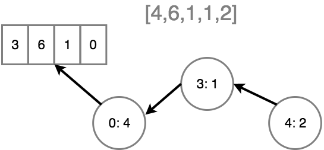

# 轻量函数式 JavaScript
# 第六章：值的不可变性

在[第五章](ch5.md)中，我们谈论了减少侧因/副作用的重要性：它们使你的应用程序状态会出乎意料地改变并造成意外的结果（bug）。这样有地雷的地方越少，我们就能对自己的代码更有信心，而且它的可读性也更高。我们在本章中的话题紧跟着为了相同的目的而做出的努力。

如果编程上的幂等性是关于定义一个只影响状态一次的改变值的操作，那么我们现在将注意力转向另一个目标：将改变发生的数量从一降为零。

现在我们来探索一下值的不可变性，这个概念是说我们在程序中仅使用不能被改变的值。

## 基本类型的不可变性

基本类型（`number`、`string`、`boolean`、`null`、以及 `undefined`）的值已经是不可变的了；你无法做任何事情来改变它们。

```js
// 不合法，也没有意义
2 = 2.5;
```

然而，JS 确实有一种特殊的行为，使它看起来允许修改这样的基本类型值：“封箱”。当你访问特定基本类型值上的一个属性时 —— 具体说是 `number`、`string`、和 `boolean` —— JS 在底层自动地将这个值包装（也就是“封箱”）在它对应的对象中（分别是 `Number`、`String`、以及 `Boolean`）。

考虑如下代码：

```js
var x = 2;

x.length = 4;

x;              // 2
x.length;       // undefined
```

数字一般没有 `length` 属性可用，所以设置 `x.length = 4` 是在试图添加一个新属性，而且它无声地失败了（或者说被忽略/丢弃了，这要看你的视角）；`x` 继续持有简单基本类型数字 `2`。

但是如果除了潜在地使读者糊涂以外没有其他原因，JS 允许语句 `x.length = 4` 运行这件事看起来根本就是个麻烦。好消息是，如果你使用 strict 模式（`"use strict";`），这样的语句将抛出一个错误。

要是你试着改变一个被明确封箱为对象表现形式的这样一个值呢？

```js
var x = new Number( 2 );

// 可以工作
x.length = 4;
```

这段代码中的 `x` 持有一个指向对象的引用，所以添加和改变自定义属性没有问题。

像 `number` 这样的简单基本类型值的不可变性显而易见。那 `string` 值呢？JS 开发者们有一个很常见的误解，就是字符串和数组很像而且因此可以被改变。JS 语法甚至使用 `[]` 访问操作符暗示它们为 “类数组”。然而，字符串也是不可变的。

```js
var s = "hello";

s[1];               // "e"

s[1] = "E";
s.length = 10;

s;                  // "hello"
```

除了能够像在一个数组中那样访问 `s[1]`，JS 字符串不是真正的数组。设置 `s[1] = "E"` 和 `s.length = 10` 都会无声地失败，就像上面的 `x.length = 4` 一样。在 strict 模式中，这些语句会失败，因为属性 `1` 和属性 `length` 在基本类型的 `string` 值上都是只读的。

有趣的是，即使是封箱后的 `String` 对象值也会表现为（几乎）不可变，因为如果你在 strict 模式下改变它的既存属性的话，它将抛出错误：

```js
"use strict";

var s = new String( "hello" );

s[1] = "E";         // error
s.length = 10;      // error

s[42] = "?";        // OK

s;                  // "hello"
```

## 从值到值

我们将在本章中更彻底地展开这个概念，但为了在开始的时候在我们的大脑中形成一个清晰的认识：值的不可变性不意味着我们不能拥有在程序运行的整个进程中一直改变的值。一个没有改变的值的程序可不是非常有趣！它也不意味着我们的变量不能持有不同的值。这些都是对值的不可变性的常见误解。

值的不可变性意味着，*当* 我们需要在程序中改变状态时，我们必须创建并追踪一个新的值而不是改变一个既存的值。

例如：

```js
function addValue(arr) {
    var newArr = [ ...arr, 4 ];
    return newArr;
}

addValue( [1,2,3] );    // [1,2,3,4]
```

注意我们没有改变 `arr` 引用的数组，而是创建了一个新数组（`newArr`） —— 它包含既存的值外加新的值 `4`。

基于我们在[第五章](ch5.md)中关于侧因/副作用的讨论来分析一下 `addValue(..)`。它是纯粹的吗？它具有引用透明性吗？给它相同的数组，它会总是产生相同的输出吗？它既没有侧因也没有副作用吗？**是的。**

想象一下，数组 `[1,2,3]` 表示一系列来自于某些先前操作的数据，而且我们把它存储在某些变量中。这就是我们的当前状态。如果我们想计算应用程序的下一个状态是什么，我们调用了 `addValue(..)`。但我们想要下一个状态的计算进行得直接且明确。所以 `addValue(..)` 操作接收一个直接的输入，返回一个直接的输出，并且避免通过改变 `arr` 引用的原始数组来制造副作用。

这意味着我们可以计算出新的状态 `[1,2,3,4]` 而且完全掌控这种状态的转换。我们程序中没有其他部分可以意外地将我们提早地转换到这个状态，或者完全转换为另一个状态，比如 `[1,2,3,5]`。通过管控我们的值并将它们视为不可变的，我们极大地缩小了意外的表面积，使我们的程序更易于阅读，易于推理，而最终更可信任。

`arr` 引用的数组实际上是可变的。我们只是选择不去改变它，如此我们践行了值的不可变性的精神。

我们也可以对对象使用这种拷贝而非改变的策略。考虑如下代码：

```js
function updateLastLogin(user) {
    var newUserRecord = Object.assign( {}, user );
    newUserRecord.lastLogin = Date.now();
    return newUserRecord;
}

var user = {
    // ..
};

user = updateLastLogin( user );
```

### 非本地

非基本类型的值在作为实际参数传递时，是通过引用持有的，被拷贝的是引用，而不是值本身。

如果你在程序的一个部分中拥有一个对象或数组，并将它传递给位于程序另一部分的一个函数，那么这个函数现在就可以通过这个引用影响这个值，以某种意外的方式改变它。

换句话说，如果非基本类型值被当做实际参数传递，那么它就会变为非本地的值。潜在的问题是，整个程序都不得不考虑这样的值是否将会被改变。

考虑如下代码：

```js
var arr = [1,2,3];

foo( arr );

console.log( arr[0] );
```

表面上，你希望 `arr[0]` 依然是值 `1`。但它是吗？你不知道，因为 `foo(..)` *可能* 会使用你传递给它的引用改变这个数组。

在前一章中我们已经看到了一种技巧可以避免这样的意外：

```js
var arr = [1,2,3];

foo( arr.slice() );         // ha! a copy!

console.log( arr[0] );      // 1
```

再过一会，我们将看到另一种保护我们自己的策略，使值不会出乎我们意料地被改变。

## 重新赋值

你如何描述一个“常量”是什么？在读下一个段落之前思考片刻。

<p align="center">
    * * * *
</p>

有些读者可能会浮现出这样的描述，“一个不能改变的值”，“一个不能被改变的变量”，等等。这些大约都是正确答案的邻居，但不是十分正确的门牌号码。一个常量的准确定义应当是：一个不能被重新赋值的变量。

这种吹毛求疵真的很重要，因为它明确了一个常量实际上与值没有关系，除了无论一个常量持有什么值，这个变量都不能再被赋值为任何其他值。但它没说关于值本身性质的任何事情。

考虑如下代码：

```js
var x = 2;
```

就像我们早先讨论的，值 `2` 是一个不可改变的（不变的）基本类型。如果我们把代码改为：

```js
const x = 2;
```

关键字 `const` —— 为人熟知的“常量声明” —— 的出现实际上根本不会改变 `2` 的性质；它已经是不可改变的了，而且将永远是不可改变的。

这稍后的一行将会出错并失败确实是真的：

```js
// 试着改变 `x`，双手合十！
x = 3;      // 错误！
```

但同样地，我们没有在改变值的任何东西。我们试图给变量 `x` 重新赋值。卷入其中的值几乎是巧合。

为了证明 `const` 与值的性质没有关系，考虑如下代码：

```js
const x = [ 2 ];
```

这个数组是常量吗？**不。** `x` 是一个常量，因为它不能被重新赋值了。但是这一行则完全没问题：

```js
x[0] = 3;
```

为什么？因为数组依然使完全可变的，即使 `x` 是一个常量。

`const` 与“常量”仅与赋值有关而与值的语义无关，这种困惑是一个又臭又长的故事。看起来几乎每种拥有 `const` 的语言的开发者中，都有很大一部分人被同样的困惑绊到。Java 事实上废弃了 `const` 而引入了一个新的关键字 `final`，至少在某种程度上将它自己与“常量”语义的困惑分离开了。

先把困惑的诋毁放在一边，如果 `const` 与创建一个不可变的值毫无关系，那么它对 FP 程序员的重要性在于何处？

### 意图

`const` 的使用告诉你代码的读者 *这个* 变量将不会再次被赋值了。作为一种意图的信号，`const` 成为了 JavaScript 的一种受欢迎的增益，作为一种对代码可读性的全面改善而经常受到高度的赞扬。

在我看来，这几乎就是炒作；这些主张中没有太多实质上的东西。以这种方式标示你的意图，我只能看到一点儿极其微弱的好处。而且当你把这与近十几年它造成的困惑 —— 暗示值的不可变性 —— 比起来的话，我认为 `const` 甚至配不上它的地位。

为了证明我的判断，让我们考虑一下作用域。`const` 会创建一个块作用域变量，意味着这个变量仅会存在于这个局部化的块中：

```js
// 许多代码

{
    const x = 2;

    // 几行代码
}

// 许多代码
```

块通常被认为最好是设计成仅有几行代码的长度。如果你有一些块多于，比如说 10 行，大多数开发者都会建议你重构。所以 `const x = 2` 最多仅对那剩下的 9 行代码有效。

程序中没有其他部分可能影响 `x` 的赋值。**就是这样。**

我的主张是：这段程序的可读性的量级基本上和下面这一段是相同的：

```js
// 许多代码

{
    let x = 2;

    // 几行代码
}

// 许多代码
```

如果你看看 `let x = 2` 后面的几行代码；你很容易就能知道 `x` 实际上没有被重新赋值。与使用什么 `const` 声明来表示“不会给它重新赋值”相比 —— 实际上确实没有给它重新赋值！ —— 这对我来说是一种 **强烈得多的信号**。

另外，让我们考虑一下这段代码在第一眼看上去将会如何与读者交流：

```js
const magicNums = [1,2,3,4];
```

有没有那么一点可能（很可能？），你代码的读者将会（错误地）假设你的意图是绝不会改变这个数组？这在我看来是一个合理的推断。想象一下他们的困惑，如果你实际上允许 `magicNums` 引用的数组被改变。这不会令他们惊讶吗？

更可怕的是，要是你故意改变 `magicNums` 的方式对于读者来说不那么显而易见呢？在稍后的代码中，他们看到 `magicNums` 的使用并（同样错误地）假设它依然是 `[1,2,3,4]`，因为它们将你的意图理解为 “将不会改变它”。

我认为你应当使用 `var` 或 `let` 来声明持有你试图改变的值的变量。与使用 `const` 相比，我想那才是一个 **明确得多的信号**。

但是 `const` 造成的麻烦不止于此。还记得我们在本章开头断言的，将值视为不可变意味着当我们需要改变状态时，我们必须创建一个新的值而非改变它吗？一旦你创建了一个新数组，你将如何处理它？要是你使用 `const` 来声明持有它的引用，你就不能再给它赋值了。

```js
const magicNums = [1,2,3,4];

// 稍后：
magicNums = magicNums.concat( 42 );  // 哦，不能再次赋值
```

那么……接下来怎么办？

照此看来，我觉得 `const` 实际上使我们坚持 FP 的努力变得更加困难，而不是容易。我的结论：`const` 根本就没那么有用。它以一种麻烦的方式给我们造成了不必要的困惑与限制。我仅会对这样简单的常量使用 `const`：

```js
const PI = 3.141592;
```

值 `3.141592` 已经是不可变的了，而且我明确地表示，“这个 `PI` 将总是被用于这个字面值的替代品或占位符。” 对我来说，这才是 `const` 有益的地方。而且坦白地讲，在我日常的编码中，我不会使用太多这种类型的声明。

我写过也看过许多 JavaScript，我想我们许多的 bug 来源于意外的重新赋值只不过是一个想象中的问题。

FP 程序员们如此地高度评价 `const` 并避免重新赋值的原因之一是方程式推理。虽然与 JS 相比这个话题与其他的语言关系更多一些，而且超出了我们将在此讨论的范围，但它是有意义的。但是，我更喜欢实用性的观点而非学术性的。

例如，我发现仔细斟酌的变量再赋值可以简化对计算的中间状态的说明。当一个值经历了多种类型强制转换或者其他变形时，我通常不想为每一种表现形式都想一个新的变量名：

```js
var a = "420";

// 稍后

a = Number( a );

// 稍后

a = [ a ];
```

如果将 `"420"` 改变为 `420` 之后，不再需要原来的值 `"420"`，那么我认为对 `a` 进行重新赋值要比想一个诸如 `aNum` 之类的变量名更具可读性。

我认为我们需要担心的不是我们的变量是否被重新赋值了，而是 **我们的变量是否被改变了**。为什么？因为值是可以流动的；而词法赋值不会。你可以将一个数组传递给一个函数，而它可以在不被你知晓的情况下改变。但你不可能有一个由某些程序其他部分引起的意外的重新赋值。

### 冻结于此

有一种既便宜又简单的方法可以将一个可变的对象/数组/函数变为一个（某种意义上的）“不变值”：

```js
var x = Object.freeze( [2] );
```

`Object.freeze(..)` 工具遍历一个对象/数组上的所有属性/下标并将它们标识为只读，于是它们就不能被重新赋值了。这实际上有些像使用 `const` 来声明属性！`Object.freeze(..)` 还会将属性标识为不可配置的，并且将对象/数组本身标识为不可扩展的（不能添加新的属性）。实质上，它使对象的顶层成为不可变的。

但只有顶层。要小心！

```js
var x = Object.freeze( [ 2, 3, [4, 5] ] );

// 不允许：
x[0] = 42;

// 噢，依然允许：
x[2][0] = 42;
```

`Object.freeze(..)` 提供了一种浅层的，幼稚的不可变性。如果你想要一个深层的不可变值，你就必须手动地遍历整个对象/数组结构并在每一个子对象/数组上使用 `Object.freeze(..)`。

但是与使你稀里糊涂地认为你得到了一个不可变值 —— 其实不是 —— 的 `const` 相对比起来，`Object.freeze(..)` *确实* 给了你一个不可变值。

回想一下之前防护的例子：

```js
var arr = Object.freeze( [1,2,3] );

foo( arr );

console.log( arr[0] );          // 1
```

现在 `arr[0]` 相当可靠地是 `1`。

这相当重要，因为当我们的值被传递给不可见或不可控的某些地方时，如果我们知道自己可以确信这个值不会改变，这会使推理我们的代码容易得多。

## 性能

无论我们何时开始创建一个新的值（数组，对象，等等）而非改变既存的东西，下一个显而易见的问题就是：这对性能意味着什么？

如果每次我们向一个数组添加元素时都不得不重新分配一个新数组，那么这不仅消耗 CPU 时间和额外的内存，而且旧的值（如果不再被引用的话）还要被垃圾回收；那会造成更多的 CPU 负担。

这是一笔可以接受的交易吗？要看情况。关于代码性能的讨论或优化不应该在 **没有上下文环境** 的前提下进行。

如果你有一个状态的改变在整个程序的生命周期中只发生一次（甚至几次），为了新的数组/对象而把旧的扔掉就几乎没什么可在乎的。我们所谈论的消耗是如此之小 —— 可能最多仅仅几微秒 —— 以至于不会对你应用程序的性能有实质上的影响。与你将节省下来的几分钟或几小时 —— 花在不得不追踪并修复因值的意外改变而引起的 bug —— 相比，这甚至没什么可争论的。

那么同样，如果这样的操作将频繁发生，或者特别地发生在你应用程序的 *关键路径* 上，那么性能 —— 性能与内存两者! —— 就完全是一个需要关心的问题了。

考虑一种特殊的数据结构，它像一个数组一样，但是你想在改变它时，使每一次改变都隐含地表现为好像得到了一个新的数组。在不实际每次创建一个新数组的情况下，你如何达成这个目标？这种特殊的数组数据结构能够存储原始值，然后跟踪每一次改变并将之作为前一个版本的增量。

从内部讲，它可能很像一个对象引用的链表树，树上的每一个节点都代表一个原始值的改变。实际上，这在概念上与 **git** 版本控制工作的方式很相似。

<p align="center">
    
</p>

在这个概念性的图示中，原始的数组 `[3,6,1,0]` 首先有一个将值 `4` 赋予位置 `0` 的改变（结果为 `[4,6,1,0]`），然后 `1` 被赋予位置 `3`（现在是`[4,6,1,1]`），最后 `2` 被赋予位置 `4`（结果：`[4,6,1,1,2]`）。这里关键的想法是，每一次改变，仅有对前一个版本的变化被记录下来，而不是复制整个原来的数据结构。一般来说，这种方式在内存和 CPU 性能上要高效得多。

想象一下这样使用这种理论上的特殊数组数据结构：

```js
var state = specialArray( 4, 6, 1, 1 );

var newState = state.set( 4, 2 );

state === newState;                 // false

state.get( 2 );                     // 1
state.get( 4 );                     // undefined

newState.get( 2 );                  // 1
newState.get( 4 );                  // 2

newState.slice( 2, 5 );             // [1,1,2]
```

数据结构 `specialArray(..)` 将会在内部追踪每一次改变操作（比如 `set(..)`），作为一个 *diff*，所以它不必仅为了向列表中添加值 `2` 而为原始值（`4`、`6`、`1`、和 `1`）重新分配内存。但重要的是，`state` 和 `newState` 指向了这个数组值的不同版本（或视图），所以 **值的不可变性的语义被保持了下来。**

发明你自己的性能优化数据结构是一种有趣的挑战。但从实用的角度讲，你可能应当使用一个在这方面已经做得很好的库。一个很棒的选项是 [Immutable.js](http://facebook.github.io/immutable-js)，它提供了各种数据结构，包括 `List`（类似数组）和 `Map`（类似对象）。

考虑上面的 `specialArray` 例子，但是用 `Immutable.List`：

```js
var state = Immutable.List.of( 4, 6, 1, 1 );

var newState = state.set( 4, 2 );

state === newState;                 // false

state.get( 2 );                     // 1
state.get( 4 );                     // undefined

newState.get( 2 );                  // 1
newState.get( 4 );                  // 2

newState.toArray().slice( 2, 5 );   // [1,1,2]
```

像 Immutable.js 这样强大的库采用了非常精巧的性能优化方法。在没有这样的库的帮助下处理所有的细节以及罕见状况将十分困难。

当一个值改变的情况很少发生或不频繁，而且不太需要关心性能的时候，我推荐轻量级的解决方案，使用早先讨论的內建 `Object.freeze(..)`。

## 解决方法

要是我们在函数中收到一个值而且我们无法确定它是可变还是不可变呢？直接改变它也没问题吗？**不。** 正如我们在本章开头断言的那样，我们应当将所有收到的值看做可变的 —— 为了避免副作用而且保持纯粹性 —— 不论它们是否可变。

回忆一下先前的这个例子：

```js
function updateLastLogin(user) {
    var newUserRecord = Object.assign( {}, user );
    newUserRecord.lastLogin = Date.now();
    return newUserRecord;
}
```

这种实现将 `user` 视为一个不应当被改变的值；它是不是可变的与阅读这部分代码无关。与这个实现相比较的话：

```js
function updateLastLogin(user) {
    user.lastLogin = Date.now();
    return user;
}
```

这个版本更易于编写，而且甚至性能更好。但这种方式不但使 `updateLastLogin(..)` 变得不纯粹，而且它改变值的方式还使阅读这段代码，以及使用这段代码的地方，更加复杂。

**我们应当总是将 `user` 视为不可变的**，因为在阅读到代码的这一点时我们不知道值从何而来，或者我们改变它的话会造成什么潜在的问题。

这种方式的一些很好的例子可以在 JS 数组的各种內建方法中看到，比如 `concat(..)` 和 `slice(..)`：

```js
var arr = [1,2,3,4,5];

var arr2 = arr.concat( 6 );

arr;                    // [1,2,3,4,5]
arr2;                   // [1,2,3,4,5,6]

var arr3 = arr2.slice( 1 );

arr2;                   // [1,2,3,4,5,6]
arr3;                   // [2,3,4,5,6]
```

其他的一些将值视为不可变，并返回一个新数组而非修改的数组原型方法是：`map(..)` 和 `filter(..)`。`reduce(..)` / `reduceRight(..)` 工具也会避免修改值，虽然它们不会默认地返回一个新数组。

不幸的是，由于一些历史原因，有好几个数组方法是不纯粹的修改器方法：`splice(..)`、`pop(..)`、`push(..)`、`shift(..)`、`unshift(..)`、`reverse(..)`、`sort(..)`、和 `fill(..)`。

就像一些人主张的，这不应当被视为使用这些工具的 *禁令*。为了例如性能优化之类的原因，有时你会想要使用它们。但你绝不应该在一个对于你当前函数来说还不是本地值的数组使用这样的方法，以避免对代码稍远处的其他部分造成副作用。

<a name="hiddenmutation"></a>

回想一下[第四章中 `compose(..)`](ch4.md/#user-content-generalcompose) 的一种实现：

```js
function compose(...fns) {
    return function composed(result){
        // 拷贝函数的数组
        var list = fns.slice();

        while (list.length > 0) {
            // 从列表的最后取出一个函数
            // 并执行它
            result = list.pop()( result );
        }

        return result;
    };
}
```

聚集形式参数 `...fns` 从传入的实际参数中制造了一个新的本地数组，我们不可能在这个数组上造成外部的副作用。我们在本地改变它很安全的设想是合理的。但这里有一个微妙的陷阱是，在这种意义上闭包着 `fns` 的内部 `composed(..)` 不是 “本地” 的。

考虑这种没有制造拷贝的不同版本：

```js
function compose(...fns) {
    return function composed(result){
        while (fns.length > 0) {
            // 从列表的最后取出一个函数
            // 并执行它
            result = fns.pop()( result );
        }

        return result;
    };
}

var f = compose( x => x / 3, x => x + 1, x => x * 2 );

f( 4 );     // 3

f( 4 );     // 4 <-- 噢！
```

第二次使用 `f(..)` 的结果不正确，因为我们在第一次调用中改变了 `fns`，这影响了后续的所有使用。根据情景的不同，制造一个像 `list = fns.slice()` 这样的数组拷贝可能有必要也可能没必要。但我认为假定你需要最安全 —— 就算是仅仅为了可读性考量 —— 除非你能证明你不需要，而非其他的原因。

严格遵守并总是将 *收到的值* 视为可变的，不管它们是还是不是。这种努力将会改进你代码的可读性与可信性。

## 总结

值的不可变性不是关于不改变值。它是随着程序状态的改变来创建并追踪新的值，而不是修改既存的值。这种方式将在阅读代码时带来更多的信心，因为我们限制了那些状态 —— 以一些我们不愿看到或期望的方式 —— 可以改变的地方。

`const` 声明（常量）常被误认为具有表示意图并强制不可变性的能力。而实际情况是，`const` 基本上与值的不可变性无关，而且它的使用造成的困惑很可能要比它解决的多。相反，`Object.freeze(..)` 提供了一种不错的內建方式来在数组或对象上设置浅层的值不可变性。在许多情况下，这就够了。

对于程序中性能敏感的部分，或者在改变频繁发生的情况下，创建一个新数组或对象（特别是如果它包含大量数据时）对于处理与内存上的考虑都是不合适的。在这样的情况下，使用来自于 **Immutable.js** 这样的库的不可变数据结构可能是最好的办法。

值的不可变性在代码可读性上的重要性并不太关乎它对改变一个值的无能为力，而更多地在于将一个值视为可变的自律。
