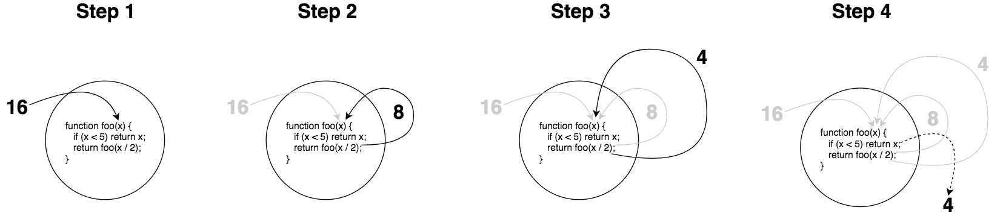
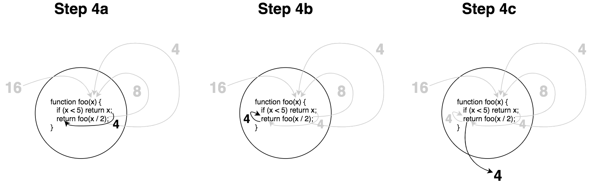
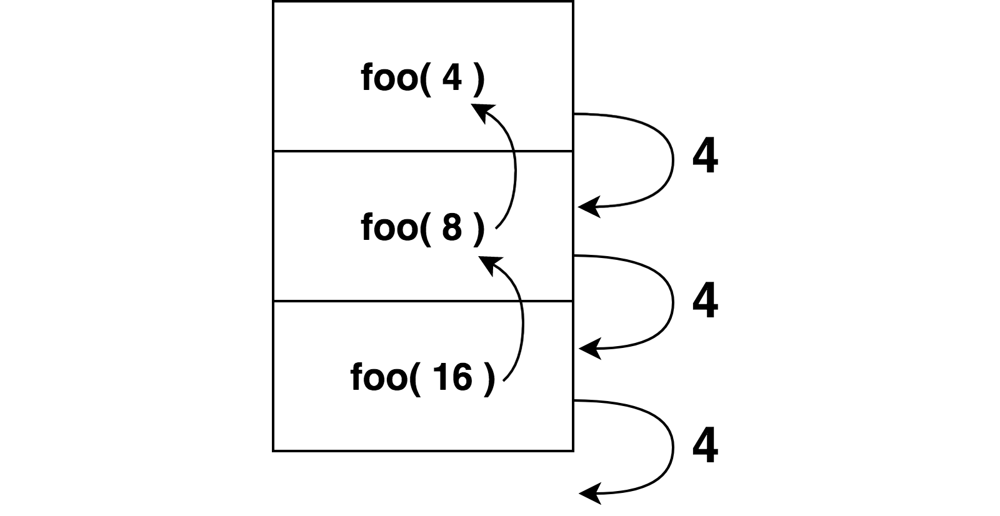
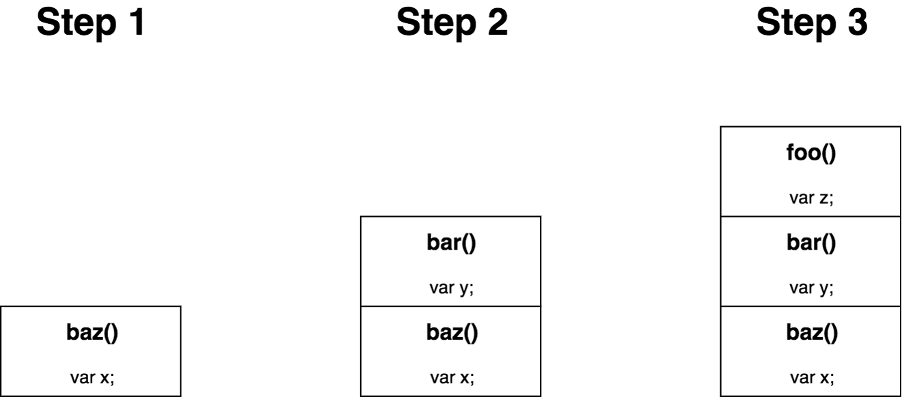
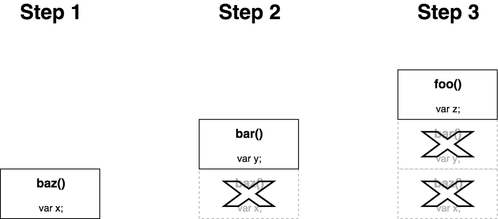

# 轻量函数式 JavaScript
# 第八章：递归

你在前一章闭包/对象的兔子洞中玩儿得开心吗？欢迎回来！

在下一页，我们将进入递归的话题。

<hr>

*(本页的剩余部分故意被留作空白)*

<p>&nbsp;</p>
<p>&nbsp;</p>
<p>&nbsp;</p>
<p>&nbsp;</p>
<p>&nbsp;</p>
<p>&nbsp;</p>
<p>&nbsp;</p>
<p>&nbsp;</p>
<p>&nbsp;</p>
<p>&nbsp;</p>
<p>&nbsp;</p>

<div style="page-break-after: always;"></div>

让我们来谈谈递归。在深入之前，参见前一页来了解其正式的定义。

很弱的玩笑，我知道。:)

递归是那些大多数开发者都承认其非常强大，但同时也不喜欢使用的技术之一。在这种意义上，我将之与正则表达式归为同一范畴。强大，但令人糊涂，因此看起来 *不值得花那么多力气*。

我是一个递归的狂热爱好者，而且你也可以是！不幸的是，许多递归的例子都关注于生成斐波那契数列这样不起眼儿的学术问题。如果你的程序真的需要这种数列 —— 让我们面对现实，这不是很常见！—— 你很可能忽视了大局。

事实上，递归是 FP 开发者们避免指令式循环和再赋值的最重要的方法之一：将实现细节的负担丢给语言和引擎。如果使用得当，递归对复杂的问题来说有一种强大的声明式作用。

可惜的是，递归远没有得到应有的重视，特别是在 JS 中，这很大程度上是由于一些非常现实的性能（速度和内存）限制。我在本章的目标是深入探究递归，并找到递归应当成为我们 FP 的先锋与中心的实际理由。

## 定义

递归是一个函数调用它自己，而且这个调用也做同样的事情，这种循环一直持续到基准条件达成，然后所有的调用都被展开。

**注意：** 如果你不能确保基准条件会 *最终* 达成，那么递归就会永远运行下去，并使你的程序崩溃或锁住你的程序；搞对基准条件十分重要！

但是…… 这个定义的书面形式太过模糊。我们可以做得更好。考虑这个递归函数：

```js
function foo(x) {
    if (x < 5) return x;
    return foo( x / 2 );
}
```

让我们将调用 `foo(16)` 时这个函数发生的事情图形化一下：

<p align="center">
    
</p>

在第二步中，`x / 2` 产生 `8`，它作为实际参数传入递归的 `foo(..)` 调用。在第三步中，同样的事情，`x / 2` 产生 `4`，而它又作为实际参数被传入另一个 `foo(..)` 调用。希望这部分看起来相当直截了当。

但一些人可能会被第四步发生的事情绊倒。一旦我们满足了 `x`（值 `4`）`< 5`的基准条件，我们就不再进行递归调用了，而仅仅（实际上）`return 4`。特别是这幅图中返回 `4` 的虚线简化了那里发生的事情，所以让我们深入这最后一步并将它图形化为这三个子步骤：

<p align="center">
    
</p>

一旦基准条件被满足，这个返回值就逐一回溯调用栈中所有的调用（因此这些调用会 `return`），最终 `return` 出最后的结果。

另一种可视化这个递归的方法是按照函数调用发生的顺序考虑它们（通常称为调用栈（call stack））：

<p align="center">
    
</p>

本章稍后有更多关于调用栈的内容。

另一个递归的例子：

```js
function isPrime(num,divisor = 2){
    if (num < 2 || (num > 2 && num % divisor == 0)) {
        return false;
    }
    if (divisor <= Math.sqrt( num )) {
        return isPrime( num, divisor + 1 );
    }

    return true;
}
```

素数检查的基本工作方式是，尝试从整数 `2` 开始一直到被检查的 `num` 的平方根，看它们中之一是否可以除尽（`%` 模运算返回 `0`）这个数字。如果有，它就不是素数。否则，它一定是一个素数。`divisor + 1` 使用递归来迭代每一个可能的 `divisor` 值。

递归的最著名的例子之一就是计算斐波那契数列，这个数列被定义为：

```txt
fib( 0 ): 0
fib( 1 ): 1
fib( n ):
    fib( n - 2 ) + fib( n - 1 )
```

**注意：** 这个数列的前几个数字是：0、1、1、2、3、5、8、13、21、34、…… 每一个数字都是数列中前两个数字的和。

用代码直接表达斐波那契数列的定义：

```js
function fib(n) {
    if (n <= 1) return n;
    return fib( n - 2 ) + fib( n - 1 );
}
```

`fib(..)` 递归地调用自己两次，这通常被称为二元递归。我们稍后将会更多地谈到二元递归。

我们将在本章的各个地方使用 `fib(..)` 来展示关于递归的思想，但是这种特殊形式的一个缺点是存在很多重复工作。`fib(n-1)` 和 `fib(n-2)` 并不互相共享它们的任何工作成果，而是在整个整数递减到 `0` 的过程中，几乎完全互相重叠。

我们在[第五章，“性能上的影响”](ch5.md/#performance-effects) 一节中简要地谈到了默记。这里，默记将允许对任何给定数字的 `fib(..)` 仅被计算一次，而不是重复计算许多次。我们不会在这个话题上走得太远，但意识到性能上的问题对任何算法都很重要，不管是不是递归。

### 相互递归

当一个函数调用它自己时，被特别地称为直接递归。这是我们在前一节的 `foo(..)`、`isPrime(..)`、和 `fib(..)` 中看到的。当两个或更多函数可以在一个递归周期中相互调用，这称为相互递归。

这两个函数就是相互递归的：

```js
function isOdd(v) {
    if (v === 0) return false;
    return isEven( Math.abs( v ) - 1 );
}

function isEven(v) {
    if (v === 0) return true;
    return isOdd( Math.abs( v ) - 1 );
}
```

是的，这是一个计算数字奇偶性的笨办法。但它展示了特定的算法可以根据互相递归进行定义的想法。

回忆一下前一节中的二元递归 `fib(..)`；我们可以使用相互递归来表达它：

```js
function fib_(n) {
    if (n == 1) return 1;
    else return fib( n - 2 );
}

function fib(n) {
    if (n == 0) return 0;
    else return fib( n - 1 ) + fib_( n );
}
```

**注意：** 这种相互递归的 `fib(..)` 实现摘自 [“使用相互递归的斐波那契数列”](https://www.researchgate.net/publication/246180510_Fibonacci_Numbers_Using_Mutual_Recursion) 中的研究。

虽然这里展示的相互递归的例子非常造作，但是确实存在相互递归可能非常有用的更复杂的用例。在一个树形数据结构中计数叶子节点就是一例子，而（有编辑器进行，源代码的）递归下降分析法是另一个。

### 为什么要递归？

现在我们已经定义并展示了递归，我们应当检视一下为什么递归如此有用。

最常为人所引用的理由是递归符合 FP 的精神，因为它用调用栈上的隐含状态取代了（绝大多数）明确的状态追踪。递归通常在这样的情况下最有用：当一个问题需要条件分支与回溯，而在一个纯粹的迭代环境中管理这种状态可能十分复杂；至少，这样的代码高度指令化而且很难阅读与验证。但在调用栈上将分支的每一层作为它自己的作用域进行追踪，通常会显著地提高代码可读性。

简单的迭代算法可以很容易地表达为递归：

```js
function sum(total,...nums) {
    for (let num of nums) {
        total = total + num;
    }

    return total;
}

// vs

function sum(num1,...nums) {
    if (nums.length == 0) return num1;
    return num1 + sum( ...nums );
}
```

它不仅是调用栈取代并消灭了 `for` 循环，而且递增的部分结果（`total` 的中间状态）一直在调用栈的 `return` 中隐含地追踪，而不是在每次迭代中给 `total` 重新赋值。FP 程序员经常喜欢在可能的地方避免对本地变量进行重新赋值。

在像这种求和的基本算法中，其区别是微小和微妙的。但是你的算法越精巧，你就越有可能看到递归取代指令式状态追踪的回报。

## 声明式递归

数学家们使用 **Σ** 符号作为占位符来表示对一个数字列表的求和。他们这么做的主要原因是因为，如果他们在研究更复杂的公式时不得不手动写出像 `1 + 3 + 5 + 7 + 9 + ..` 这样的求和的话，就太麻烦了（也不易读懂！）。使用符号就是声明式的数学！

递归对算法的声明性，与 **Σ** 对数学的声明性的含义是相同的。递归表达的是一个问题的解决方案存在，但不必要求代码的读者理解这种解决方案是如何工作的。让我们考虑两种找出参数中最大偶数的方式：

```js
function maxEven(...nums) {
    var maxNum = -Infinity;

    for (let num of nums) {
        if (num % 2 == 0 && num > maxNum) {
            maxNum = num;
        }
    }

    if (maxNum !== -Infinity) {
        return maxNum;
    }
}
```

这个实现不是特别的难对付，但看懂它的微妙之处也不是很容易。`maxEven()`、`maxEven(1)`、和 `maxEven(1,13)` 都返回 `undefined` 这件事有多明显？最后一个 `if` 语句为什么必要这件事很快就能搞明白吗？

为了比较，让我们来考虑一种递归的方式。我们可以将递归这样符号化：

```txt
maxEven( nums ):
    maxEven( nums.0, maxEven( ...nums.1 ) )
```

换言之，我们可以将一个数列中的最大偶数定义为，第一个数字与其余数字中的最大偶数相比之下的最大偶数。例如：

```txt
maxEven( 1, 10, 3, 2 ):
    maxEven( 1, maxEven( 10, maxEven( 3, maxEven( 2 ) ) )
```

要在 JS 中实现这种递归定义，一个方式是：

```js
function maxEven(num1,...restNums) {
    var maxRest = restNums.length > 0 ?
            maxEven( ...restNums ) :
            undefined;

    return (num1 % 2 != 0 || num1 < maxRest) ?
        maxRest :
        num1;
}
```

那么这种方式有什么好处？

首先，它的签名与之前稍有不同。我有意地将第一个参数名称叫做 `num1`，将剩余的参数收集到 `restNums` 中。但为什么？我们本可以将它们全部收集到一个 `nums` 数组中，然后引用 `nums[0]`。

这个函数签名是对递归定义的一种有意提示。它读起来就像这样：

```txt
maxEven( num1, ...restNums ):
    maxEven( num1, maxEven( ...restNums ) )
```

你看到签名与递归定义之间的对称性了吗？

当我们能够在函数签名中使递归的定义更加明显时，我们就增强了函数的声明性。而且如果我们进而能够将递归的定义投射到函数体中的话，它就会变得更好。

但我要说最明显的改进是指令式 `for` 循环使人分心的地方被压制了。这个循环的所有逻辑都被抽象到递归调用栈中，这样这些东西就不会搞乱代码。之后我们就可以将注意力集中到每次比较两个数字并找出最大偶数的逻辑中 —— 总之是最重要的部分！

在思维上，这里发生的事与一个数学家在一个很大的等式中使用 **Σ** 求和相似。我们在说，“这个列表中剩余部分的最大偶数是由 `maxEven(...restNums)` 计算的，所以我们假设这部分成立并继续向下进行。”

另外，我们使用了 `restNums.length > 0` 守护条件来强化这个概念，因为如果没有更多数字需要考虑了，那么自然的结果就是 `maxRest` 必定是 `undefined`。我们不必再花费任何额外的精力来推理这一部分。基准条件（没有更多数字要考虑了）是显而易见的。

接下来，我们将注意力转移至对照 `maxRest` 来检查 `num1` —— 这个算法的主逻辑是如何判定两个数字中的哪一个是最大偶数。如果 `num1` 不是偶数（`num1 % 2 != 0`），或者它小于 `maxRest`，那么 `maxRest` *必须* 被 `return`，即使它是 `undefined`。否则，`num1` 就是答案。

我在制造的情景是，与指令式的方式相比，它使阅读一个实现时推理它变得更加直截了当，使我们分心的微小差别和噪音更少；它要比使用 `-Infinity` 的 `for` 循环版本 **声明性更强**。

**提示：** 我们应当指出除了手动迭代或递归之外的另一种（很可能是更好的！）建模方式是列表操作（见[第九章](ch9.md)）。数列可以首先被 `filter(..)` 为仅含有偶数，然后用一个 `reduce(..)` 寻找最大值。我们使用这个例子只是为了展示与手动迭代相比，递归更具声明性的性质。

### 二叉树递归

这是另一个递归的例子：计算二叉树的深度。事实上，几乎所有你将对树进行的操作用递归来实现都是最简单的，因为对栈进行上上下下的手动追踪是高度指令化且易错的。

一个二叉树的深度是树中向下（要么在左侧要么在右侧）最长的节点路径。另一种定义它的方法是递归的：一个树在任意节点的深度，是 1（当前节点）加上它左侧或右侧子树中深度较大的那一棵树的深度。

```txt
depth( node ):
    1 + max( depth( node.left ), depth( node.right ) )
```

将它直接翻译为一个二元递归函数：

```js
function depth(node) {
    if (node) {
        let depthLeft = depth( node.left );
        let depthRight = depth( node.right );
        return 1 + max( depthLeft, depthRight );
    }

    return 0;
}
```

我不会给出这个算法的指令式形式，但相信我，它要混乱得多。这种递归的方式具有良好且优雅的声明性。它紧贴着算法的递归定义而且很少有令人分心的事情。

不是所有的问题都是纯粹递归的。它不是你应当四处尝试使用的某种杀手锏。但递归可以很有效地将一个问题的表达从更强的指令性演化为更强的声明性。

## 栈

让我们重新审视早先的 `isOdd(..)` / `isEven(..)` 递归：

```js
function isOdd(v) {
    if (v === 0) return false;
    return isEven( Math.abs( v ) - 1 );
}

function isEven(v) {
    if (v === 0) return true;
    return isOdd( Math.abs( v ) - 1 );
}
```

在大多数浏览器中，如果你试着运行这段代码你就会得到一个错误：

```js
isOdd( 33333 );         // RangeError: Maximum call stack size exceeded
```

发生了什么错误？引擎抛出这个错误是因为它想防止你的程序耗尽系统内存。为了解释这一切，我们需要看看当函数调用发生时，JS 引擎在背后发生了什么。

每一个函数调用都会留出一小块称为栈帧（stack frame）的内存。栈帧中持有一些特殊的重要信息：在一个函数中当前正在处理的语句的状态，包括所有变量中的值。这些信息需要被存储在内存（栈帧）中的原因是函数可能会调用另一个函数，这会暂停当前函数的运行。当另一个函数结束时，引擎需要从当前函数正好被暂停时的状态继续它的运行。

当第二个函数调用开始时，它也需要一个栈帧，从而将栈帧的数量增加到 2。如果这个函数再调用另一个函数，我们就需要第三个栈帧。以此类推。“栈” 这个词说的是这样的概念：每次一个函数被前一个函数调用时，下一个帧会被 *堆积到* 栈的顶部。当一个函数调用完成时，它的帧会从栈中弹出。

考虑这段程序：

```js
function foo() {
    var z = "foo!";
}

function bar() {
    var y = "bar!";
    foo();
}

function baz() {
    var x = "baz!";
    bar();
}

baz();
```

一步一步地将这段程序的栈可视化：

<p align="center">
    
</p>

**注意：** 如果这些函数没有相互调用，而只是顺序地被调用的话 —— 比如 `baz(); bar(); foo();`，这样每一个函数都会在下一个开始之前完成 —— 栈帧就不会堆积起来；每个函数调用都会在下一个栈帧加入栈中之前将自己的栈帧移除掉。

好了，所以每个函数调用都需要一点儿内存。在大多数普通程序的情况下没什么大不了的，对吧？一旦当你引入递归后它很快就会成为一个大问题。虽然你几乎绝对不会手动地在一个调用栈中将上千（甚至不会有上百个！）个不同的函数调用堆积在一起，但是你会很容易地看到有成千上万或更多的递归调用堆积起来。

成对的 `isOdd(..)` / `isEven(..)` 抛出一个 `RangeError` 是因为引擎遇到了一个被随意设置的限制，从而认为调用栈增长的太多而需要被停止。这个限制不是基于实际内存水平接近于零，而是由引擎进行的预测：如果放任这种程序运行下去，内存就会耗尽了。知道或证明一个程序最终会停止是不可能的，所以引擎不得不进行一次有依据的猜测。

这种限制是依赖于实现的。语言规范中对此没有任何说明，所以它不是 *必须* 的。但在实际中所有的 JS 引擎都确实有一个限制，因为不作限制将会制造出不稳定的设备，它们很容易受到烂代码或恶意代码的攻击。在每一个不同设备环境中的每一个引擎都会强制一个它自己的限制，所以没有办法可以预测或保证我们可以在函数调用栈上走多远。

这种限制对我们开发者的意义是，在解决关于大型数据集合的问题时递归的用途有一种应用的局限性。事实上，我认为这种局限性才是使递归在开发者工具箱中沦为二等公民的最大原因。令人遗憾的是，递归是一种事后思考而不是一种主要技术。

### 尾部调用

递归的出现远早于 JS，这些内存的限制也是。早在 1960 年代，开发者们就因想使用递归而遭遇了设备内存限制的困难，而他们强大的计算机的内存比我们今天的手表还要小得多。

幸运的是，在那些早年间的日子里产生的一种强大的远见依然给出了希望。这种技术称为 *尾部调用（tail calls）*。

它的想法是，如果从函数 `baz()` 到函数 `bar()` 的调用发生在函数 `baz()` 执行的最末尾 —— 这称为一个尾部调用 —— 那么 `baz()` 的栈帧就不再需要了。这意味着内存要么被回收，要么或者更好地，简单地被重用于函数 `bar()` 的执行。图形化一下的话：

<p align="center">
    
</p>

尾部调用本质上和递归没有直接的联系；这个概念对任何函数调用都成立。但是你的手动非递归调用在大多数情况下不太可能超出 10 层的深度，所以尾部调用对你程序使用的内存使用空间造成明显影响的可能性非常低。

尾部调用真正闪光的地方是在递归的情况下，因为它意味着一个递归栈可以 “永远” 运行，而唯一需要关心的性能问题是计算，而不是固定的内存限制。尾部调用递归可以运行在固定为 `O(1)` 的内存用量中。

这种类型的技术经常被称为尾部调用优化（Tail Call Optimizations —— TCO），但重要的是要区别检测到尾部调用以便可以在固定的内存空间中运行的能力，与优化这种方式的技术。技术上讲，尾部调用本身不是人们想象中的一种性能优化，因为它们实际上要比普通的调用运行得慢。TCO 才是由于优化尾部调用使之更高效运行的优化。

### 正确尾部调用（PTC）

在 ES6 之前，JavaScript 从没要求（或禁止）过尾部调用。ES6 以一个语言规范的形式规定了尾部调用的识别，称为正确尾部调用（Proper Tail Calls —— PTC），而且保证 PTC 形式的代码将可以不受内存栈增长的影响无边界地运行。从实际上讲，这意味着如果我们遵循 PTC，我们就不会得到 `RangeError`。

首先，在 JavaScript 中 PTC 要求 strict 模式。你应当已经在使用 strict 模式了，但如果你没有，这就是另一个你应当已经开始使用 strict 模式的理由。难道我没提到过你应当已经在使用 strict 模式了吗！？

第二，一个 *正确* 尾部调用看起来像这样：

```js
return foo( .. );
```

换句话说，函数调用是这个函数最后一件需要执行的事情，而无论它返回什么值都要被明确地 `return`。这样，JS 就可以绝对地保证不再需要当前的栈帧了。

这些 *不是* PTC：

```js
foo();
return;

// 或者

var x = foo( .. );
return x;

// 或者

return 1 + foo( .. );
```

**注意：** 一个 JS 引擎，或者一个智能的转译器，*可能* 会做一些代码识别工作来认识到 `var x = foo(); return x;` 实质上与 `return foo();` 是一样的，这将使它成为合法的 PTC。但语言规范中对此没有要求。

`1 +` 的那一部分绝对会在 `foo(..)` 完成 *之后* 处理，所以栈帧不得不保留。

然而，这 *是* PTC：

```js
return x ? foo( .. ) : bar( .. );
```

在条件 `x` 计算之后，不是 `foo(..)` 就是 `bar(..)` 将会运行，而且无论哪种情况，返回值都总是被 `return` 回去。这是 PTC 的形式。

二元（或多元）递归 —— 像早先展示的那样，两个（或更多！）的递归调用在每一层被发起 —— 绝不可能按原样就是有效的 PTC，因为所有的递归都不得不在尾部的位置以避免调用栈的增长；而最多只有一个递归调用可以出现在 PTC 位置。

早先，我们展示了将二元递归重构为相互递归的例子。通过将多递归算法分割为隔离的函数调用 —— 每一个都分别表达为 PTC 形式 —— 来达成 PTC 是可能的。然而，这种错综复杂的重构高度依赖与它所在的场景，而且也超出了我们这本书要讲解的范围。

## 重新安排递归

如果你想使用递归，但你的问题最终会增长到超过 JS 引擎的调用栈极限，那么你就需要重新安排你的递归调用来利用 PTC 的优势（或者完全避免嵌套调用）。有几种重构策略可以帮上忙，但自然有一些需要注意的代价。

一句告诫，要时刻记住代码可读性是我们整体上最重要的目标。如果递归与这些后述的策略组合的结果是难以阅读/理解的代码，**那么就不要使用递归**；去寻找另一种可读性更高的方式。

### 替换栈

递归的主要问题是内存用量，在一个函数调用发起下一个递归调用迭代时保留栈帧以追踪它的状态。如果我们能够搞清如何重新安排递归的使用，以至于栈帧不再需要被保留，那么我们就可以使用 PTC 表达递归并利用 JS 引擎对尾部调用的优化处理。

让我们回忆一下先前的求和的例子：

```js
function sum(num1,...nums) {
    if (nums.length == 0) return num1;
    return num1 + sum( ...nums );
}
```

这不是 PTC 形式，因为在对 `sum(...nums)` 的递归调用完成之后，变量 `total` 被加到了它的结果上。所以，栈帧必须被保留，以便在其余的递归处理运行时追踪这个 `total` 部分结果。

这种重构策略的关键特征是，我们可以通过 *现在* 就做加法而非 *以后* 再做，来移除我们对栈的依赖，然后将这个部分结果作为参数向下传递给递归调用。换句话说，与其将 `total` 保留在当前函数的栈帧中，不如将它推到下一个递归调用的栈帧中；这释放了当前的栈帧，使得它可以被移除/重用。

为了开始，我们可以改变 `sum(..)` 函数的签名，使它拥有一个新的作为部分结果的第一参数：

```js
function sum(result,num1,...nums) {
    // ..
}
```

现在，我们应当提前计算 `result` 和 `num1` 的加法，并将它传递出去：

```js
"use strict";

function sum(result,num1,...nums) {
    result = result + num1;
    if (nums.length == 0) return result;
    return sum( result, ...nums );
}
```

现在我们的 `sum(..)` 是 PTC 形式的了！ 耶！

但缺点是现在我们改变了函数的签名而让它使用起来很奇怪。实质上调用方不得不将 `0` 在其余他希望求和的数字之前作为第一个参数传递。

```js
sum( /*initialResult=*/0, 3, 1, 17, 94, 8 );        // 123
```

这很不幸。

通常人们会这样解决这个问题：将他们带有尴尬签名的递归函数命名为不同的东西，然后定义一个接口函数来隐藏这种尴尬：

```js
"use strict";

function sumRec(result,num1,...nums) {
    result = result + num1;
    if (nums.length == 0) return result;
    return sumRec( result, ...nums );
}

function sum(...nums) {
    return sumRec( /*initialResult=*/0, ...nums );
}

sum( 3, 1, 17, 94, 8 );                             // 123
```

这好多了。但依然不幸的是我们现在创建了多个函数而不是一个。有时候你会看到一些开发者将递归函数作为一个内部函数“藏”起来，就像这样：

```js
"use strict";

function sum(...nums) {
    return sumRec( /*initialResult=*/0, ...nums );

    function sumRec(result,num1,...nums) {
        result = result + num1;
        if (nums.length == 0) return result;
        return sumRec( result, ...nums );
    }
}

sum( 3, 1, 17, 94, 8 );                             // 123
```

这里的缺陷是我们将在每一次 `sum(..)` 被调用时重新创建那个内部的 `sumRec(..)` 函数。所以，我们可以回到它们是并排存在的函数时的状态，但把它们藏在一个 IIFE 中，让后仅仅暴露我们想要的哪一个：

```js
"use strict";

var sum = (function IIFE(){

    return function sum(...nums) {
        return sumRec( /*initialResult=*/0, ...nums );
    }

    function sumRec(result,num1,...nums) {
        result = result + num1;
        if (nums.length == 0) return result;
        return sumRec( result, ...nums );
    }

})();

sum( 3, 1, 17, 94, 8 );                             // 123
```

好的，我们得到了 PTC 而且我们得到了不要求调用方知道我们实现细节的漂亮干净的 `sum(..)` 签名。耶！

但是…… 哇哦，我们简单的递归函数现在多了不少噪音。可读性绝对是降低了。至少这是很不幸的。但有时候，这是我们能做到的最佳状态。

幸运的是，在一些其他情况下，比如当前这种，会有更好的方法。让我们重置为这个版本：

```js
"use strict";

function sum(result,num1,...nums) {
    result = result + num1;
    if (nums.length == 0) return result;
    return sum( result, ...nums );
}

sum( /*initialResult=*/0, 3, 1, 17, 94, 8 );        // 123
```

你可能观察到了，`result` 就像 `num1` 一样是一个数字，这意味着我们总是可以将数列中的第一个数字视为我们运行中的和；这甚至包括第一个调用。我们所需的一切就是重命名这些参数使这一点更清晰：

```js
"use strict";

function sum(num1,num2,...nums) {
    num1 = num1 + num2;
    if (nums.length == 0) return num1;
    return sum( num1, ...nums );
}

sum( 3, 1, 17, 94, 8 );                             // 123
```

赞。这好多了，不是吗！？我认为这种模式在声明性/合理性与性能之间取得了一个良好的平衡。

让我们再一次尝试 PTC 重构，回忆我们早先的 `maxEven(..)`（目前还不是 PTC）。我们将看到它也很相似地将总和保持为第一个参数，我们可以每次缩减一个列表中的数字，让第一个参数保持为我们目前为止最大的偶数。

为了清晰，我们可能用到的算法策略是（与我们之前讨论过的相似）：

1. 一开始先比较头两个数字，`num1` 和 `num2`。
2. `num1` 是偶数，而且 `num1` 大于 `num2` 吗？如果是，保持 `num1`。
3. 如果 `num2` 是偶数，保持它（存储在 `num1` 中）。
4. 否则。退回到 `undefined`（存储在 `num1` 中）。
5. 如果有更多的 `nums` 要考虑，将它们递归地与 `num1` 进行比较。
6. 最后，返回留在 `num1` 中的任何值。

我们的代码几乎可以原样跟随这些步骤：

```js
"use strict";

function maxEven(num1,num2,...nums) {
    num1 =
        (num1 % 2 == 0 && !(maxEven( num2 ) > num1)) ?
            num1 :
            (num2 % 2 == 0 ? num2 : undefined);

    return nums.length == 0 ?
        num1 :
        maxEven( num1, ...nums )
}
```

**注意：** 第一个 `maxEven(..)` 调用不在 PTC 位置上，但因为它仅传入了 `num2`，所以它仅递归一层然后立即返回出来；这只是一个避免重复 `%` 逻辑的技巧。因此，这个调用不会增长递归栈，至少不会比这个调用是一个完全不同的函数的情况增长的多。第二个 `maxEven(..)` 调用是一个合法的递归调用，而且它确实位于 PTC 的位置上，这意味着我们的调用栈不会随着递归处理增长。

应当再次强调的是，这个例子只是为了展示将递归转换为 PTC 形式来优化调用栈（内存）使用的方式。表达一个最大偶数算法的更直接的方法可能确实是首先将 `nums` 数列过滤为仅含偶数，紧接着一个最大值冒泡或者一个排序。

不可否认，将递归重构为 PTC 对于简单的声明式形式有点儿侵入性，但它依然可以合理地完成任务。不幸的是，有些种类的递归即便使用接口函数也不能很好地工作，所以我们需要不同的策略。

### 延续传递风格（CPS）

在 JavaScript 中，*延续（continuation）* 一词经常用于表示一个函数回调，它指定了一个特定函数完成其工作之后要执行的后续步骤。每个函数接收另一个函数在它的末尾执行，这种组织代码的方式称为延续传递风格（Continuation Passing Style —— CPS）。

有些形式的递归实际上不能被重构为纯粹的 PTC，特别是多重递归。回忆一下早先的 `fib(..)` 函数，以及我们衍生出来的相互递归形式。在这两种情况中存在多重递归调用，这实质上抵消了 PTC 内存优化。

然而，你可以进行第一个递归调用，而将后续的递归调用包装在一个延续函数中传递给第一个调用。虽然这意味着最终在栈中有更多的函数需要被执行，但只要它们，包括延续，是 PTC 形式的，栈的内存用量就不会无界限地增长。

我们可以这样处理 `fib(..)`

```js
"use strict";

function fib(n,cont = identity) {
    if (n <= 1) return cont( n );
    return fib(
        n - 2,
        n2 => fib(
            n - 1,
            n1 => cont( n2 + n1 )
        )
    );
}
```

仔细注意这里发生了什么。首先，我们将延续函数 `cont(..)` 的默认值设置为我们[第三章中的 `identity(..)` 工具](ch3.md/#one-on-one)；记住，它简单地返回任何传递给它的东西。

另外，这里混入的不是一个而是两个延续函数。第一个接收参数 `n2`，它最终接收到值 `fib(n-2)` 的计算结果。下一个内部延续接收参数 `n1`，它最终是 `fib(n-1)` 的值。一旦知道 `n2` 和 `n1` 的值，它们就可以相加在一起（`n2 + n1`），而且这个值被传递给下一个 `cont(..)` 延续步骤。

也许这有助于在脑海中理清发生的事情：就像在前面的讨论中，我们传递结果的一部分而非在递归栈堆积起来之后将其返回，我们在这里做的是相同的事情，但每一步都被包装在一个延续中，这推迟了它的计算。这种技巧允许我们运行多个步骤，而每个步骤都是 PTC 形式。

在静态语言中，CPS 经常是尾部调用的好机会，编译器可以自动识别并重新安排递归代码来利用它。不幸的是，这对 JS 的天性来说不成立。

在 JavaScript 中，你很可能需要自己编写 CPS 形式。没错，这更笨重；像标记一样的声明式形式肯定被模糊了。但总体上，这种形式还是要比 `for` 循环的指令式实现更具声明性。

**警告：** 在 CPS 中应当注意的一个主要问题是，创建额外的内部延续函数依然会消耗内存，但种类不同。与堆砌栈帧不同的是，闭包只会消耗自由内存（通常是堆）。引擎似乎不会在这样的情况下实施 `RangeError` 的限制，但这不意味着你的内存用量是按比例固定的。

### 蹦床

CPS 创建延续并传递它们，另一种减轻内存压力的技术称为蹦床（trampolines）。在这种风格的代码中，会创建 CPS 形式的延续，但它们不是被传入，而是被浅层地返回。

与函数调用函数不同，这里的栈深度绝不会超过 1，因为每个函数都只是返回下一个应当被调用的函数。一个循环持续不断地运行每一个被返回的函数，直到没有函数可以运行。

蹦床的一个优点是你不被局限在支持 PTC 的环境下；另一个优点是每个函数调用都是普通的，不是 PTC 优化过的，所以它可能运行的快一些。

让我们画出 `trampoline(..)` 工具的草图：

```js
function trampoline(fn) {
    return function trampolined(...args) {
        var result = fn( ...args );

        while (typeof result == "function") {
            result = result();
        }

        return result;
    };
}
```

只要有一个函数被返回，循环就持续运行，执行那个函数并捕获它的返回值，然后检查它的值。一旦一个非函数的值被返回，蹦床就会认为函数调用完成了，然后给出结果值。

因为每个延续都需要返回另一个延续，我们很可能需要使用一个之前的技巧：将结果的一部分作为参数向前传递。这是我们如何在早先数列求和的例子中使用这个工具：

```js
var sum = trampoline(
    function sum(num1,num2,...nums) {
        num1 = num1 + num2;
        if (nums.length == 0) return num1;
        return () => sum( num1, ...nums );
    }
);

var xs = [];
for (let i=0; i<20000; i++) {
    xs.push( i );
}

sum( ...xs );                   // 199990000
```

蹦床的缺点是它要求你将你的递归函数包装在蹦床的驱动函数中；另外，就像 CPS，每个延续都会创建闭包。然而，与 CPS 不同的是，每一个延续函数都立即被执行并完成，所以虽然要解决的问题的栈深度耗尽了，引擎也不必累积增长的闭包内存。

除了执行与内存性能，蹦床超过 CPS 的优势是对声明式递归形式侵入性更小，因为你就不必改变函数签名来接收一个延续函数参数。蹦床不是理想的，但它们可能很有效地帮你在指令式循坏代码和声明式递归之间找到平衡。

## 总结

递归就是一个函数递归地调用它自己。哼。一个递归的递归定义。明白了！？

直接递归是一个函数至少发起对自己的调用一次，而这次调用持续地分发给自己直到满足基准条件。多重递归（比如二元递归）是一个函数调用它自己多次。相互递归是当两个或更多函数通过 *互相地* 调用对方递归地循环。

递归的好处是它更具声明性而因此通常可读性更强。缺点通常是性能，而在内存上受到的制约要比执行速度更甚。

尾部调用通过重用/丢弃栈帧缓和了内存的压力。JavaScript 要求 strict 模式和正确尾部调用（PTC）来利用这种 “优化”。我们可以混合并调整使用几种技术，通过将调用栈扁平化将一个非 PTC 递归函数重构为 PTC 形式，或者至少避免内存的制约。

记住：递归应当用于制造可读性更好的代码。如果你误用或滥用递归，可读性最后会变得比指令式形式更差。别这么做！
